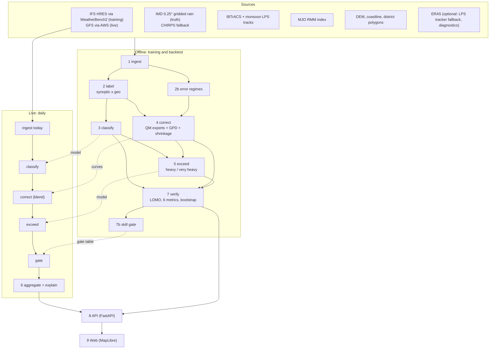

# Regime-Aware Rainfall Post-Processing — Product Requirements Document

**Problem statement:** SIH26080 · *Regime-Aware AI Post-Processing of Monsoon Rainfall Forecasts*
**Organisation:** Ministry of Earth Sciences (MoES) / NCMRWF · **Category:** Software · **Theme:** Smart Automation
**Revision:** B (supersedes A)
**Date:** 29 September 2026 · **Portal deadline:** 20 September 2026 per the saved brief (idea submission; the build happens at the finale). **Confirm the live deadline before relying on this date** (§20).

---

## Document control

| | |
|---|---|
| Status | Working draft, binding on the build |
| Owner | Tech lead |
| Source PS text | `docs/PS26080_Brief.md` |
| Companion documents | `TECHNICAL_SPEC.md` (TRD: system how), `docs/MODEL_SPEC.md` (model build guide, step by step with code), `docs/SOLUTION_EXPLAINED_80.md` (plain-language explainer with diagrams), `docs/PPT_BRIEF.md` (deck narrative) |
| Sibling project | PS26081 (Hybrid AI–NWP blending), built separately by Mridul; shares the same data pipeline and India domain but is out of scope here |
| Team on this PS | Everyone except Mridul (who owns PS26081) |

**How to read this.** §1–§7 are orientation, readable by a non-specialist. §8–§13 are the build contract: requirement IDs here are the IDs to reuse in code, tests and the deck. §14–§20 are execution planning. Nothing in this document has been measured yet; there is no MVP as of this revision. Every number in §17 is a target, not a result, until an experiment produces it.

### Revision history

| Rev | Date | Change |
|---|---|---|
| A | 29 Sep 2026 | First draft |
| B | 29 Sep 2026 | Very-heavy threshold corrected to IMD's **115.6 mm/day** (was 124.5). Regimes restructured as **two axes** (synoptic × geographic) instead of one precedence list. **IMD gridded rainfall is the primary truth**, CHIRPS the fallback. Monsoon low-pressure-system (LPS) tracks added to IBTrACS. Soft (probability-weighted) blending promoted from stretch goal to core. Added: error-defined regimes (FR-10), GPD tail (§10.2), hierarchical shrinkage (§10.2), skill gate (FR-11), SHAP explanations (FR-12), optional conditional-mean product (FR-13). Western disturbances explicitly out of JJAS scope. Rain day aligned to IMD's 03–03 UTC. |

---

## Table of contents

**Part I — Orientation**
1. [Summary](#1-summary)
2. [Problem and context](#2-problem-and-context)
3. [The ask, decoded](#3-the-ask-decoded)
4. [Positioning and novelty](#4-positioning-and-novelty)
5. [Goals and non-goals](#5-goals-and-non-goals)
6. [Users](#6-users)
7. [Domain primer and glossary](#7-domain-primer-and-glossary)

**Part II — The build contract**
8. [Architecture](#8-architecture)
9. [Functional requirements](#9-functional-requirements)
10. [Algorithms in detail](#10-algorithms-in-detail)
11. [Data model and artefact schemas](#11-data-model-and-artefact-schemas)
12. [API contract](#12-api-contract)
13. [Interface specification](#13-interface-specification)

**Part III — Execution**
14. [Data sources](#14-data-sources)
15. [Stack and rejected alternatives](#15-stack-and-rejected-alternatives)
16. [Non-functional requirements](#16-non-functional-requirements)
17. [Validation and metrics](#17-validation-and-metrics)
18. [Build order, phases, team](#18-build-order-phases-team)
19. [Acceptance criteria](#19-acceptance-criteria)
20. [Risk register and open questions](#20-risk-register-and-open-questions)

---
---

# Part I — Orientation

## 1. Summary

Raw NWP rainfall forecasts are wrong in systematic, regime-dependent ways. They behave differently during active monsoon spells, break spells, monsoon lows and depressions, orographic events (Western Ghats, Himalayan foothills, Northeast hills) and coastal convection. One global bias-correction curve fitted across all of these at once averages away the very structure that would make the correction useful for the events that matter: heavy and very heavy rainfall.

**The one line.** We first work out what kind of day the model is forecasting, and what kind of mistake it tends to make on such a day. Then we apply the correction learned for exactly that situation, blended by how confident we are in the regime. We also tell the user where our correction should not be trusted.

**Deck line.** *"We don't just correct the forecast — we learn which kind of mistake the model is about to make, and we tell you when not to trust our correction."*

**Why this framing wins this problem statement.** The PS names its own scorecard (RMSE, ETS, CSI, POD, FAR, FSS). Most teams will not build all six, and few will run them under a leave-one-season-out split, which is the only split that doesn't leak. NCMRWF's judges are atmospheric scientists; they will ask for skill against a named baseline (raw NWP), not for a nice map. A regime-conditioned correction with the full metric suite, honestly reported including where it does *not* help, is the credible answer to a MoES panel.

## 2. Problem and context

India's rainfall forecast errors are not uniform. A forecast system tuned to perform well on average performs worse than it should during the specific spells that cause damage:

- **Active monsoon** spells (strong low-level jet, monsoon trough over central India): the model spreads rain too evenly, producing too much light rain and too little heavy rain.
- **Break monsoon** spells (trough shifted to the Himalayan foothills): the model keeps too much rain over central India and misses foothill and Northeast heavy rain.
- **Monsoon lows and depressions**: concentrated heavy rain that the model places wrongly (track and speed errors) and under-forecasts near the centre.
- **Orographic rainfall** (windward Western Ghats, NE hills, Himalayan foothills): a standing model weakness, because coarse model terrain is too smooth.
- **Coastal rainfall** (Konkan, Karnataka, Odisha–Andhra coasts): convection placed inland or offshore of where it falls.
- **Western disturbances**: chiefly a winter phenomenon; relevant at monsoon onset and withdrawal over northwest India. **Out of JJAS build scope** (§5 NG6).

The error differs not just in size between regimes but in **direction and shape**. A single global bias correction under-corrects the regime that most needs it and over-corrects the one that didn't. The PS asks for the regime-first approach, classify then correct, and asks for the improvement to be reported with six named skill scores rather than an anecdote.

## 3. The ask, decoded

The brief (`docs/PS26080_Brief.md`) lists five deliverables. This is the literal mapping from ask to build:

| PS deliverable | What we build | FR |
|---|---|---|
| Weather regime classifier (active / break / depression / coastal-orographic) | A **synoptic** classifier giving probabilities over {active, break, depression, normal} per cell and lead day from forecast-time features only, crossed with a fixed **geographic** class {orographic, coastal, plains}. Plus a data-driven **error-regime** classification (novelty). | FR-1, FR-2, FR-10 |
| Bias-corrected rainfall forecast, better than raw NWP | A mixture of per-regime quantile-mapping "experts" with a GPD extreme tail, weighted by regime probability, shrunk toward parent curves where data is thin. | FR-3 |
| Heavy-rainfall probability above operational thresholds | Calibrated gradient-boosted exceedance models for IMD **heavy (≥64.5 mm/day)** and **very heavy (≥115.6 mm/day)**. Extremely heavy (≥204.5) is reported descriptively only. | FR-4 |
| District-level rainfall product | Area-weighted aggregation to district polygons: mean, max-cell, exceedance probability, regime, confidence flag and a one-line reason, as a table and a choropleth. | FR-5, FR-11, FR-12 |
| Verification report, RMSE/ETS/CSI/POD/FAR/FSS | All six, raw vs corrected, per threshold, lead, regime and season, under leave-one-monsoon-out CV, with bootstrap confidence intervals and reliability diagrams. | FR-6 |

## 4. Positioning and novelty

Being "regime-aware" is not new in itself: research groups have studied regime-dependent post-processing, mostly for European temperature and wind. Our novelty is in **how** we use regimes.

| # | Novelty | What it is | Where |
|---|---|---|---|
| ★1 | **Error-defined regimes** | Cluster historical days by the *shape of the NWP error* (bias, heavy-rain area ratio, displacement, correlation, intensity ratio). Predict that cluster from forecast-time features. Compare correction grouped by error regime against grouping by meteorological regime and against no grouping. | §10.5 |
| ★2 | **Soft regimes / mixture of experts** | The final correction is the probability-weighted blend of per-regime corrections, so there are no jumps at regime transitions. | §10.2 |
| ★3 | **Skill gate** | For each district × regime × lead, correction is used only where leave-one-monsoon-out verification shows it helped; elsewhere we fall back to raw NWP and flag it. | §10.6 |
| 4 | **GPD extreme tail** | The quantile-mapping tail is modelled with a Generalised Pareto Distribution, so very heavy values are not clipped at the training maximum. | §10.2 |
| 5 | **Explained alerts** | Each district alert carries its top three SHAP contributors in plain language. | §10.7 |
| Stretch | **Displacement correction** | Regime-dependent correction of misplaced rain (e.g., depression rain placed too far north). Not in the acceptance bar. | §20 |

How we compare with what exists:

| Who | What they typically do | Our difference |
|---|---|---|
| Operational (NCMRWF/IMD) | A single bias correction on NCUM/NEPS output, not split by regime *(our understanding; to confirm)* | Regime conditioning, soft blending, skill-gated fallback |
| Research | Regime-dependent post-processing in Europe (temperature/wind); one global statistical or deep model for Indian rainfall | Applied to monsoon rainfall extremes, with error-defined regimes |
| Other SIH teams (expected) | One U-Net or XGBoost model, k-means "regimes", RMSE only, random split, Streamlit map | Six metrics, leave-one-monsoon-out, calibrated probabilities, honest failure reporting |

Two principles carry over from Rev A:
1. **Name a real baseline and beat it on a named scorecard, or say honestly where we don't.** Bias-correction gains are typically a few percent. Don't oversell.
2. **Win on rigour as much as on idea.** Verification discipline is the part other teams will skip.

## 5. Goals and non-goals

**Goals**
- G1. Predict synoptic regime probabilities for each grid cell and lead day using only forecast-time inputs.
- G2. Produce a bias-corrected rainfall forecast that improves on raw NWP under leave-one-monsoon-out CV at the heavy-rain thresholds (POD, CSI, ETS, FSS), reported alongside RMSE whether or not RMSE improves.
- G3. Produce calibrated heavy and very-heavy exceedance probabilities, evaluated with reliability diagrams and the Brier score.
- G4. Produce a district-level rainfall table and map from the corrected grid, with confidence flags and explanations.
- G5. Report all six named metrics against the raw-NWP baseline, honestly, including where correction does not help.
- G6. Run the three-way experiment (global vs meteorological regimes vs error regimes) and report the result either way.
- G7. Ship a live "today" demo: pull today's open forecast, run the full pipeline, render the map.

**Non-goals (explicitly out of scope for the finale)**
- NG1. Ingesting NCMRWF's own NCUM/NEPS output, which is not public. We validate on open models (HRES for training, GFS for the live demo) and document an adapter interface instead.
- NG2. Week 3–4 or seasonal forecasting. This PS is short/medium-range post-processing (Day 1–5), not the extended-range problem PS26086 covers.
- NG3. Radar, lightning or satellite nowcasting inputs. Different PS, different data class.
- NG4. A general-purpose weather UI. The interface exists to demonstrate this pipeline's output.
- NG5. Deep-learning models in the acceptance bar. A CNN regime classifier is a listed extension only.
- NG6. A separate western-disturbance regime. WD is mainly a non-monsoon phenomenon and is not in the PS's expected-outcome list. Stated as a limitation.

## 6. Users

| User | What they need from this |
|---|---|
| NCMRWF forecaster (primary, judge proxy) | A correction they can audit: which regime was predicted, with what probability, which correction was applied, whether the skill gate trusted it, and what the skill scores say, including failure cases. |
| District disaster-management officer (downstream) | A district table and map: corrected rainfall (mean and max), heavy-rain probability, a confidence flag and a one-line reason, in plain units. |
| NCMRWF model developers (secondary) | The error-regime cross-tab and skill-gate map, as diagnostics of where their model's errors are systematic. |
| SIH judges | A working demo on today's live data, a named baseline and six real numbers, not a static mockup. |

## 7. Domain primer and glossary

- **NWP**: Numerical Weather Prediction; the raw physics-based forecast we correct (IFS HRES in training, GFS in the live demo, NCUM operationally).
- **Rain day (IMD)**: the 24 h ending 03 UTC (08:30 IST). All rainfall in this project uses this window.
- **Synoptic regime**: the day's large-scale state: **active**, **break**, **depression** (a low or depression within ~500 km) or **normal**. Changes day to day and is predicted.
- **Geographic class**: the fixed setting of a grid cell: **orographic**, **coastal** or **plains**. Computed once from terrain and coastline.
- **Active / break monsoon**: standardised rainfall anomaly over the core monsoon zone (~18–28°N, 65–88°E) above +1 (active) or below −1 (break) for ≥ 3 consecutive days (Rajeevan, Gadgil & Bhate, 2010 convention).
- **Monsoon low / depression**: a cyclonic low-pressure system, usually forming over the Bay of Bengal; depression = sustained winds 17–27 kt, deep depression 28–33 kt.
- **MJO**: Madden–Julian Oscillation; a 30–60-day tropical convection pulse that modulates active/break cycles. Tracked via the RMM index.
- **Quantile mapping (QM)**: replaces a forecast value at the p-th percentile of historical forecasts with the p-th percentile of historical observations.
- **GPD**: Generalised Pareto Distribution, used to model the extreme upper tail.
- **Mixture of experts**: several specialised correctors blended by weights from a gating model (here, the regime classifier).
- **Skill gate**: per district × regime × lead switch that uses the correction only where it has been shown to help.
- **IMD rainfall categories (mm/day)**: light 2.5–15.5; moderate 15.6–64.4; **heavy 64.5–115.5**; **very heavy 115.6–204.4**; **extremely heavy ≥ 204.5**.
- **RMSE, ETS, CSI, POD, FAR, FSS**: see §17.1.
- **Leave-one-monsoon-out (LOMO) CV**: each fold holds out one entire June–September season.

---
---

# Part II — The build contract

## 8. Architecture



Stages 1–2 run once, offline, over the historical record. Stages 3–7 run in both backtest mode and live mode. Stage 9 reuses the SatQuery (PS26167) frontend pattern (`../167/`) for the MapLibre setup and the Field Atlas visual language (`docs/PPT_BRIEF.md` §Design). Module-level design is in `TECHNICAL_SPEC.md` §4; model-level build instructions are in `docs/MODEL_SPEC.md`.

## 9. Functional requirements

| ID | Requirement |
|---|---|
| FR-1 | The system shall predict, for each land grid cell and lead day (Day 1–5), a probability distribution over the synoptic regimes {active, break, depression, normal}, using only inputs available at forecast issue time. |
| FR-2 | The system shall assign each land grid cell a fixed geographic class {orographic, coastal, plains} from static terrain and coastline data, and expose the regime as the pair (synoptic, geographic). |
| FR-3 | The system shall correct raw NWP rainfall with a probability-weighted mixture of quantile-mapping experts keyed by (synoptic regime, geographic class, zone, lead), with a GPD upper tail and hierarchical shrinkage toward parent curves for experts with few samples. |
| FR-4 | The system shall output calibrated exceedance probabilities for IMD heavy (≥64.5 mm/day) and very heavy (≥115.6 mm/day) rainfall, with P(very heavy) ≤ P(heavy) enforced. |
| FR-5 | The system shall aggregate corrected rainfall and exceedance probabilities to district polygons (area-weighted mean, max-cell, P max-cell, area fraction with P ≥ 0.5) and expose a table and a choropleth map. |
| FR-6 | The system shall compute RMSE, ETS, CSI, POD, FAR and FSS (at ≥ 2 neighbourhood scales) for both the raw-NWP baseline and the corrected output, under LOMO CV, per threshold, lead, regime and season, with bootstrap 90% confidence intervals on each raw-vs-corrected difference. |
| FR-7 | The system shall support a live mode: pull the latest open forecast (GFS), run the full pipeline without retraining, and render current-day output. |
| FR-8 | The interface shall let a user toggle raw vs corrected rainfall, regime layers, exceedance layers and the skill-gate layer on the same map. |
| FR-9 | Every rendered number shall be traceable to a run artefact on disk. No number is typed directly into the frontend or deck. |
| FR-10 | The system shall discover error-defined regimes by clustering historical error descriptors (refitted inside each CV fold), and shall report the three-way comparison: global QM vs meteorological-regime QM vs error-regime QM. |
| FR-11 | The system shall compute a skill-gate table per district × synoptic regime × lead from LOMO results, and in live mode shall serve raw NWP (flagged) wherever the gate is OFF. |
| FR-12 | The system shall attach to each district alert the top three positive feature contributions (SHAP / LightGBM `pred_contrib`) rendered as a plain-language reason. |
| FR-13 | *(Should.)* The system shall provide an optional conditional-mean (RMSE-optimal) rainfall product via the API, alongside the default QM product. |

## 10. Algorithms in detail

Full implementation instructions with code are in `docs/MODEL_SPEC.md`; section numbers there are given in brackets.

### 10.1 Regime labelling and classifier [MODEL_SPEC §5–§9]

- **Labels (training only, derived from observations):**
  - *Depression*: a monsoon low or depression centre (IBTrACS North Indian basin ∪ monsoon LPS tracks) within **500 km** of the cell during the rain day. Overrides active/break for that cell.
  - *Active / break*: IMD-gridded area-mean rainfall over the core monsoon zone (18–28°N, 65–88°E, land), standardised by a 1981–2015 day-of-year climatology; z > +1 for ≥ 3 consecutive days = active, z < −1 for ≥ 3 days = break.
  - *Normal*: otherwise.
  - *Geographic class (static)*: orographic if sub-grid elevation standard deviation > 150 m or windward-slope index above threshold (with mean elevation > 300 m); else coastal if within 50 km of the coastline; else plains.
- **Features (forecast-time only):** raw forecast rain and neighbourhood mean/max; 850 hPa winds and an Arabian Sea low-level-jet index; monsoon trough latitude; precipitable water and integrated moisture-flux convergence; 850 hPa relative vorticity (max within 500 km) and distance to the forecast MSLP minimum; 500 hPa vertical velocity; MJO RMM phase/amplitude at initialisation; static terrain/coast descriptors; day of year; lead day.
- **Model:** LightGBM multi-class (4 synoptic classes), lead day as a feature (or one model per lead if compute allows), inverse-frequency class weights, temperature-scaled probabilities, 3×3 spatial smoothing of probabilities.
- **Output:** `regime_prob[lead, lat, lon, synoptic]`.

### 10.2 Regime-conditioned bias correction [MODEL_SPEC §11]

- **Experts:** one quantile-mapping curve per (synoptic s, geo g, zone z, lead L), where zones are IMD's four homogeneous monsoon regions. Fitted on pooled cell-days with that *labelled* regime in the training seasons.
- **Body:** empirical CDFs on a 1,001-point quantile grid; wet-day frequency handled by mapping forecast values below the forecast quantile at the observed dry fraction to 0.
- **Tail:** above the 95th percentile, GPD fits (shape ξ clipped to [0, 0.4]) for both forecast and observed exceedances; at least 50 exceedances or the tail is inherited from the parent.
- **Shrinkage:** $QM = w \cdot QM_{s,g,z,L} + (1-w) \cdot QM_{parent}$ with $w = n_{days}/(n_{days} + N_0)$, $N_0 = 30$ days. Distinct days are used, not cell-days, because cells within a day are strongly correlated. Hierarchy (s,g,z,L) → (g,z,L) → (g,L).
- **Mixture:** $\hat{x} = \sum_s \tilde{p}_s \, QM_{s,g,z,L}(x)$, where $\tilde{p}$ keeps regimes with $p_s \ge 0.1$ and renormalises; if any $p_s \ge 0.8$ the dominant expert is used alone.
- **Known limitation:** QM does not fix spatial displacement, and it can increase RMSE while improving heavy-rain detection (§17.4). Report the sample count behind every curve.

### 10.3 Heavy-rainfall exceedance model [MODEL_SPEC §12]

- LightGBM binary classifier per threshold (64.5, 115.6 mm/day). Features: §10.1 features plus corrected rain and cross-fitted regime probabilities.
- Isotonic calibration fitted on an inner held-out season, never the test season. Monotonicity enforced.
- Evaluated with Brier score, reliability diagram, ROC-AUC and PR-AUC.

### 10.4 District aggregation [MODEL_SPEC §16]

- GADM level-2 (or Survey of India, licence permitting) polygons. Exact cell–polygon overlap area weights, computed in an equal-area projection.
- Outputs per district: area-weighted mean, max-cell value, P(heavy) and P(very heavy) as max over cells and as the area fraction with P ≥ 0.5, the dominant regime, the gate status and the reason text.

### 10.5 Error-defined regimes [MODEL_SPEC §10]

- Per training day and lead: error descriptors for each of the four zones (normalised bias, heavy-area ratio, heavy-object centroid displacement, spatial correlation, 95th-percentile intensity ratio), giving ~20 numbers per day.
- Standardise → PCA (90% variance) → k-means, k ∈ [4, 8] chosen by silhouette and bootstrap stability. **Refitted inside each CV fold** on training seasons only.
- A LightGBM classifier predicts the error regime from forecast-time features. Variant C uses (error regime, geo, zone, lead) experts.
- Report the contingency table of error regimes × meteorological regimes.

### 10.6 Skill gate [MODEL_SPEC §14]

- From pooled LOMO predictions, for each district × synoptic regime × lead: the MSE skill score $SS = 1 - MSE_{corr}/MSE_{raw}$, the ETS gain at 64.5 mm (pooled over the district's cells), per-season win counts and a day-block bootstrap 90% CI.
- **ON**: either measure significantly better and neither significantly worse. **OFF**: either measure significantly worse and neither significantly better. **NEUTRAL**: otherwise (use corrected, flag low confidence). Fewer than 30 regime-days → inherit the district × lead gate.

### 10.7 Explanations [MODEL_SPEC §15]

- LightGBM `pred_contrib=True` on the heavy-rain model (exact TreeSHAP). Top three positive contributors → a templated sentence using a feature-name → phrase dictionary.

## 11. Data model and artefact schemas

Every pipeline run writes to `runs/<run_id>/` (mirrors the pattern in `../143/mvp/`). Field-level schemas are in `TECHNICAL_SPEC.md` §3.

```
runs/<run_id>/
  manifest.json              # sources, versions, model hashes, seed, git commit, config hash
  regime_probs.nc            # lead x lat x lon x synoptic
  corrected_rainfall.nc      # lead x lat x lon  (qm, raw, optional cond_mean)
  exceedance_probs.nc        # lead x lat x lon x threshold
  gate.nc                    # lead x lat x lon  (ON/NEUTRAL/OFF per cell via its district)
  district_table.csv         # one row per district x lead
  district_table.json        # same, for the API
models/<model_set_id>/        # training artefacts (TECHNICAL_SPEC §3.4)
reports/<backtest_id>/
  verification_report.json   # all metrics, all slices, CIs
  skill_gate.parquet
  error_regime_crosstab.csv
  reliability_*.png, confusion_*.png
```

## 12. API contract

FastAPI, following the SatQuery (`../167/`) backend pattern. Full request/response schemas: `TECHNICAL_SPEC.md` §4.8.

| Endpoint | Method | Returns |
|---|---|---|
| `/runs/latest` | GET | Latest run id and manifest |
| `/runs/{run_id}/regime?lead=1` | GET | Regime probability grid (PNG overlay or GeoJSON) and the all-India summary |
| `/runs/{run_id}/rainfall?variant=raw\|corrected\|cond_mean&lead=1` | GET | Rainfall grid |
| `/runs/{run_id}/exceedance/{threshold}?lead=1` | GET | Exceedance probability grid (`heavy` \| `very_heavy`) |
| `/runs/{run_id}/gate?lead=1` | GET | Skill-gate layer |
| `/runs/{run_id}/districts?lead=1` | GET | District table (JSON) |
| `/reports/{backtest_id}/verification` | GET | Verification report JSON |
| `/runs/live` | POST | Triggers a live run on today's forecast; returns a `run_id` |

## 13. Interface specification

Two views, one page, in the Field Atlas visual language (light, map-first; see `docs/PPT_BRIEF.md`):

1. **Map view.** India basemap (MapLibre), with a lead-day selector (D1–D5). Layers: regime (categorical), raw rainfall, corrected rainfall, P(heavy), P(very heavy), skill gate. A raw-vs-corrected swipe. District boundaries overlaid; click a district for its table row, including the regime probabilities, gate status and reason.
2. **Scorecard panel.** The six metrics, raw vs corrected, with CIs; filters for threshold, lead and regime; the three-way variant comparison. A judge should be able to read the honest delta in five seconds (NFR-4: never hide a metric that doesn't improve).

---
---

# Part III — Execution

## 14. Data sources

| Source | What | Access | Status |
|---|---|---|---|
| WeatherBench2 `hres` | IFS HRES deterministic forecast 2016–2022, 0.25°, 6-hourly leads | Public zarr (GCS, anonymous) | Store reachable (25 Sep); **precipitation variable name to confirm in Phase 0** |
| **IMD gridded rainfall 0.25°** | **Primary truth**, 1901–present, gauge-based | Public; `imdlib` Python package | **Confirm download from the team network in Phase 0** |
| CHIRPS 2.0 daily 0.05° | Fallback truth | Open HTTPS | Confirmed reachable |
| IBTrACS v04 (North Indian basin) | Depression and stronger tracks | Open CSV | Confirmed reachable |
| Monsoon LPS track dataset (e.g., Vishnu et al. 2020 / Hurley & Boos 2015) | Monsoon lows missed by IBTrACS | Open (confirm host) | **Confirm in Phase 0**; fallback: our own ERA5 vorticity tracker (MODEL_SPEC §6.3) |
| WeatherBench2 ERA5 | Only for the LPS tracker fallback and diagnostics | Public zarr | Confirmed reachable |
| BOM/NOAA MJO RMM index | Daily RMM phase and amplitude | Open text file | Confirmed reachable |
| NOAA GFS 0.25° (AWS Open Data) | Live forecast for the demo | Open S3 | Confirmed reachable |
| ETOPO 2022 / GMTED2010 DEM | Terrain descriptors | Open | To download in Phase 0 |
| District boundaries (GADM / Survey of India) | Aggregation | Public; licence varies | Confirm redistribution terms |

## 15. Stack and rejected alternatives

- **Backend:** Python 3.11, FastAPI, xarray/zarr/dask, pandas/pyarrow, reusing SatQuery's pattern.
- **ML:** LightGBM for the regime classifier, the error-regime classifier, the exceedance models and the optional conditional-mean regressor. scikit-learn for PCA, k-means and isotonic calibration; SciPy for GPD. *Rejected:* a CNN/U-Net on the gridded fields. Seven seasons are not enough data, it is harder to explain, and it burns build hours the verification work needs.
- **Bias correction:** quantile-mapping experts with a GPD tail and shrinkage: auditable and explainable in one sentence. *Rejected:* a learned end-to-end correction network, for the same reasons, and because the PS frames the task as classify-then-correct.
- **Frontend:** MapLibre GL, reusing `../167/`'s web workstation scaffolding and the Field Atlas design system.

## 16. Non-functional requirements

- NFR-1. **Determinism.** A run with a fixed manifest (same input snapshot, same seed, same config hash) reproduces identical outputs.
- NFR-2. **No fabricated numbers.** Every skill score, probability or corrected value shown anywhere must trace to a run or report artefact. Enforced by a repo-level test (as in `../143/`).
- NFR-3. **Runtime budget.** A live run (stages 3–8, no retraining, excluding download) completes in under 60 s on a laptop. GFS download for Day 1–5 completes in under 5 min.
- NFR-4. **Honest degradation.** If the corrected output does not beat raw NWP on a metric, regime or lead, the report and the deck say so.
- NFR-5. **No leakage.** No truth-derived feature enters any model; no held-out-season date enters any artefact of its fold; clustering, climatologies fitted on the training window, calibration and gates are all fold-internal. Enforced by tests.
- NFR-6. **Laptop-scale training.** The full LOMO backtest completes in under 6 h on a 16 GB-RAM laptop in `fast` mode (MODEL_SPEC §19).

## 17. Validation and metrics

### 17.1 The six named metrics (exact definitions)

Let hits (H), misses (M), false alarms (FA) and correct negatives (CN) be counted per threshold contingency table, $\hat{r}$ = forecast, $r$ = truth, over $n$ land cell-days.

- **RMSE** $= \sqrt{\frac{1}{n}\sum(\hat{r}-r)^2}$
- **POD** $= H/(H+M)$
- **FAR** $= FA/(H+FA)$
- **CSI** $= H/(H+M+FA)$
- **ETS** $= (H - H_r)/(H+M+FA-H_r)$, with $H_r = (H+M)(H+FA)/n$
- **FSS** $= 1 - \frac{\sum(P_f-P_o)^2}{\sum P_f^2 + \sum P_o^2}$, where $P_f, P_o$ are the fractions of cells ≥ threshold in an $n \times n$ window, pooled over all days. Windows of 1, 3, 5 and 9 cells (≈25, 75, 125 and 225 km). Headline: 3 and 5.

Thresholds: 2.5, 15.6, 64.5 and 115.6 mm/day. All metrics are computed for **raw** and **corrected** and reported side by side; the delta is the claim.

### 17.2 Cross-validation

Leave-one-monsoon-out over JJAS 2016–2022 (7 folds). Inside each fold, one training season is the inner validation season (early stopping, temperature scaling, isotonic calibration). Everything fitted on data (active/break climatology excepted: it uses 1981–2015, which lies outside the evaluation window) is fitted inside the fold. Held-out predictions are pooled across folds for the headline numbers; per-season numbers show consistency.

### 17.3 Uncertainty and calibration

- Day-block bootstrap (1,000 resamples of days) for 90% CIs on every raw-vs-corrected difference. Non-significant differences are labelled as such.
- Reliability diagrams and Brier score for exceedance probabilities; reliability and a confusion matrix for the regime classifier.

### 17.4 The known metric tension

Distribution-matching correction (QM) can raise RMSE while improving POD, CSI, ETS and FSS at heavy thresholds. We report every metric regardless, and provide the RMSE-optimal conditional-mean product (FR-13) for users who need it.

## 18. Build order, phases, team

Team: everyone except Mridul (PS26081), roughly four to five people. The techniques are tabular-scale (gradient-boosted trees, quantile mapping) so they don't need a deep-learning specialist. Step-by-step instructions for every phase are in `docs/MODEL_SPEC.md`.

| Phase | Work | Owner role | Depends on |
|---|---|---|---|
| 0. Data check | Confirm HRES precip variable; IMD download via `imdlib`; LPS dataset host; GFS pull; DEM; district licence; **confirm SIH deadline and pre-build rules** | Data lead | — |
| 1. Ingest + static layers | HRES→rain-day alignment, IMD, tracks, MJO, geo classes, zones | Data lead | 0 |
| 2. Labels + features | Synoptic labels, feature builder, training tables | Data lead + ML lead | 1 |
| 3. Verification module first | Metrics, bootstrap, report writer, tests on toy data | Verification lead | 1 (parallel with 2) |
| 4. Regime classifier | FR-1, FR-2 | ML lead | 2 |
| 5. QM experts | FR-3 (global variant A first, then B) | ML lead / second modeller | 2 |
| 6. Exceedance models | FR-4 | Second modeller | 4, 5 |
| 7. Backtest | Full LOMO, variants A/B, report | Verification lead | 3–6 |
| 8. Error regimes | FR-10, variant C | ML lead | 7 |
| 9. Skill gate + explanations | FR-11, FR-12 | Verification lead | 7 |
| 10. Aggregation + API + frontend | FR-5, FR-7, FR-8 | Frontend lead | 7 (real numbers) |
| 11. Live demo | GFS end-to-end | Data lead | 10 |
| 12. Deck | Numbers pulled from `verification_report.json`; see `docs/PPT_BRIEF.md` | All | 7 onward |

Verification (Phase 3) is built **before** models, and the interface **after** real numbers exist. The interface exists to display real numbers, not to be filled with placeholders that risk becoming the numbers shown.

## 19. Acceptance criteria

- AC-1. The regime classifier produces a probability vector for every land cell and lead using only forecast-time features. A unit test asserts that no truth-derived column is in any feature set.
- AC-2. The corrected forecast's six metrics are reported against raw NWP under LOMO CV for all 7 seasons, with bootstrap CIs.
- AC-3. All six metrics appear in `verification_report.json` for raw and corrected, at 64.5 and 115.6 mm/day, per lead and per synoptic regime.
- AC-4. The live pipeline runs end-to-end on a freshly pulled GFS forecast and renders on the map without manual intervention, within NFR-3.
- AC-5. No number in the frontend or the deck is hand-typed. Every one traces to an artefact (grep-able test, following `../143/`).
- AC-6. Where correction does not improve a metric or regime, the report and the deck state it plainly.
- AC-7. The three-way comparison (variants A, B, C) is present in the report.
- AC-8. The skill-gate layer is served and visible on the map; OFF cells show raw NWP.
- AC-9. Fold-isolation tests pass: no held-out-season date appears in any training artefact of its fold, including clustering, calibration and gate inputs.

## 20. Risk register and open questions

| Risk | Likelihood | Impact | Mitigation |
|---|---|---|---|
| SIH idea-submission deadline already passed (brief says 20 Sep 2026) | Unknown | Critical | Confirm on the portal before further work |
| IMD gridded rainfall unreachable from the team network | Medium | Medium | CHIRPS fallback; declare the truth source in `manifest.json` and the deck |
| HRES precipitation in WeatherBench2 is 6-hourly only (no 03 UTC boundary) | High | Low | Linear interpolation of cumulative precipitation to 03 UTC boundaries (MODEL_SPEC §4.2); disclose |
| LPS dataset host unavailable | Medium | Low | ERA5 vorticity-based tracker fallback (MODEL_SPEC §6.3) |
| Bias-correction gains are small | High | Medium | Lead with heavy-rain POD/ETS/FSS, the skill gate and the error-regime finding; never oversell |
| QM worsens RMSE | Medium | Medium | Report honestly; provide the conditional-mean product |
| Depression and very-heavy samples are thin | Medium | Medium | Pooling, shrinkage, reported n, CIs |
| Train on HRES, demo on GFS | Certain | Low | Disclose; operationally retrain per model (NCUM adapter) |
| Compute for full LOMO with cross-fitting | Medium | Medium | `fast` mode: cell subsampling for the classifier, lead as a feature, cached features |
| District boundary licence unclear | Low | Medium | Resolve in Phase 0; GADM fallback, link rather than redistribute |
| No dedicated modeller | Medium | Medium | Tabular ML only; MODEL_SPEC gives copy-ready code |

**Open questions**
- [ ] Confirm the SIH idea-submission deadline and the rules on pre-building before the finale.
- [ ] Confirm the IMD `imdlib` download works from the team network, and the IMD date convention (MODEL_SPEC §4.3).
- [ ] Confirm the WeatherBench2 HRES precipitation variable name and accumulation convention.
- [ ] Confirm the LPS track dataset source.
- [ ] Confirm the district boundary source and licence.
- [ ] Decide whether to attempt the displacement-correction stretch goal after AC-1…AC-9 pass.
