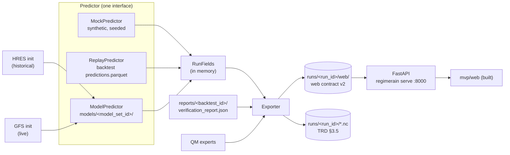

# Backend Build Plan (SIH26080)

**Owner: TBC.** Scope: everything between the trained models and the web app. That means producing runs, exporting them in the shape the web reads, serving them over an API, and the live GFS run.

Requirements come from `../PRD.md` §8, §11, §12, §16 (NFR-1 to NFR-4), §18 (Phase 10–11), §19 and `../TECHNICAL_SPEC.md` §3.5–§3.8, §4.13–§4.14, §9, §10, §13, §15. Model internals are in `MODEL_SPEC.md` §17–§18. The web side is in `FRONTEND_BUILD_PLAN.md`.

> **Working rule until the model arrives.** The ML team will hand over a trained model set later. Until then the backend runs on **mock data** (synthetic, clearly flagged) or **replayed backtest output** (real, held-out, historical). Every path goes through the same exporter and the same API, so plugging in the model means swapping one class, not rewriting the pipeline.

---

## 0. Progress

| Date | Done |
|---|---|
| 29 Sep 2026 | B0 + B1. `regimerain/runs/` (`fields`, `contract`, `mock`, `derive`, `export_web`, `geo`, `places`); CLI `run --source mock [--publish NAME]`, `publish`, `contract --check/--schema`; `tests/test_runs.py` (12 tests incl. contract ↔ `types.ts` drift). The web reads v2 only; the sample run is now produced by the package (`npm run sample`). Decisions D1–D3 applied |
| 29 Sep 2026 | B2–B5 + B7. `api/app.py` + `runs/store.py` + `serve` (B2). `runs/replay.py`, `run --source replay [--pick]` (B3). `modelset.py` (TRD 3.4 layout, sha256-verified load), `final.py` + `fit-final` (MODEL_SPEC 17), fold models saved to `cache/fold=Y/model/`, `runs/model_run.py` + `run --source hres`, parity test passes (B4). `live/gfs.py` (Herbie, parallel prefetch, retries, cache) + `live/run.py` + `run --source gfs --init today\|cached\|DATE`, `serve --live` with `POST/GET /api/runs/live` (B5). `preflight`, `import-kaggle` (B7). Runbook: `docs/RUNBOOK.md` |

## 1. Where things stood (29 Sep 2026, before B0)

| Piece | State |
|---|---|
| `regimerain` ingest, static (basic), labels, features | Built (commit `1378b48`) |
| Classifier (M1), QM experts A/B (M3), LOMO backtest, report | Built, pilot config (3 seasons, D1 and D3) |
| Error regimes (M2), exceedance (M4), gate, districts, explain | Not built |
| `fit-final`, `run`, `serve` CLI commands | Stubs: exit 2 with "not implemented yet" |
| Web app (`mvp/web`) | Built. Reads a static run folder (`public/run/<id>/`) with synthetic data from `mvp/tools/make_sample_run.py` |
| API | None |

The gap: **two contracts exist and nothing connects them.**

- The pipeline's run artefacts (TRD §3.5) are NetCDF grids, a district table and a manifest.
- The web reads five JSON files (`manifest`, `grid`, `places`, `qm_curves`, `verification`), whose shapes were invented for the synthetic sample.

The backend's first job is to own the second contract and fill it from the first.

---

## 2. Architecture



**One interface, three producers.** Each predictor returns the same in-memory `RunFields` object. Everything after it (derivations, export, API, web) is shared, so mock data exercises exactly the code the model will use.

```python
@dataclass
class RunFields:
    kind: Literal["mock", "replay", "model"]      # the exporter stamps synthetic = (kind == "mock")
    init: date; source: str                        # "mock" | "hres" | "gfs"
    lat: np.ndarray; lon: np.ndarray               # ascending, working grid
    leads: list[int]                               # 1..5 (rain day L = hours 3+24(L-1) .. 27+24(L-1))
    land: np.ndarray                               # bool (lat, lon)
    raw: np.ndarray                                # (lead, lat, lon) mm/day, NaN over sea
    corrected: np.ndarray                          # variant B
    corrected_global: np.ndarray | None            # variant A, for the "regime-aware vs global" story
    p_synoptic: np.ndarray                         # (lead, lat, lon, 4): active, break, depression, normal
    geo: np.ndarray                                # (lat, lon) int8: plains, coastal, orographic
    u850: np.ndarray | None; v850: np.ndarray | None; mslp: np.ndarray | None
    p_heavy: np.ndarray | None; p_very_heavy: np.ndarray | None   # None until M4 exists
    truth: np.ndarray | None                       # replay only: IMD rain, for "what fell"
    provenance: dict                               # model_set_id, hashes, config_sha256, git commit, backtest fold
```

`None` means **the layer is not built**, not that it is zero. The exporter lists the layers it wrote in `manifest.layers`, and the web hides any layer that isn't listed. **Mock values are never mixed into a replay or model run** (NFR-2): a run is either wholly synthetic, or each layer is real or absent.

### 2.1 Package layout (inside `regimerain`, per TRD §8)

```
regimerain/
  runs/
    fields.py        RunFields + validation (shapes, ranges, NaN over sea)
    predictors.py    Predictor protocol; MockPredictor, ReplayPredictor, ModelPredictor
    mock.py          synthetic generator (moved from mvp/tools/make_sample_run.py, seeded)
    derive.py        wettest point, depression track (MSLP minimum), place sampling, regime-day counts
    contract.py      pydantic models for web contract v2 (single source of truth) -> JSON Schema
    export_web.py    RunFields + report + experts -> runs/<id>/web/*.json
    export_nc.py     RunFields -> TRD §3.5 NetCDF (after B4)
    store.py         list / latest / resolve runs on disk; run_id rules; atomic writes
  api/
    app.py           FastAPI app (read-only first, jobs later)
    jobs.py          one-at-a-time live-run runner with status + log tail
  live/
    gfs.py           GFS download (MODEL_SPEC §18.2) -> the raw schema
    run.py           one init -> features -> ModelPredictor -> export
```

`mvp/tools/make_sample_run.py` keeps only the Natural Earth `land.json` builder. Its synthetic run moves into `runs/mock.py`.

### 2.2 CLI (extends TRD §9)

```bash
regimerain run --source mock   [--seed 26080] [--init 2022-07-14]           # synthetic run
regimerain run --source replay --valid 2020-07-15 [--lead-base 1]            # backtest hindcast, needs cache/fold=*/
regimerain run --source hres   --init 2021-08-02 --model-set <id>            # model on a historical HRES init
regimerain run --source gfs    --init today|cached --model-set <id>          # live
regimerain publish <run_id> [--to mvp/web/public/run]                        # copy the web export for static hosting
regimerain serve [--port 8000] [--runs runs/] [--web mvp/web/dist]           # API + built web on one port
regimerain contract --check runs/<id>/web                                    # validate a web export against v2
```

`run_id` follows TRD §3.5: `{init:%Y%m%d}T00Z_{source}_{model_set_id[:8]}`. Mock runs use `mock` as the model id, and replay runs use `replay-<backtest_id[:8]>`.

---

## 3. Web contract v2

Written by `contract.py`, emitted as JSON Schema to `mvp/web/src/lib/contract.schema.json`, and validated in tests on both sides. `manifest.contract_version = 2`. The web loads v1 (the current sample) and v2 until the switch-over is done.

| File | Built from | Change from v1 (the sample) |
|---|---|---|
| `manifest.json` | RunFields + provenance | + `contract_version`, `kind` (`mock`/`replay`/`model`), `layers` (list), `model_set_id`, `model_hashes`, `config_sha256`, `git_commit`, `backtest_id`, `created_utc`. `synthetic` is derived from `kind`, never set by hand. `thresholds_mm` comes from config (64.5 / **115.6**). Replay runs add `truth_source` and `held_out_season` |
| `grid.json` | RunFields | Regime is `p_synoptic` (4 per cell) + static `geo`, not 6 mixed classes. Adds `truth` for replay runs. Any layer can be absent. Values rounded (rain 0.1 mm, probabilities 0.01) to keep size down |
| `places.json` | `derive.place_values` | `regime_probs` over the 4 synoptic classes + `geo`. `qm_curve` is the expert key actually used, with its `n_days` and shrinkage weight |
| `qm_curves.json` | `ExpertSet.to_frame` | Parent (zone = all-India) experts per synoptic regime × geo, downsampled from 1001 to 41 quantiles. + `w_shrink`, `has_tail` |
| `verification.json` | `reports/<id>/verification_report.json` | Variants `raw` / `A` / `B` (not baseline/corrected only). FSS keyed by window in cells, plus `fss_window_km` computed from the grid step. Bootstrap `ci90` and `significant` from `deltas`. `classifier` block. A mock run gets a mock report, generated in the same report schema so the mapping code is shared |

**Decisions** (confirmed 29 Sep 2026: follow MODEL_SPEC wherever it answers the question):

| # | Question | Recommendation |
|---|---|---|
| D1 | The UI showed 6 regimes (active, break, depression, coastal, orographic, other). MODEL_SPEC has 4 synoptic classes + 3 static geo classes | **Done: the model's taxonomy.** Regime layer = synoptic argmax with probabilities; terrain class shown in the point panel, places and bulletin |
| D2 | Very-heavy threshold: web said 124.5, config/TRD Rev B say 115.6 | **Done: 115.6, read from `manifest.thresholds_mm`.** No threshold literals left in the web source; the rain ramp breaks are set from the manifest |
| D3 | FSS labels: web said 25 km / 50 km, report has windows 1/3/5/9 cells | **Done: the report's windows with km from the grid step** (28 / 83 / 139 / 250 km at 0.25°) |
| D4 | Serve static JSON files, or an API? | **Both.** The exporter writes plain files, the API serves them, and the web reads either (`VITE_API_BASE` unset = static). A static-only deploy of the site stays possible |
| D5 | `grid.json` size at 0.25° (measured on the mock run: 4.2 MB raw) | **Keep one file, gzip it, measure it.** Split per lead (`grid/L{n}.json`) only if first paint on the demo laptop exceeds 1.5 s |

---

## 4. API

FastAPI, read-only first, following TRD §10. It never computes a forecast or a metric (TRD §4.14): it only lists, reads and serves what the exporter wrote.

| Endpoint | Phase | Returns |
|---|---|---|
| `GET /api/health` | B2 | `{ok, version, runs_dir, n_runs}` |
| `GET /api/runs` | B2 | `[{run_id, kind, synthetic, source, init, created_utc, layers}]`, newest first |
| `GET /api/runs/latest[?kind=model]` | B2 | Latest run id + manifest. Prefers `model`, then `replay`, then `mock` |
| `GET /api/runs/{run_id}/{manifest,grid,places,qm_curves,verification}.json` | B2 | The export files. gzip, `ETag`, immutable cache (run folders never change after writing) |
| `GET /api/reports/{backtest_id}/verification` | B3 | TRD §3.6 rows, filterable by `variant`, `lead`, `threshold`, `synoptic` |
| `POST /api/runs/live` | B5 ✅ | `202 {status: "running", stage, log_tail}`. `409` if a run is in progress, `503` unless `serve --live` |
| `GET /api/runs/live` | B5 ✅ | `{status: idle\|running\|done\|failed, stage, run_id, error, log_tail}` (the run id is only known at the end) |
| `GET /api/runs/{run_id}/districts?lead=` | B6 | TRD §3.8 rows, once `aggregate` exists |
| TRD §10 per-lead PNG / GeoJSON grids | Deferred | The web draws grids client-side from `grid.json`, so nothing needs these yet. Add them only if an external consumer asks |

`serve` mounts the built web app at `/` with a single-page-app fallback, so the demo is one process on one port (TRD §15). Errors: `404` for an unknown run, file or lead; `422` for bad query values. CORS is open only in dev.

**Web changes to consume it** (frontend owner):
- Run loader: API mode behind `VITE_API_BASE`.
- Run picker (`?run=` + a "latest" default).
- `manifest.layers` hides missing layers.
- Thresholds and FSS labels read from data (D2, D3).
- Regime taxonomy (D1).
- The banner changes by kind: synthetic → yellow "Sample run"; replay → neutral "Hindcast of 15 Jul 2020 · held-out season, compared with IMD".

---

## 5. Phases

| Phase | Work | Needs | Size |
|---|---|---|---|
| **B0 Contract** ✅ | Decide D1–D5. `contract.py` pydantic models, JSON Schema export, v1 → v2 notes. Update the web types from the schema | Team sign-off on D1–D3 | 0.5 day |
| **B1 Mock producer** ✅ | `RunFields`, `MockPredictor` (port of the sample generator on the real 0.25° grid, 4 synoptic classes, geo, wind, MSLP low), `derive.py`, `export_web.py`, mock verification in report schema, `run --source mock`, `publish`, `contract --check`. The web runs on a v2 mock run | B0 | 1–1.5 days |
| **B2 API + serve** | `api/app.py` read-only endpoints, `store.py`, `serve` command, gzip/ETag, web API mode, smoke test through the API | B1 | 1 day |
| **B3 Replay (real data, no model needed)** | `ReplayPredictor` reads `cache/fold=Y/predictions.parquet` (raw, A, B, `p_*`, IMD truth for held-out seasons), wind/MSLP from `data/raw/hres/dyn_<year>.zarr`, experts counts, the pilot `verification_report.json`. Picks showcase dates automatically (wettest depression day, a break day, an active day). Runs where the backtest cache lives (Colab/Drive); the run folders (a few MB) come back to the laptop | Pilot backtest + report done | 1.5–2 days |
| **B4 Model set** | `ModelPredictor`: load `models/<id>/` (booster + temperature, experts, feature list, config, hashes), build features for one init with the existing `features` code, predict. `run --source hres`. **Parity test** against B3 (below). `export_nc.py` for TRD §3.5 | Model handover (§6) + `fit-final` | 1.5–2 days |
| **B5 Live GFS** | `live/gfs.py` (MODEL_SPEC §18.2), GFS → raw schema → features → `ModelPredictor`. `POST /api/runs/live`, job runner, status, cached-GRIB fallback, `make demo`. MJO: latest RMM, or neutral if more than 3 days old (recorded in the manifest). The UI discloses the HRES → GFS transfer | B4 | 2–3 days |
| **B6 Later layers** | Exceedance (M4) → `p_heavy`/`p_very_heavy`. Gate → `gate` layer + served rainfall. Districts → `/districts` + bulletin rows. Explain → reason phrases. Each is one exporter branch + one entry in `layers` | Those modules | 0.5 day each |
| **B7 Demo hardening** | Preflight script (runs present, hashes match, web built, port free), offline run, venue-laptop timing, runbook | B2 minimum | 0.5 day |

**Order of value.** B0–B2 put the whole stack on one port with honest mock data. B3 then replaces mock with **real held-out hindcasts before any model hand-over**: real forecasts, real corrections, real IMD truth, real scores. That is the strongest thing to show if the final model is late. B4 and B5 wait on the model.

**Parity test (B4 acceptance).** For one held-out date, the backtest's fold model and a `ModelPredictor` loaded from that fold's saved artefacts must reproduce `predictions.parquet`: `p_*` within 1e-6 and `B` within 0.01 mm. The final-fit model can't be checked this way (it has seen every season), so parity runs on a saved fold model. **Ask the ML team to save fold models too** (§6).

---

## 6. Model handover checklist (ML team → backend)

What "the model" must contain for B4 to be a drop-in. It is TRD §3.4, restricted to what exists:

- [ ] `models/<model_set_id>/config.yaml`: the frozen config (thresholds, QM settings, `p_min`/`p_hard`, smoothing size)
- [ ] `classifier/booster.txt` + `classifier/temperature.json`
- [ ] `qm/experts.parquet` for variants A and B (`ExpertSet.to_frame`), with `n0_days`
- [ ] `feature_list.json`: exact ordered feature names
- [ ] `hashes.json`: sha256 of every file
- [ ] The static layer snapshot the model was trained with (`static.zarr`: land, geo, zone; later elevation/coast)
- [ ] The MJO RMM file used (or the rule for the latest one)
- [ ] **One saved fold model** + its test season, for the parity test
- [ ] Per fold, the fitted experts (`ExpertSet.to_frame` → `cache/fold=Y/experts_B.parquet`): cheap, and without them a replay run can't show its QM curves
- [ ] Later: `exceed/*.txt` + isotonic calibrators, `gate/skill_gate.parquet`, error-regime artefacts

If the hand-over is late or partial, the backend keeps serving B3 replay runs. Nothing downstream waits.

---

## 7. Mock data rules

- **Seeded and deterministic** (NFR-1): the same seed gives byte-identical files.
- **Shape-true.** Real 0.25° grid (6.5–38.5°N, 66.5–100°E), the IMD-like land mask, leads 1–5, 4 synoptic classes + geo, NaN over sea, the real thresholds. The UI can't behave differently when real data arrives.
- **Plausible, not flattering.** Some regimes and metrics get *worse* after correction, so the "where it did not help" path is always exercised (NFR-4).
- **Loudly flagged.** `kind: "mock"` makes `synthetic: true` in the exporter; there is no flag to forget. The API sorts mock runs last in `latest`, and `test_no_mock_in_real` fails if any non-mock run contains a value produced by `mock.py`.

---

## 8. Tests

| Test | Asserts |
|---|---|
| `test_contract_mock` | A mock export validates against the v2 schema; `contract --check` passes |
| `test_contract_roundtrip` | pydantic → JSON Schema → the web's `types.ts` field names agree (a script diffs them) |
| `test_export_deterministic` | Two mock runs with the same seed are byte-identical |
| `test_layers_honest` | A run with `p_heavy=None` has no `p_heavy` in `grid.json` and none in `manifest.layers` |
| `test_no_mock_in_real` | Replay/model runs never import from `runs/mock.py` (call-graph check) and have `synthetic: false` |
| `test_derive` | The wettest point is the argmax of `corrected`; the depression track follows the MSLP minimum in a synthetic low |
| `test_replay_matches_backtest` | Replay grid values equal `predictions.parquet` at sampled cells |
| `test_model_parity` | §5 parity (marked `slow`, needs the fold model) |
| `test_api_readonly` | Every GET returns the file bytes on disk; unknown run → 404; ETag/304 works |
| `test_live_smoke` | `run --source gfs --init cached` produces a valid export in under 60 s after download (`network` marker off, cached fixture) |
| Web smoke (`mvp/web/tests/smoke.mjs`) | Runs against `regimerain serve` as well as `vite preview` |

---

## 9. Risks

| Risk | Effect | Mitigation |
|---|---|---|
| Model hand-over late or partial | B4–B5 slip | B3 replay gives real held-out results without it. The web never depends on the model existing |
| Taxonomy mismatch (D1) left open | UI shows classes the model doesn't produce | Decide in B0; the contract enforces it |
| HRES reads from GCS slow on a laptop (chunking unchecked, PHASE0 "Still to check") | `run --source hres` impractical locally | Produce HRES/replay runs on Colab, ship the run folders; the laptop only serves |
| GFS download fails at the venue | No live demo | `--init cached` fallback with a pre-downloaded GRIB; `make demo` tries live, then cached |
| BOM blocks MJO downloads from cloud IPs | Stale MJO features | Manual file (PHASE0); neutral MJO if more than 3 days stale, recorded in the manifest |
| `grid.json` too large at 0.25° | Slow first paint | Rounding + gzip; per-lead split (D5) if measured slow |
| Mock numbers leak into slides | NFR-2 breach | `synthetic` derived from `kind`, banner, `test_no_mock_in_real`; the deck pulls numbers from replay/report runs only |

---

## 10. Definition of done

- [ ] Web contract v2 written as pydantic + JSON Schema; the web reads v2
- [ ] `regimerain run --source mock` → valid export; the web runs on it with zero console errors
- [ ] `regimerain serve` serves the API and the built web app on port 8000
- [ ] At least three replay hindcasts (depression, break, active day) from held-out seasons, `synthetic: false`
- [ ] `ModelPredictor` passes the parity test on a saved fold model
- [ ] `run --source gfs --init cached` under 60 s after download; `POST /api/runs/live` with status polling
- [ ] Every value on screen traces to a run or report artefact (NFR-2); missing layers are hidden, never faked
- [ ] Demo runbook + preflight script
