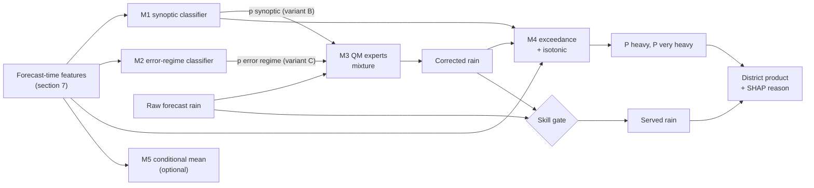
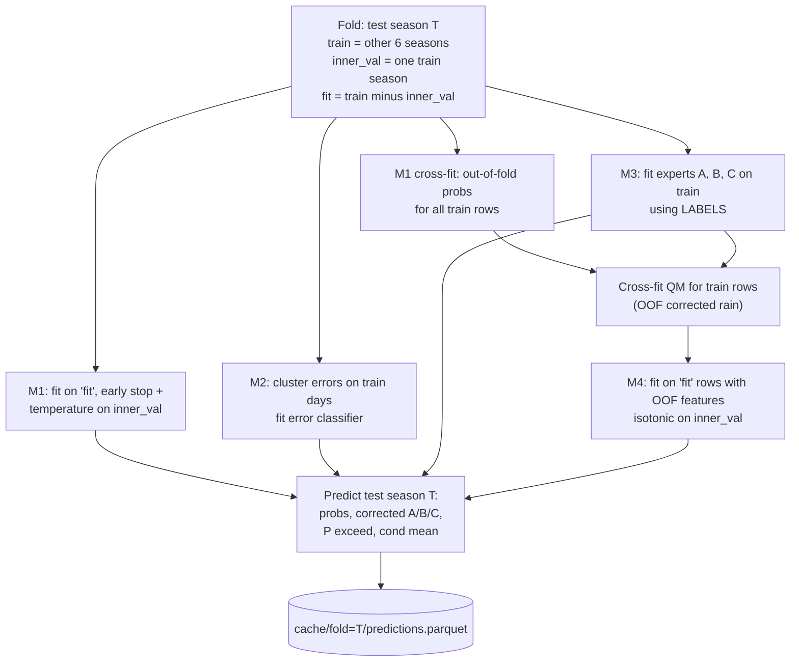
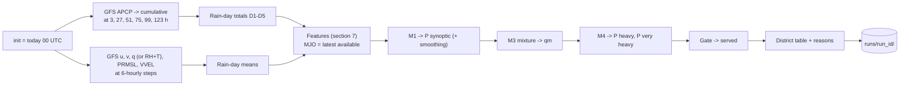
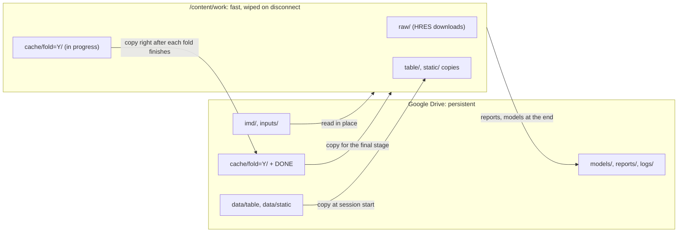
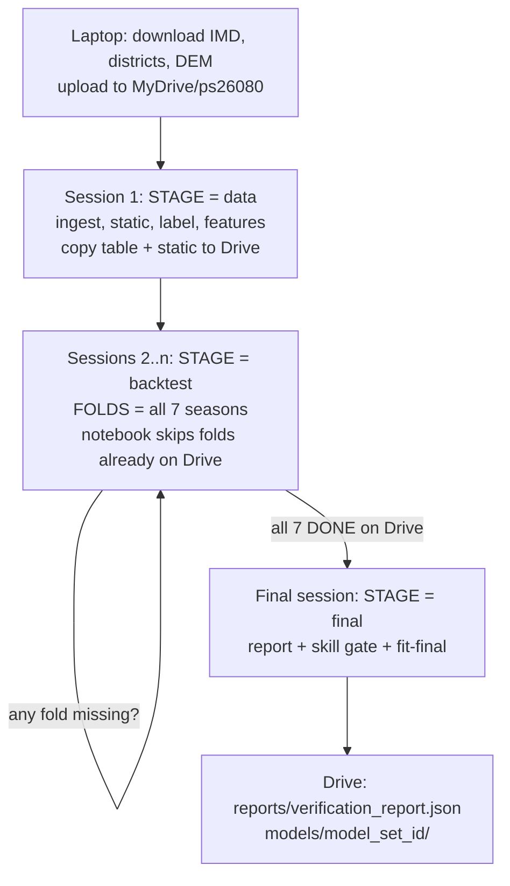
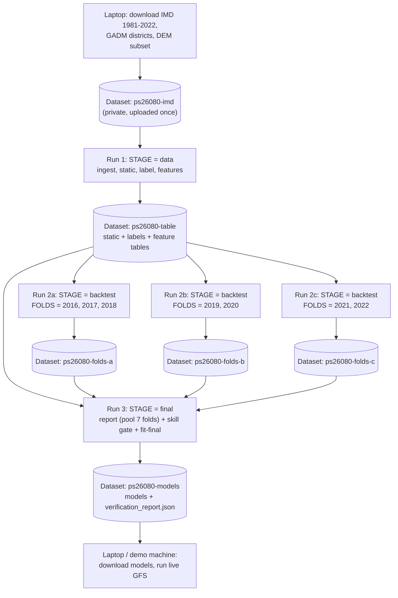

# Model Specification & Build Guide — SIH26080

**How to build every model in the Regime-Aware Rainfall Post-Processing system, step by step, with code.**

| | |
|---|---|
| Revision | B · 29 September 2026 |
| Binding documents | `PRD.md` (what/why, FR-IDs), `TECHNICAL_SPEC.md` (TRD: grids, schemas, modules, CLI) |
| Plain-language explainer | `docs/SOLUTION_EXPLAINED_80.md` |
| Package | `regimerain` |

> **How to use this guide.** Follow the sections in order; each one ends with a **Definition of Done (DoD)**. Code blocks are reference implementations meant to be copied into the module named in the block's first comment, then adapted. Anything marked **VERIFY** is an assumption about an external dataset or library that must be checked in Phase 0 before relying on it. No number in this guide is a result; results only come from `verification_report.json`.

---

## Contents

1. [What you are building](#1-what-you-are-building)
2. [Environment setup](#2-environment-setup)
3. [Phase 0: data checks](#3-phase-0-data-checks)
4. [Ingest: forecasts and truth](#4-ingest-forecasts-and-truth)
5. [Static layers: terrain, coast, geo class, zones](#5-static-layers-terrain-coast-geo-class-zones)
6. [Regime labels](#6-regime-labels)
7. [Features](#7-features)
8. [Training table and LOMO folds](#8-training-table-and-lomo-folds)
9. [Model 1: synoptic regime classifier](#9-model-1-synoptic-regime-classifier)
10. [Model 2: error-regime discovery and classifier](#10-model-2-error-regime-discovery-and-classifier)
11. [Model 3: quantile-mapping experts (the corrector)](#11-model-3-quantile-mapping-experts-the-corrector)
12. [Model 4: heavy-rain exceedance models (+ conditional mean)](#12-model-4-heavy-rain-exceedance-models--conditional-mean)
13. [Verification and the backtest loop](#13-verification-and-the-backtest-loop)
14. [Skill gate](#14-skill-gate)
15. [Explanations](#15-explanations)
16. [District aggregation](#16-district-aggregation)
17. [Final fit, artefacts and traceability](#17-final-fit-artefacts-and-traceability)
18. [Live inference on GFS](#18-live-inference-on-gfs)
19. [Configuration reference](#19-configuration-reference)
20. [Tuning without cheating](#20-tuning-without-cheating)
21. [Pitfalls checklist](#21-pitfalls-checklist)
22. [Build checklist](#22-build-checklist)
23. [Training on Google Colab (primary)](#23-training-on-google-colab-primary)
24. [Alternative: training on Kaggle](#24-alternative-training-on-kaggle)

---

## 1. What you are building

### 1.1 Model inventory

| # | Model | Type | Input | Output | Trained on | Section |
|---|---|---|---|---|---|---|
| M1 | Synoptic regime classifier | LightGBM multi-class (4) + temperature scaling + spatial smoothing | Forecast-time features per cell | p(active, break, depression, normal) | Cell-days, labels from IMD rain + tracks | §9 |
| M2 | Error-regime model | Standardiser → PCA → k-means (discovery) + LightGBM multi-class (prediction) | Error descriptors (training only) / day-level forecast features | Error-regime probabilities per day | Days | §10 |
| M3 | Quantile-mapping experts | Empirical CDF + GPD tail + hierarchical shrinkage, blended as a mixture | Raw forecast rain + regime probabilities | Corrected rain | Pooled cell-days per expert key | §11 |
| M4 | Exceedance models | LightGBM binary ×2 + isotonic calibration | Features + corrected rain + regime probabilities | P(≥64.5), P(≥115.6) | Cell-days | §12 |
| M5 | Conditional-mean regressor (optional) | LightGBM Tweedie | Same as M4 | E[rain \| features] | Cell-days | §12.5 |
| — | Skill gate | Statistical rule table | LOMO verification statistics | ON / NEUTRAL / OFF per district × regime × lead | — | §14 |

### 1.2 How the models connect



### 1.3 How training works (one LOMO fold)



All seven folds' test predictions are pooled for verification (§13) and the skill gate (§14). Then everything is refitted on all seasons for live use (§17).

---

## 2. Environment setup

Windows note: `cfgrib`/`eccodes` (for GFS GRIB) are painless only through **conda-forge**, so use conda/mamba. WSL2 also works.

```bash
mamba create -n regimerain -c conda-forge python=3.11 \
  numpy scipy pandas pyarrow xarray zarr dask gcsfs netcdf4 h5netcdf \
  scikit-learn lightgbm geopandas shapely rioxarray rasterio \
  cfgrib eccodes herbie-data matplotlib pyyaml pydantic \
  fastapi uvicorn pytest
mamba activate regimerain
pip install imdlib
```

Pin versions once the environment works:

```bash
mamba env export --no-builds > environment.lock.yml
```

**Hardware:** a 16 GB RAM laptop with 8 cores is enough in `fast` mode (§19). Disk: ~20 GB free.

**DoD:** `python -c "import lightgbm, xarray, gcsfs, imdlib, herbie, geopandas"` runs without error.

---

## 3. Phase 0: data checks

Run these **before** writing pipeline code. Record the answers in `docs/PHASE0_FINDINGS.md`.

```python
# scripts/phase0_check.py
import xarray as xr

# 1) WeatherBench2 HRES: variables, lead spacing, lat order.  VERIFY path by listing the bucket:
#    gsutil ls gs://weatherbench2/datasets/hres/
HRES = "gs://weatherbench2/datasets/hres/2016-2022-0012-1440x721.zarr"
ds = xr.open_zarr(HRES, storage_options={"token": "anon"})
print(list(ds.data_vars))                     # look for total_precipitation_6hr / _24hr / total_precipitation
print(ds.prediction_timedelta.values[:6])     # expect 0h, 6h, 12h ...
print(ds.latitude.values[:3], ds.longitude.values[:3])
print(ds.level.values if "level" in ds.dims else "no level dim")
for v in ds.data_vars:
    print(v, ds[v].attrs.get("units"), ds[v].dims)
```

| Check | Expected / action |
|---|---|
| HRES precipitation variable | A 6-hour accumulation (`total_precipitation_6hr`, metres) **or** accumulation since init. Pick the matching branch of §4.2 |
| HRES levels | Must include 1000, 925, 850, 700, 600, 500, 400, 300 hPa for moisture integrals |
| HRES variables | `u_component_of_wind`, `v_component_of_wind`, `specific_humidity`, `mean_sea_level_pressure`, `vertical_velocity` (names **VERIFY**) |
| IMD download | `imdlib.get_data("rain", 2016, 2016, ...)` succeeds from the team network |
| IMD date convention | Run §4.3's lag check |
| IBTrACS NI CSV | Downloads; `NEWDELHI_GRADE` column present |
| LPS dataset | Locate host (Zenodo/GitHub for Vishnu et al. 2020, or Hurley & Boos 2015). If not found, use the §6.3 tracker |
| MJO RMM | BOM `rmm.74toRealtime.txt` downloads (**VERIFY** URL) |
| GFS | `Herbie(<yesterday>, model="gfs", product="pgrb2.0p25", fxx=6).inventory(":APCP:")` lists the APCP windows |
| DEM | ETOPO 2022 (60″) or GMTED2010 GeoTIFF downloaded |
| Districts | GADM 4.1 India level-2 downloaded; licence noted |

**DoD:** every row answered in `PHASE0_FINDINGS.md`.

---

## 4. Ingest: forecasts and truth

### 4.1 Open and subset HRES

```python
# regimerain/ingest/hres.py
import numpy as np
import xarray as xr

RAIN_BOX = (6.5, 38.5, 66.5, 100.0)      # lat0, lat1, lon0, lon1
DYN_BOX = (0.0, 40.0, 40.0, 110.0)

def open_hres(url: str) -> xr.Dataset:
    ds = xr.open_zarr(url, storage_options={"token": "anon"})
    ds = ds.sortby("latitude")                           # ascending lat everywhere
    ds = ds.rename({"latitude": "lat", "longitude": "lon", "time": "init"})
    return ds.sel(init=ds.init.dt.hour == 0)             # 00 UTC runs only

def subset(ds: xr.Dataset, box) -> xr.Dataset:
    lat0, lat1, lon0, lon1 = box
    return ds.sel(lat=slice(lat0, lat1), lon=slice(lon0, lon1))

def season_inits(ds: xr.Dataset, year: int, max_lead: int = 5) -> xr.Dataset:
    # valid rain days 1 Jun..30 Sep -> init dates from (1 Jun - (max_lead-1) d) to 30 Sep
    start = np.datetime64(f"{year}-06-01") - np.timedelta64(max_lead - 1, "D")
    end = np.datetime64(f"{year}-09-30")
    return ds.sel(init=slice(start, end))
```

### 4.2 Align forecast precipitation to the IMD rain day (03–03 UTC)

HRES leads are 6-hourly (0, 6, 12, …), but the rain day boundaries are at 03 UTC (lead hours 3, 27, 51, …). We interpolate **cumulative** precipitation linearly to those hours. This is equivalent to assuming a constant rain rate within each 6-hour block, and it is disclosed as an approximation.

```python
# regimerain/ingest/align.py
import numpy as np
import xarray as xr

def to_hours(da: xr.DataArray) -> xr.DataArray:
    hrs = (da.prediction_timedelta / np.timedelta64(1, "h")).astype("float64")
    return da.assign_coords(hour=("prediction_timedelta", hrs.values)).swap_dims(
        prediction_timedelta="hour").drop_vars("prediction_timedelta")

def cumulative_from_6h(tp6: xr.DataArray) -> xr.DataArray:
    """tp6: 6-hour accumulation ending at each lead (metres). Returns cumulative since init (m)."""
    tp6 = to_hours(tp6).clip(min=0)
    tp6 = tp6.sel(hour=tp6.hour > 0)
    cum = tp6.cumsum("hour")
    zero = xr.zeros_like(cum.isel(hour=0)).assign_coords(hour=0.0)
    return xr.concat([zero, cum], dim="hour")

def rainday_totals(cum: xr.DataArray, leads=(1, 2, 3, 4, 5)) -> xr.DataArray:
    """cum: cumulative precip since init with a float 'hour' coord. Returns mm per rain day."""
    out = []
    for L in leads:
        a, b = 3.0 + 24 * (L - 1), 27.0 + 24 * (L - 1)
        tot = cum.interp(hour=b) - cum.interp(hour=a)
        out.append(tot.drop_vars("hour").expand_dims(lead=[L]))
    rain = (xr.concat(out, dim="lead") * 1000.0).clip(min=0.0)       # m -> mm
    valid = rain.init.dt.floor("D") + (rain.lead - 1) * np.timedelta64(1, "D")
    return rain.assign_coords(valid=valid).rename("f_rain").astype("float32")
```

If the store has **accumulation since init** instead, skip `cumulative_from_6h` and call `rainday_totals(to_hours(tp))` directly.

**Dynamics** (instantaneous fields) are averaged over the four 6-hourly times inside the rain day, hours 6, 12, 18 and 24 (+24(L−1)):

```python
def rainday_mean_instant(da: xr.DataArray, leads=(1, 2, 3, 4, 5)) -> xr.DataArray:
    da = to_hours(da)
    out = []
    for L in leads:
        hrs = [h + 24 * (L - 1) for h in (6, 12, 18, 24)]
        out.append(da.sel(hour=hrs).mean("hour").expand_dims(lead=[L]))
    return xr.concat(out, dim="lead")
```

Write per season: `data/raw/hres/rain_{year}.zarr` (rain domain) and `data/raw/hres/dyn_{year}.zarr` (dynamics domain; u, v at 850 hPa; q, u, v at 1000–300 hPa; mslp; w at 500 hPa).

### 4.3 IMD gridded rainfall (primary truth)

```python
# regimerain/ingest/imd.py
import imdlib as imd
import xarray as xr

def download_imd(start: int, end: int, out_dir: str = "data/raw/imd"):
    imd.get_data("rain", start, end, fn_format="yearwise", file_dir=out_dir)

def open_imd(start: int, end: int, out_dir: str = "data/raw/imd") -> xr.DataArray:
    data = imd.open_data("rain", start, end, "yearwise", out_dir)
    rain = data.get_xarray()["rain"]
    rain = rain.where(rain > -998.0)                      # -999 = missing / ocean
    rain = rain.sortby("lat").astype("float32")
    return rain.rename("o_rain")                          # dims: time, lat, lon (mm/day)
```

**IMD date convention (VERIFY empirically).** We need to know whether IMD's value on date D is the rain day starting D 03 UTC or ending D 03 UTC. Test both by correlation with the Day-1 forecast:

```python
# scripts/imd_offset_check.py
import numpy as np
import xarray as xr

def best_imd_offset(f_rain_d1: xr.DataArray, o_rain: xr.DataArray, land) -> int:
    """f_rain_d1: Day-1 forecast indexed by valid (rain-day start date).
    Returns k such that IMD date = valid + k days best matches."""
    f = f_rain_d1.where(land).mean(["lat", "lon"]).to_series()
    o = o_rain.where(land).mean(["lat", "lon"]).to_series()
    scores = {}
    for k in (-1, 0, 1):
        o_shift = o.copy(); o_shift.index = o_shift.index - np.timedelta64(k, "D")
        j = f.to_frame("f").join(o_shift.to_frame("o"), how="inner")
        scores[k] = j["f"].corr(j["o"])
    print(scores)
    return max(scores, key=scores.get)
```

Store the answer as `imd_date_offset_days` in the config. The truth for rain day `valid` is then IMD at `valid + offset`.

### 4.4 CHIRPS fallback (conservative regrid without xESMF)

CHIRPS 0.05° → 0.25° with exact area overlap. On a regular grid this is separable, so no ESMF is needed (useful on Windows).

```python
# regimerain/ingest/chirps.py
import numpy as np
import xarray as xr

def edges(c):
    c = np.asarray(c, float); d = np.diff(c).mean()
    return np.concatenate([[c[0] - d / 2], (c[:-1] + c[1:]) / 2, [c[-1] + d / 2]])

def overlap_matrix(src_c, dst_c, is_lat=False):
    se, de = edges(src_c), edges(dst_c)
    W = np.zeros((len(dst_c), len(src_c)))
    for i in range(len(dst_c)):
        lo = np.maximum(de[i], se[:-1]); hi = np.minimum(de[i + 1], se[1:])
        ov = np.clip(hi - lo, 0, None)
        if is_lat:   # area on a sphere is proportional to the difference of sin(lat)
            ov = np.clip(np.sin(np.deg2rad(hi)) - np.sin(np.deg2rad(lo)), 0, None)
        W[i] = ov
    return W

def conservative_regrid(da: xr.DataArray, lat_out, lon_out) -> xr.DataArray:
    Wy = overlap_matrix(da.lat.values, lat_out, is_lat=True)
    Wx = overlap_matrix(da.lon.values, lon_out)
    vals = np.nan_to_num(da.values); valid = (~np.isnan(da.values)).astype(float)
    num = np.einsum("yi,tij,xj->tyx", Wy, vals, Wx)
    den = np.einsum("yi,tij,xj->tyx", Wy, valid, Wx)
    out = np.where(den > 0, num / np.where(den > 0, den, 1), np.nan)
    return xr.DataArray(out.astype("float32"), dims=("time", "lat", "lon"),
                        coords={"time": da.time, "lat": lat_out, "lon": lon_out}, name="o_rain")
```

CHIRPS files: `https://data.chc.ucsb.edu/products/CHIRPS-2.0/global_daily/netcdf/p05/chirps-v2.0.{year}.days_p05.nc`. Subset to the rain box **before** regridding. CHIRPS days are not 03–03 UTC; the offset is disclosed when CHIRPS is used.

### 4.5 Tracks and MJO

```python
# regimerain/ingest/tracks.py
import pandas as pd

IBTRACS_NI = ("https://www.ncei.noaa.gov/data/international-best-track-archive-for-climate-stewardship-ibtracs/"
              "v04r01/access/csv/ibtracs.NI.list.v04r01.csv")          # VERIFY version string

def load_ibtracs_ni(url=IBTRACS_NI) -> pd.DataFrame:
    df = pd.read_csv(url, skiprows=[1], low_memory=False, na_values=[" ", ""])   # row 1 = units
    df = df[["SID", "ISO_TIME", "LAT", "LON", "NEWDELHI_GRADE", "NEWDELHI_WIND"]].dropna(subset=["LAT", "LON"])
    df.columns = ["sid", "time", "lat", "lon", "grade", "wind_kt"]
    df["time"] = pd.to_datetime(df["time"])
    df["lat"] = df["lat"].astype(float); df["lon"] = df["lon"].astype(float)
    return df[(df.time.dt.month.between(5, 10)) & (df.time.dt.year.between(2015, 2022))]
```

```python
# regimerain/ingest/mjo.py
import pandas as pd

RMM_URL = "http://www.bom.gov.au/climate/mjo/graphics/rmm.74toRealtime.txt"   # VERIFY

def load_rmm(url=RMM_URL) -> pd.DataFrame:
    df = pd.read_csv(url, sep=r"\s+", skiprows=2, header=None, usecols=range(7),
                     names=["year", "month", "day", "rmm1", "rmm2", "phase", "amplitude"])
    df["date"] = pd.to_datetime(df[["year", "month", "day"]])
    df = df[(df.amplitude < 100)]                                   # drop 999/1e36 missing flags
    return df[["date", "rmm1", "rmm2", "phase", "amplitude"]]
```

**DoD (§4):** `rain_{year}.zarr` for 2016–2022 with dims `(init, lead, lat, lon)` and a `valid` coord; `test_align_rainday` passes; IMD 1981–2022 on disk; offset chosen; tracks and RMM as parquet.

---

## 5. Static layers: terrain, coast, geo class, zones

### 5.1 Terrain descriptors from a DEM

```python
# regimerain/static/dem.py
import numpy as np
import pandas as pd
import rioxarray  # noqa: F401  (registers .rio)
import xarray as xr

R_EARTH = 6.371e6

def dem_descriptors(dem_path: str, lat_c: np.ndarray, lon_c: np.ndarray, flow_to_deg: float = 70.0):
    """Aggregate a fine DEM to 0.25-degree cells: mean, std, slope, windward index."""
    dem = xr.open_dataarray(dem_path, engine="rasterio").squeeze(drop=True)
    dem = dem.rename({"y": "lat", "x": "lon"}).sortby("lat")
    dem = dem.sel(lat=slice(lat_c[0] - 0.125, lat_c[-1] + 0.125), lon=slice(lon_c[0] - 0.125, lon_c[-1] + 0.125))
    h = dem.values.astype("float64"); h[h < 0] = 0.0                 # sea -> 0 m
    lat, lon = dem.lat.values, dem.lon.values
    dy = R_EARTH * np.deg2rad(np.gradient(lat))[:, None]
    dx = R_EARTH * np.cos(np.deg2rad(lat))[:, None] * np.deg2rad(np.gradient(lon))[None, :]
    dhdy = np.gradient(h, axis=0) / dy
    dhdx = np.gradient(h, axis=1) / dx
    slope = np.degrees(np.arctan(np.hypot(dhdx, dhdy)))
    ux, uy = np.sin(np.deg2rad(flow_to_deg)), np.cos(np.deg2rad(flow_to_deg))   # SW monsoon flow toward ENE
    upslope = np.clip(ux * dhdx + uy * dhdy, 0, None)

    iy = np.floor((lat - (lat_c[0] - 0.125)) / 0.25).astype(int)
    ix = np.floor((lon - (lon_c[0] - 0.125)) / 0.25).astype(int)
    IY, IX = np.meshgrid(iy, ix, indexing="ij")
    df = pd.DataFrame({"iy": IY.ravel(), "ix": IX.ravel(), "h": h.ravel(),
                       "slope": slope.ravel(), "up": upslope.ravel()})
    df = df[(df.iy >= 0) & (df.iy < len(lat_c)) & (df.ix >= 0) & (df.ix < len(lon_c))]
    g = df.groupby(["iy", "ix"]).agg(elev_mean=("h", "mean"), elev_std=("h", "std"),
                                     slope_mean=("slope", "mean"), windward=("up", "mean"))
    out = {}
    for col in g.columns:
        arr = np.full((len(lat_c), len(lon_c)), np.nan, "float32")
        arr[g.index.get_level_values(0), g.index.get_level_values(1)] = g[col].values
        out[col] = (("lat", "lon"), arr)
    return xr.Dataset(out, coords={"lat": lat_c, "lon": lon_c})
```

### 5.2 Distance to coast

```python
# regimerain/static/coast.py
import numpy as np
from scipy import ndimage

def dist_to_coast_km(h_fine: np.ndarray, lat_fine: np.ndarray, pix_deg: float) -> np.ndarray:
    """h_fine: fine DEM (m, sea<=0). Returns distance (km) from each land pixel to the nearest open-sea pixel."""
    sea = h_fine <= 0
    lab, _ = ndimage.label(sea)
    border = np.unique(np.concatenate([lab[0], lab[-1], lab[:, 0], lab[:, -1]]))
    open_sea = np.isin(lab, border[border > 0])            # drop inland depressions/lakes
    d_pix = ndimage.distance_transform_edt(~open_sea)
    km_per_pix = 111.2 * pix_deg * np.sqrt((1 + np.cos(np.deg2rad(lat_fine))[:, None] ** 2) / 2)  # rough isotropic
    return d_pix * km_per_pix
```

Aggregate to 0.25° with the **minimum** per cell (a cell "touches" the coast if any part is near it), using the same `iy/ix` grouping as §5.1.

### 5.3 Geographic class

```python
# regimerain/static/geo.py
import numpy as np

def geo_class(elev_mean, elev_std, windward, dist_coast_km, cfg) -> np.ndarray:
    oro = (elev_std > cfg["oro_elev_std_m"]) | ((windward > cfg["oro_windward"]) & (elev_mean > cfg["oro_min_elev_m"]))
    coastal = (~oro) & (dist_coast_km <= cfg["coastal_km"])
    return np.where(oro, 2, np.where(coastal, 1, 0)).astype("int8")   # 0 plains, 1 coastal, 2 orographic
```

Defaults: `oro_elev_std_m=150`, `oro_windward=0.02`, `oro_min_elev_m=300`, `coastal_km=50`. **Sanity-check by plotting**: the Western Ghats, NE hills, Himalayan foothills and Eastern Ghats should be orographic; the Konkan, Karnataka, Kerala, Tamil Nadu, Andhra, Odisha and Bengal coasts coastal.

### 5.4 Zones (IMD homogeneous monsoon regions)

Rasterise from states via the district weights (§16), taking the state with the largest weight per cell.

```python
# regimerain/static/zones.py
ZONE_OF_STATE = {
    # 0 Northwest
    "jammu and kashmir": 0, "ladakh": 0, "himachal pradesh": 0, "uttarakhand": 0, "punjab": 0,
    "chandigarh": 0, "haryana": 0, "nct of delhi": 0, "delhi": 0, "uttar pradesh": 0, "rajasthan": 0,
    # 1 Central
    "gujarat": 1, "dadra and nagar haveli and daman and diu": 1, "dadra and nagar haveli": 1, "daman and diu": 1,
    "madhya pradesh": 1, "chhattisgarh": 1, "maharashtra": 1, "goa": 1, "odisha": 1,
    # 2 South Peninsula
    "andhra pradesh": 2, "telangana": 2, "karnataka": 2, "kerala": 2, "tamil nadu": 2,
    "puducherry": 2, "lakshadweep": 2, "andaman and nicobar": 2, "andaman and nicobar islands": 2,
    # 3 East & Northeast
    "bihar": 3, "jharkhand": 3, "west bengal": 3, "sikkim": 3, "assam": 3, "meghalaya": 3,
    "arunachal pradesh": 3, "nagaland": 3, "manipur": 3, "mizoram": 3, "tripura": 3,
}
# VERIFY against IMD's subdivision -> region list; log any GADM state name not found here.
```

**DoD (§5):** `data/static/static.nc` holds all TRD §3.2 variables; a PNG of `geo` and `zone` has been checked by eye.

---

## 6. Regime labels

Labels use **observations** and exist only for training and evaluation. They never enter a feature matrix.

### 6.1 Active / break

```python
# regimerain/label/active_break.py
import numpy as np
import xarray as xr

CMZ = dict(lat=slice(18, 28), lon=slice(65, 88))

def cmz_series(o_rain: xr.DataArray, land: xr.DataArray) -> xr.DataArray:
    box = o_rain.sel(**CMZ).where(land.sel(**CMZ))
    w = np.cos(np.deg2rad(box.lat))
    return box.weighted(w).mean(["lat", "lon"])

def _circ_smooth(x: xr.DataArray, window: int = 31) -> xr.DataArray:
    v = x.values; n = len(v); p = window // 2
    padded = np.concatenate([v[-p:], v, v[:p]])
    sm = np.convolve(padded, np.ones(window) / window, mode="valid")
    return x.copy(data=sm[:n])

def standardised_anomaly(R: xr.DataArray, clim=(1981, 2015)) -> xr.DataArray:
    base = R.sel(time=R.time.dt.year.isin(range(clim[0], clim[1] + 1)))
    g = base.groupby("time.dayofyear")
    mu, sd = _circ_smooth(g.mean()), _circ_smooth(g.std())
    doy = R.time.dt.dayofyear
    z = (R - mu.sel(dayofyear=doy)) / sd.sel(dayofyear=doy)
    return z.drop_vars("dayofyear")

def runs_at_least(mask: np.ndarray, k: int) -> np.ndarray:
    out = np.zeros_like(mask, dtype=bool); i, n = 0, len(mask)
    while i < n:
        if mask[i]:
            j = i
            while j < n and mask[j]:
                j += 1
            if j - i >= k:
                out[i:j] = True
            i = j
        else:
            i += 1
    return out

def active_break(z: xr.DataArray, thr: float = 1.0, k: int = 3) -> xr.DataArray:
    """Returns int8 per day: 0 active, 1 break, 3 normal (2 is reserved for depression)."""
    lab = np.full(z.sizes["time"], 3, "int8")
    for yr in np.unique(z.time.dt.year):                      # run-lengths do not cross years
        idx = np.where(z.time.dt.year.values == yr)[0]
        zz = z.values[idx]
        lab[idx[runs_at_least(zz > thr, k)]] = 0
        lab[idx[runs_at_least(zz < -thr, k)]] = 1
    return xr.DataArray(lab, coords={"time": z.time}, dims="time", name="ab")
```

### 6.2 Depression (cell-level)

```python
# regimerain/label/depression.py
import numpy as np
import pandas as pd

def haversine_km(lat1, lon1, lat2, lon2):
    p1, p2 = np.deg2rad(lat1), np.deg2rad(lat2)
    dphi, dl = p2 - p1, np.deg2rad(lon2 - lon1)
    a = np.sin(dphi / 2) ** 2 + np.cos(p1) * np.cos(p2) * np.sin(dl / 2) ** 2
    return 2 * 6371.0 * np.arcsin(np.sqrt(a))

def depression_mask(tracks: pd.DataFrame, days: pd.DatetimeIndex, lat, lon, radius_km=500.0) -> np.ndarray:
    """tracks: time, lat, lon (IBTrACS NI + LPS). days: rain-day start dates. Returns bool (day, lat, lon)."""
    LAT, LON = np.meshgrid(lat, lon, indexing="ij")
    out = np.zeros((len(days), len(lat), len(lon)), bool)
    for i, d in enumerate(days):
        t0 = d + pd.Timedelta(hours=3); t1 = t0 + pd.Timedelta(hours=24)
        pts = tracks[(tracks.time >= t0) & (tracks.time < t1)]
        for la, lo in zip(pts.lat.values, pts.lon.values):
            out[i] |= haversine_km(LAT, LON, la, lo) <= radius_km
    return out
```

### 6.3 Fallback monsoon-low tracker (if no LPS dataset)

A simple ERA5 850 hPa vorticity tracker. It is a proxy, and it is disclosed as one.

```python
# regimerain/label/tracker.py
import numpy as np
import pandas as pd
from scipy import ndimage

def track_lows(vort850: np.ndarray, times, lat, lon, zeta_min=1.0e-5, box=(10, 30, 65, 95),
               sigma_cells=4, link_km=500, min_fixes=4) -> pd.DataFrame:
    """vort850: (time, lat, lon) 6-hourly ERA5 relative vorticity (s^-1). Returns track fixes."""
    from regimerain.label.depression import haversine_km
    fixes = []
    for t, z in zip(times, vort850):
        zs = ndimage.gaussian_filter(z, sigma_cells)
        peak = (zs == ndimage.maximum_filter(zs, size=2 * sigma_cells + 1)) & (zs >= zeta_min)
        for iy, ix in zip(*np.nonzero(peak)):
            if box[0] <= lat[iy] <= box[1] and box[2] <= lon[ix] <= box[3]:
                fixes.append((pd.Timestamp(t), lat[iy], lon[ix]))
    df = pd.DataFrame(fixes, columns=["time", "lat", "lon"]).sort_values("time")
    # greedy linking of consecutive fixes into tracks
    tid, last, ids = 0, {}, []
    for r in df.itertuples():
        best = None
        for k, (tt, la, lo) in last.items():
            if pd.Timedelta(0) < r.time - tt <= pd.Timedelta(hours=6) and haversine_km(la, lo, r.lat, r.lon) <= link_km:
                best = k
                break
        if best is None:
            tid += 1; best = tid
        last[best] = (r.time, r.lat, r.lon); ids.append(best)
    df["sid"] = ids
    return df[df.groupby("sid").sid.transform("size") >= min_fixes]
```

### 6.4 Combine into `y_synoptic`

```python
# regimerain/label/combine.py
import numpy as np

def synoptic_labels(ab_by_day: np.ndarray, dep_mask: np.ndarray) -> np.ndarray:
    """ab_by_day: (day,) in {0 active, 1 break, 3 normal}; dep_mask: (day, lat, lon) bool.
    Returns (day, lat, lon) int8 in {0 active, 1 break, 2 depression, 3 normal}."""
    lab = np.broadcast_to(ab_by_day[:, None, None], dep_mask.shape).copy()
    lab[dep_mask] = 2
    return lab.astype("int8")
```

Also store a **day-level** label (used for FSS slicing and the error-regime crosstab): `depression` if ≥ 5% of land cells are depression, else the active/break/normal value.

**DoD (§6):** `label_counts.csv` written; per season, active and break days fall roughly in July–August runs; depression cells cluster along the Bay of Bengal → central India track. Plot 2019 as a check.

---

## 7. Features

### 7.1 Physics helpers

```python
# regimerain/features/dynamics.py
import numpy as np
from scipy import ndimage

R = 6.371e6
G = 9.80665

def ddx(f, lat, lon):
    dx = R * np.cos(np.deg2rad(lat))[:, None] * np.deg2rad(np.gradient(lon))[None, :]
    return np.gradient(f, axis=-1) / dx

def ddy(f, lat):
    dy = R * np.deg2rad(np.gradient(lat))[:, None]
    return np.gradient(f, axis=-2) / dy

def rel_vorticity(u, v, lat, lon):
    return ddx(v, lat, lon) - ddy(u, lat)

def column_integrals(q, u, v, p_hpa):
    """q,u,v: (level, lat, lon) at pressure levels p_hpa. Returns PW (mm), IVTx, IVTy (kg m-1 s-1)."""
    order = np.argsort(p_hpa); p = np.asarray(p_hpa)[order] * 100.0       # ascending Pa
    q, u, v = q[order], u[order], v[order]
    pw = np.trapz(q, p, axis=0) / G
    ivtx = np.trapz(q * u, p, axis=0) / G
    ivty = np.trapz(q * v, p, axis=0) / G
    return pw, ivtx, ivty

def imfc_mm_day(ivtx, ivty, lat, lon):
    div = ddx(ivtx, lat, lon) + ddy(ivty, lat)
    return -div * 86400.0                                          # kg m-2 day-1 == mm/day

def box_mean(field, lat, lon, box):
    la = (lat >= box[0]) & (lat <= box[1]); lo = (lon >= box[2]) & (lon <= box[3])
    w = np.cos(np.deg2rad(lat[la]))[:, None] * np.ones(lo.sum())[None, :]
    sub = field[np.ix_(la, lo)]
    return float(np.nansum(sub * w) / np.nansum(w * ~np.isnan(sub)))

def trough_latitude(mslp, lat, lon, lon_band=(75, 85), lat_band=(15, 32)):
    lo = (lon >= lon_band[0]) & (lon <= lon_band[1]); la = (lat >= lat_band[0]) & (lat <= lat_band[1])
    prof = ndimage.uniform_filter1d(mslp[:, lo].mean(axis=1), 5)[la]
    return float(lat[la][np.argmin(prof)])
```

### 7.2 Domain indices (one value per init × lead)

| Feature | Definition | Default box (config) |
|---|---|---|
| `f_llj_index` | Mean u850 | 5–15°N, 50–70°E (Arabian Sea low-level jet) |
| `f_trough_lat` | Latitude of min MSLP, zonal mean over 75–85°E, searched 15–32°N | as shown |
| `f_bob_vort_max` | Max smoothed ζ850 | 15–25°N, 80–95°E (Bay of Bengal genesis region) |

### 7.3 Cell-level features

| Feature | Definition |
|---|---|
| `f_rain` | Rain-day forecast (mm) |
| `f_rain_nbr{3,5}_{mean,max}` | `uniform_filter` / `maximum_filter` of `f_rain` with size 3 and 5, `mode="nearest"` |
| `f_u850`, `f_v850`, `f_ws850` | Rain-day mean winds at 850 hPa, and speed |
| `f_vort850_max500km` | `maximum_filter(gaussian_filter(ζ850, 2), size=37)`; 37 cells ≈ ±500 km |
| `f_dist_mslp_min_km` | Great-circle distance to the MSLP minimum within 10–30°N, 70–95°E |
| `f_mslp_anom` | MSLP minus the rain-domain mean MSLP |
| `f_pw`, `f_ivt`, `f_imfc` | Precipitable water, IVT magnitude, moisture-flux convergence (mm/day) |
| `f_w500` | 500 hPa omega (Pa/s; negative = ascent) |
| `mjo_rmm1`, `mjo_rmm2`, `mjo_amp`, `mjo_phase` | RMM on the **init date** (known at forecast time) |
| `doy_sin`, `doy_cos` | Of the valid date |
| static | `lat`, `lon`, `geo`, `zone`, `elev_mean`, `elev_std`, `slope_mean`, `windward`, `dist_coast_km` |
| `lead` | 1–5 |

### 7.4 Build the table

```python
# regimerain/features/build.py  (sketch of the per-(season, lead) loop)
import numpy as np
import pandas as pd
import xarray as xr
from scipy import ndimage
from regimerain.features import dynamics as dyn

def cell_frame(arrs: dict, land: np.ndarray, lat, lon) -> pd.DataFrame:
    iy, ix = np.nonzero(land)
    df = pd.DataFrame({"lat_idx": iy.astype("int16"), "lon_idx": ix.astype("int16"),
                       "lat": lat[iy].astype("float32"), "lon": lon[ix].astype("float32")})
    for k, a in arrs.items():
        df[k] = np.asarray(a)[iy, ix].astype("float32") if np.ndim(a) == 2 else np.float32(a)
    return df

def build_one(init, lead, rain2d, dyn_ds, static, rmm_row, o2d, ysyn2d, cfg) -> pd.DataFrame:
    lat_r, lon_r = static.lat.values, static.lon.values
    land = static.land.values
    # dynamics on the big domain
    D = dyn_ds.sel(init=init, lead=lead)
    latd, lond = D.lat.values, D.lon.values
    u850, v850 = D.u850.values, D.v850.values
    zeta = dyn.rel_vorticity(u850, v850, latd, lond)
    pw, ivx, ivy = dyn.column_integrals(D.q.values, D.u.values, D.v.values, D.level.values)
    imfc = dyn.imfc_mm_day(ivx, ivy, latd, lond)
    mslp = D.mslp.values / 100.0
    idx = {
        "f_llj_index": dyn.box_mean(u850, latd, lond, cfg["llj_box"]),
        "f_trough_lat": dyn.trough_latitude(mslp, latd, lond),
        "f_bob_vort_max": float(np.nanmax(ndimage.gaussian_filter(zeta, 2)[
            np.ix_((latd >= 15) & (latd <= 25), (lond >= 80) & (lond <= 95))])),
    }
    # cut dynamics to the rain grid (same 0.25-degree lattice)
    cut = lambda a: xr.DataArray(a, coords={"lat": latd, "lon": lond}, dims=("lat", "lon")).sel(
        lat=lat_r, lon=lon_r).values
    zeta_r = cut(ndimage.maximum_filter(ndimage.gaussian_filter(zeta, 2), size=37))
    arrs = {
        "f_rain": rain2d,
        "f_rain_nbr3_mean": ndimage.uniform_filter(rain2d, 3, mode="nearest"),
        "f_rain_nbr3_max": ndimage.maximum_filter(rain2d, 3, mode="nearest"),
        "f_rain_nbr5_mean": ndimage.uniform_filter(rain2d, 5, mode="nearest"),
        "f_rain_nbr5_max": ndimage.maximum_filter(rain2d, 5, mode="nearest"),
        "f_u850": cut(u850), "f_v850": cut(v850), "f_ws850": np.hypot(cut(u850), cut(v850)),
        "f_vort850_max500km": zeta_r,
        "f_mslp_anom": cut(mslp) - np.nanmean(cut(mslp)),
        "f_pw": cut(pw), "f_ivt": np.hypot(cut(ivx), cut(ivy)), "f_imfc": cut(imfc),
        "f_w500": cut(D.w500.values),
        **idx,
    }
    # distance to MSLP minimum
    sub = (latd >= 10) & (latd <= 30); subl = (lond >= 70) & (lond <= 95)
    m = mslp[np.ix_(sub, subl)]; iy, ix = np.unravel_index(np.nanargmin(m), m.shape)
    LAT, LON = np.meshgrid(lat_r, lon_r, indexing="ij")
    from regimerain.label.depression import haversine_km
    arrs["f_dist_mslp_min_km"] = haversine_km(LAT, LON, latd[sub][iy], lond[subl][ix])
    for k in ("geo", "zone", "elev_mean", "elev_std", "slope_mean", "windward", "dist_coast_km"):
        arrs[k] = static[k].values
    arrs["o_rain"] = o2d; arrs["y_synoptic"] = ysyn2d
    df = cell_frame(arrs, land, lat_r, lon_r)
    valid = pd.Timestamp(init).normalize() + pd.Timedelta(days=lead - 1)
    df["init"], df["valid"], df["lead"] = pd.Timestamp(init), valid, np.int8(lead)
    doy = valid.dayofyear
    df["doy_sin"], df["doy_cos"] = np.float32(np.sin(2 * np.pi * doy / 365.25)), np.float32(np.cos(2 * np.pi * doy / 365.25))
    for k in ("rmm1", "rmm2", "amplitude"):
        df[f"mjo_{k if k != 'amplitude' else 'amp'}"] = np.float32(rmm_row[k])
    df["mjo_phase"] = np.int8(rmm_row["phase"])
    for k in ("geo", "zone"):
        df[k] = df[k].astype("int8")
    df["y_synoptic"] = df["y_synoptic"].astype("int8")
    return df
```

Loop over seasons × leads × inits, concatenate per (season, lead), keep only rows whose `valid` is in 1 Jun–30 Sep, and write `data/table/lead={L}/season={Y}/part.parquet`.

### 7.5 The feature allow-list (single source of truth)

```python
# regimerain/features/schema.py
STATIC = ["lat", "lon", "geo", "zone", "elev_mean", "elev_std", "slope_mean", "windward", "dist_coast_km"]
FORECAST = ["f_rain", "f_rain_nbr3_mean", "f_rain_nbr3_max", "f_rain_nbr5_mean", "f_rain_nbr5_max",
            "f_u850", "f_v850", "f_ws850", "f_llj_index", "f_trough_lat", "f_bob_vort_max",
            "f_vort850_max500km", "f_dist_mslp_min_km", "f_mslp_anom", "f_pw", "f_ivt", "f_imfc", "f_w500"]
OTHER = ["mjo_rmm1", "mjo_rmm2", "mjo_amp", "mjo_phase", "doy_sin", "doy_cos", "lead"]
BASE_FEATURES = STATIC + FORECAST + OTHER
CATEGORICAL = ["geo", "zone", "mjo_phase"]
REGIME_PROB_FEATURES = ["p_active", "p_break", "p_depression", "p_normal"]
EXCEED_FEATURES = BASE_FEATURES + ["qm_rain"] + REGIME_PROB_FEATURES
FORBIDDEN_PREFIXES = ("o_", "y_")

def assert_no_leak(features):
    bad = [f for f in features if f.startswith(FORBIDDEN_PREFIXES)]
    assert not bad, f"Leakage: {bad}"
```

**DoD (§7):** tables exist for 5 leads × 7 seasons; row counts ≈ 122 days × land cells; no NaNs in `BASE_FEATURES` (fill ocean-edge NaNs from nearest neighbours); a feature-distribution PNG per season has been checked.

---

## 8. Training table and LOMO folds

```python
# regimerain/folds.py
SEASONS = list(range(2016, 2023))

def lomo_folds(seasons=SEASONS):
    for i, test in enumerate(seasons):
        train = [s for s in seasons if s != test]
        inner_val = seasons[i - 1] if i > 0 else seasons[-1]      # season before the test season, cyclic
        fit = [s for s in train if s != inner_val]
        yield {"test": test, "train": train, "inner_val": inner_val, "fit": fit}

def crossfit_groups(train, n_groups=3):
    """Split training seasons into groups for out-of-fold predictions."""
    return [train[i::n_groups] for i in range(n_groups)]
```

```python
# regimerain/data.py
import pyarrow.dataset as pads

def load_table(seasons, leads, columns=None, cell_stride=1):
    ds = pads.dataset("data/table", format="parquet", partitioning="hive")
    filt = pads.field("season").isin(seasons) & pads.field("lead").isin(leads)
    df = ds.to_table(filter=filt, columns=columns).to_pandas()
    if cell_stride > 1:
        df = df[(df.lat_idx % cell_stride == 0) & (df.lon_idx % cell_stride == 0)]
    return df
```

**Why this split matters:** consecutive days are highly correlated, and each season has its own character (e.g., El Niño year vs normal year). A random split would leak. Every fitted object, including scalers, PCA, clusters, QM curves, calibrators and gates, is fitted **inside** the fold.

---

## 9. Model 1: synoptic regime classifier

### 9.1 Data

- Rows: fit-season cell-days, all leads (`lead` is a feature), `cell_stride=2` in `fast` mode (¼ of cells). Regimes are large-scale, so this loses little.
- Target: `y_synoptic` ∈ {0 active, 1 break, 2 depression, 3 normal}.
- Sample weights: inverse class frequency, $w_c = N / (K \cdot N_c)$.

### 9.2 Hyperparameters (defaults)

| Param | Value | Why |
|---|---|---|
| `objective` | `multiclass`, `num_class=4` | |
| `learning_rate` | 0.05 | |
| `num_leaves` | 63 | |
| `min_data_in_leaf` | 500 | Cell-days are highly correlated; big leaves avoid memorising days |
| `feature_fraction` | 0.8 | |
| `bagging_fraction` / `bagging_freq` | 0.7 / 1 | |
| `lambda_l2` | 1.0 | |
| `num_boost_round` | 2000 with early stopping (100) on inner_val | |
| `deterministic`, `seed`, `num_threads` | true, config seed, 8 | NFR-1 |

### 9.3 Train

```python
# regimerain/classify/train.py
import lightgbm as lgb
import numpy as np
from regimerain.features.schema import BASE_FEATURES, CATEGORICAL, assert_no_leak

def class_weights(y, K=4):
    counts = np.bincount(y, minlength=K).astype(float)
    w = len(y) / (K * np.maximum(counts, 1))
    return w[y]

def train_classifier(df_fit, df_val, params, features=BASE_FEATURES):
    assert_no_leak(features)
    dtr = lgb.Dataset(df_fit[features], df_fit.y_synoptic, weight=class_weights(df_fit.y_synoptic.values),
                      categorical_feature=CATEGORICAL, free_raw_data=True)
    dva = lgb.Dataset(df_val[features], df_val.y_synoptic, weight=class_weights(df_val.y_synoptic.values),
                      categorical_feature=CATEGORICAL, reference=dtr)
    booster = lgb.train(params, dtr, num_boost_round=params.pop("num_boost_round", 2000),
                        valid_sets=[dva], callbacks=[lgb.early_stopping(100), lgb.log_evaluation(100)])
    assert_no_leak(booster.feature_name())
    return booster
```

### 9.4 Calibrate and smooth

```python
# regimerain/classify/calibrate.py
import numpy as np
from scipy.ndimage import uniform_filter
from scipy.optimize import minimize_scalar
from scipy.special import log_softmax, softmax

def fit_temperature(logits: np.ndarray, y: np.ndarray) -> float:
    def nll(T):
        return -log_softmax(logits / T, axis=1)[np.arange(len(y)), y].mean()
    return float(minimize_scalar(nll, bounds=(0.25, 10.0), method="bounded").x)

def predict_proba(booster, X, T: float) -> np.ndarray:
    return softmax(booster.predict(X, raw_score=True) / T, axis=1)      # (n, 4)

def smooth_probs(P: np.ndarray, land: np.ndarray, size: int = 3) -> np.ndarray:
    """P: (K, lat, lon) probabilities on the grid (0 over ocean). Masked 3x3 mean, renormalised."""
    m = land.astype(float)
    den = uniform_filter(m, size, mode="constant")
    S = np.stack([uniform_filter(P[k] * m, size, mode="constant") for k in range(P.shape[0])])
    S = np.where(den > 0, S / np.where(den > 0, den, 1), 0)
    tot = S.sum(0, keepdims=True)
    return np.where(tot > 0, S / np.where(tot > 0, tot, 1), 0) * land
```

The temperature `T` is fitted on inner_val logits. Smoothing is applied per (init, lead) grid after prediction.

### 9.5 Cross-fitted probabilities for downstream models

The exceedance model (M4) uses regime probabilities as features. On training rows these must be **out-of-fold**; otherwise M4 learns from over-confident in-sample probabilities that it will never see at test time.

```python
# regimerain/classify/crossfit.py
def oof_probs(df_train, params, groups, T_default):
    """groups: list of season lists (section 8). Returns df_train with p_* columns, out-of-fold."""
    import numpy as np
    from regimerain.classify.train import train_classifier
    from regimerain.classify.calibrate import predict_proba
    from regimerain.features.schema import BASE_FEATURES
    out = np.zeros((len(df_train), 4), "float32")
    for g in groups:
        held = df_train.season.isin(g).values
        tr = df_train[~held]
        val_season = tr.season.max()                       # any non-held season for early stopping
        booster = train_classifier(tr[tr.season != val_season], tr[tr.season == val_season], dict(params))
        out[held] = predict_proba(booster, df_train.loc[held, BASE_FEATURES], T_default)
    df = df_train.copy()
    df[["p_active", "p_break", "p_depression", "p_normal"]] = out
    return df
```

In `fast` mode use 3 groups (3 extra fits per fold). In `full` mode use one group per season.

### 9.6 Evaluate (per fold, per lead)

- Accuracy, **macro-F1**, per-class recall, confusion matrix, multi-class Brier score.
- Reliability curves per class.
- **Sanity plot:** the daily fraction of land cells with argmax = break, against the observed break-day index for the test season. They should rise and fall together.

**DoD (§9):** for every fold, macro-F1 and the confusion matrix are in the report. The depression-class recall is reported even if poor.

---

## 10. Model 2: error-regime discovery and classifier

### 10.1 Error descriptors (per day, per lead, training seasons only)

For each zone z ∈ {NW, Central, South, East&NE}, over land cells in z:

| Descriptor | Formula |
|---|---|
| `bias_z` | $(\sum f - \sum o)/(\sum o + 1)$ |
| `larea_z` | $\log\frac{\#(f \ge 64.5)+1}{\#(o \ge 64.5)+1}$ |
| `disp_km_z` | Distance between the rain-weighted centroids of heavy cells in f and o (0 if either is empty) |
| `disp_north_km_z` | Northward component of that displacement |
| `corr_z` | Pearson correlation of log1p(f) and log1p(o) |
| `lint_z` | $\log\frac{P95(f)+1}{P95(o)+1}$ |

This gives 6 × 4 = 24 numbers per day.

```python
# regimerain/errreg/descriptors.py
import numpy as np
from regimerain.label.depression import haversine_km

def centroid(v, lat, lon, thr):
    m = v >= thr
    if not m.any():
        return None
    w = v[m]
    return float(np.average(lat[m], weights=w)), float(np.average(lon[m], weights=w))

def day_descriptors(f, o, lat, lon, zone, n_zones=4, heavy=64.5):
    """f, o, lat, lon, zone: 1-D arrays over land cells for one (init, lead)."""
    out = []
    for z in range(n_zones):
        m = zone == z
        fz, oz, la, lo = f[m], o[m], lat[m], lon[m]
        bias = (fz.sum() - oz.sum()) / (oz.sum() + 1.0)
        larea = np.log(((fz >= heavy).sum() + 1) / ((oz >= heavy).sum() + 1))
        cf, co = centroid(fz, la, lo, heavy), centroid(oz, la, lo, heavy)
        if cf and co:
            disp = haversine_km(co[0], co[1], cf[0], cf[1]); north = (cf[0] - co[0]) * 111.2
        else:
            disp = north = 0.0
        a, b = np.log1p(fz), np.log1p(oz)
        corr = np.corrcoef(a, b)[0, 1] if a.std() > 0 and b.std() > 0 else 0.0
        lint = np.log((np.percentile(fz, 95) + 1) / (np.percentile(oz, 95) + 1))
        out += [bias, larea, disp, north, corr, lint]
    return np.asarray(out, "float64")
```

### 10.2 Cluster (inside each fold, separately per lead)

```python
# regimerain/errreg/cluster.py
import numpy as np
from sklearn.cluster import KMeans
from sklearn.decomposition import PCA
from sklearn.metrics import adjusted_rand_score, silhouette_score
from sklearn.preprocessing import StandardScaler

def fit_error_regimes(E: np.ndarray, k_range=range(4, 9), seed=0, n_boot=20):
    scaler = StandardScaler().fit(E)
    pca = PCA(n_components=0.90, random_state=seed).fit(scaler.transform(E))
    Z = pca.transform(scaler.transform(E))
    rng = np.random.default_rng(seed); best = None
    for k in k_range:
        km = KMeans(k, n_init=20, random_state=seed).fit(Z)
        sil = silhouette_score(Z, km.labels_)
        aris = []
        for _ in range(n_boot):                                   # stability under resampling
            idx = rng.choice(len(Z), len(Z), replace=True)
            kb = KMeans(k, n_init=5, random_state=int(rng.integers(1e9))).fit(Z[idx])
            aris.append(adjusted_rand_score(km.predict(Z), kb.predict(Z)))
        score = sil * np.mean(aris)
        if best is None or score > best[0]:
            best = (score, k, km, sil, float(np.mean(aris)))
    _, k, km, sil, ari = best
    return {"scaler": scaler, "pca": pca, "kmeans": km, "k": k, "silhouette": sil, "stability": ari,
            "labels": km.labels_}
```

**Name the clusters** by inspecting cluster-mean descriptors (e.g., "widespread wet bias", "missed orographic extremes", "displaced depression rain"). These names go in the report and the deck.

### 10.3 Predict the error regime from forecast-time information

The target is day-level, so the classifier is day-level (~730 training days per lead). Features: the domain indices, MJO, doy, lead, and per-zone forecast aggregates (mean `f_rain`, heavy-area fraction, mean `f_imfc`, mean `f_pw`).

```python
# regimerain/errreg/predict.py
import lightgbm as lgb

ERR_PARAMS = dict(objective="multiclass", learning_rate=0.03, num_leaves=15, min_data_in_leaf=20,
                  feature_fraction=0.8, bagging_fraction=0.8, bagging_freq=1, lambda_l2=5.0,
                  deterministic=True, verbose=-1)

def train_err_classifier(Xd_fit, y_fit, Xd_val, y_val, k, seed):
    p = dict(ERR_PARAMS, num_class=k, seed=seed)
    dtr = lgb.Dataset(Xd_fit, y_fit); dva = lgb.Dataset(Xd_val, y_val, reference=dtr)
    return lgb.train(p, dtr, 1000, valid_sets=[dva], callbacks=[lgb.early_stopping(50)])
```

To get inner_val labels, assign inner_val days to the fold's clusters with `kmeans.predict(pca.transform(scaler.transform(E_val)))`. The test season's descriptors are **never** used for fitting; they are only used afterwards to report agreement.

### 10.4 Crosstab

Error cluster × day-level synoptic label, on training days. Normalise by row and write `error_regime_crosstab.csv`.

**DoD (§10):** per fold and lead, k, silhouette, stability and the crosstab are stored; variant C experts are fitted in §11.

---

## 11. Model 3: quantile-mapping experts (the corrector)

### 11.1 Concept recap

$$\hat{x} = F^{-1}_{obs,e}\big(F_{fcst,e}(x)\big)$$

for expert $e$ = (regime, geo, zone, lead). Values below the forecast quantile at the observed dry fraction map to 0. Above the 95th percentile, both CDFs are spliced with GPD tails.

### 11.2 The expert

```python
# regimerain/correct/qm.py
from dataclasses import dataclass
import numpy as np
from scipy.stats import genpareto

QGRID = np.linspace(0.0, 1.0, 1001)

def fit_gpd(exc: np.ndarray, xi_bounds=(0.0, 0.4)):
    xi, _, sigma = genpareto.fit(exc, floc=0.0)
    xi_c = float(np.clip(xi, *xi_bounds))
    if xi_c != xi:
        _, _, sigma = genpareto.fit(exc, fc=xi_c, floc=0.0)
    return xi_c, float(sigma)

@dataclass
class QMExpert:
    n: int
    n_days: int
    f_q: np.ndarray
    o_q: np.ndarray
    f_dry_thr: float
    tail_q: float
    f_u: float
    o_u: float
    has_tail: bool = False
    f_xi: float = np.nan
    f_sigma: float = np.nan
    o_xi: float = np.nan
    o_sigma: float = np.nan

    @classmethod
    def fit(cls, f, o, n_days, tail_q=0.95, min_exc=50, xi_bounds=(0.0, 0.4)):
        f = np.asarray(f, "float64"); o = np.asarray(o, "float64")
        f_q = np.quantile(f, QGRID); o_q = np.quantile(o, QGRID)
        p_dry = float(np.mean(o <= 0.0))
        e = cls(n=len(f), n_days=int(n_days), f_q=f_q, o_q=o_q,
                f_dry_thr=float(np.quantile(f, p_dry)), tail_q=tail_q,
                f_u=float(np.quantile(f, tail_q)), o_u=float(np.quantile(o, tail_q)))
        fe, oe = f[f > e.f_u] - e.f_u, o[o > e.o_u] - e.o_u
        if len(fe) >= min_exc and len(oe) >= min_exc and e.o_u > 0:
            e.f_xi, e.f_sigma = fit_gpd(fe, xi_bounds)
            e.o_xi, e.o_sigma = fit_gpd(oe, xi_bounds)
            e.has_tail = True
        return e

    def _fq_strict(self):
        return self.f_q + np.arange(len(self.f_q)) * 1e-9            # strictly increasing for np.interp

    def transform(self, x):
        x = np.asarray(x, "float64")
        out = np.zeros_like(x)
        wet = x > max(self.f_dry_thr, 0.0)
        if not wet.any():
            return out
        xw = x[wet]
        q = np.interp(xw, self._fq_strict(), QGRID)
        if self.has_tail:
            t = xw > self.f_u
            q[t] = self.tail_q + (1 - self.tail_q) * genpareto.cdf(xw[t] - self.f_u, self.f_xi, scale=self.f_sigma)
        q = np.clip(q, 0.0, 1.0 - 1e-6)
        y = np.interp(q, QGRID, self.o_q)
        if self.has_tail:
            t = q > self.tail_q
            y[t] = self.o_u + genpareto.ppf((q[t] - self.tail_q) / (1 - self.tail_q), self.o_xi, scale=self.o_sigma)
        out[wet] = y
        return out
```

**Properties to test:** monotone non-decreasing; `fit(o, o)` gives ≈ identity; with ξ ≥ 0 and a tail, inputs above the training max map above `o_q[-1]`.

### 11.3 Why GPD, and its guard rails

- Empirical QM clamps at the largest training value, so a record event can never be forecast. The GPD extrapolates.
- ξ is clipped to [0, 0.4]. Negative ξ would impose an upper bound, and a large ξ explodes the tail.
- A minimum of 50 exceedances is required. Otherwise the expert has no tail and inherits its parent's behaviour above `f_u` (§11.4).
- Plot every expert's tail against the empirical exceedances (a QQ plot) for the report.

### 11.4 Expert hierarchy and shrinkage

Keys: level 0 = (regime, geo, zone, lead) → level 1 = (−1, geo, zone, lead) → level 2 = (−1, geo, −1, lead).

Shrinkage weight uses the number of distinct **days** (cell-days within a day are strongly correlated, so days are the honest sample size):

$$w = \frac{n_{days}}{n_{days} + N_0}, \qquad N_0 = 30 \text{ days (config)}$$

```python
# regimerain/correct/experts.py
import numpy as np
import pandas as pd
from regimerain.correct.qm import QMExpert

class ExpertSet:
    def __init__(self, n0_days=30, **fit_kw):
        self.e, self.n0, self.kw = {}, n0_days, fit_kw

    def fit(self, df: pd.DataFrame, regime_col: str | None):
        """df: training rows with f_rain, o_rain, geo, zone, lead, valid, [regime_col]."""
        def put(key, d):
            self.e[key] = QMExpert.fit(d.f_rain.values, d.o_rain.values, d.valid.nunique(), **self.kw)
        for (g, L), d in df.groupby(["geo", "lead"]):
            put((-1, g, -1, L), d)
        for (g, z, L), d in df.groupby(["geo", "zone", "lead"]):
            put((-1, g, z, L), d)
        if regime_col:
            for (r, g, z, L), d in df.groupby([regime_col, "geo", "zone", "lead"]):
                put((int(r), g, z, L), d)
        return self

    @staticmethod
    def parent(key):
        r, g, z, L = key
        if r != -1:
            return (-1, g, z, L)
        if z != -1:
            return (-1, g, -1, L)
        return None

    def apply(self, key, x):
        """Shrunk transform: w * expert(x) + (1 - w) * parent(x), recursively."""
        e = self.e.get(key)
        par = self.parent(key)
        if e is None:
            return self.apply(par, x) if par else x.copy()          # nothing fitted: identity at the root
        y = e.transform(x)
        if par is None:
            return y
        yp = self.apply(par, x)
        w = e.n_days / (e.n_days + self.n0)
        out = w * y + (1 - w) * yp
        if not e.has_tail:                                            # above f_u, trust the parent's tail
            hi = x > e.f_u
            out[hi] = yp[hi]
        return out
```

Record `n`, `n_days` and `w` for every expert in the report (`qm_sample_counts`).

### 11.5 The mixture (soft regimes)

```python
# regimerain/correct/mixture.py
import numpy as np

def correct_mixture(df, P: np.ndarray, experts, p_min=0.1, p_hard=0.8):
    """df: rows with f_rain, geo, zone, lead. P: (n, K) regime probabilities. Returns corrected rain."""
    W = P.copy()
    hard = W.max(1) >= p_hard
    W[hard] = (W[hard] == W[hard].max(1, keepdims=True)).astype(W.dtype)
    W[W < p_min] = 0.0
    W /= W.sum(1, keepdims=True)                     # K=4 -> max p >= 0.25 > p_min, so the sum is > 0
    out = np.zeros(len(df))
    x_all = df.f_rain.values.astype("float64")
    for (g, z, L), idx in df.groupby(["geo", "zone", "lead"]).indices.items():
        x = x_all[idx]
        for r in range(W.shape[1]):
            wr = W[idx, r]; m = wr > 0
            if m.any():
                out[idx[m]] += wr[m] * experts.apply((r, g, z, L), x[m])
    return out.astype("float32")
```

### 11.6 The three variants

| Variant | Fit with | Apply with |
|---|---|---|
| **A** global | `ExpertSet.fit(df, regime_col=None)` | `experts.apply((-1, g, z, L), x)` |
| **B** meteorological | `fit(df, "y_synoptic")` | `correct_mixture(df, P_synoptic, experts)` |
| **C** error regimes | `fit(df, "y_err_regime")` (fold labels) | `correct_mixture(df, P_err, experts)` with P_err broadcast from day to cells |

Experts are fitted on all **train** seasons of the fold (6), using **labels**. At test time they are applied with **predicted** probabilities. This mismatch is realistic, and it is exactly what verification measures.

### 11.7 Cross-fitted corrected rain (for M4 training rows)

For the same groups as §9.5: fit experts on train minus group, then apply with that group's OOF probabilities. This gives an `qm_rain` column on the training rows that behaves like a test-time value.

**DoD (§11):** `test_qm_identity`, `test_qm_monotone`, `test_gpd_tail_extends`, `test_shrinkage_weights` and `test_mixture_weights` pass; `experts.parquet` is serialised with every field of TRD §3.4.

---

## 12. Model 4: heavy-rain exceedance models (+ conditional mean)

### 12.1 Data and features

- Rows: fit-season cell-days (all leads, `lead` as a feature); `cell_stride=1`, because heavy events are sparse and every positive matters.
- Features: `EXCEED_FEATURES` = base + `qm_rain` (OOF, §11.7) + `p_*` (OOF, §9.5).
- Targets: `o_rain >= 64.5`, `o_rain >= 115.6`.

### 12.2 Train and calibrate

```python
# regimerain/exceed/train.py
import lightgbm as lgb
import numpy as np
from sklearn.isotonic import IsotonicRegression
from regimerain.features.schema import EXCEED_FEATURES, CATEGORICAL, assert_no_leak

EXC_PARAMS = dict(objective="binary", learning_rate=0.05, num_leaves=63, min_data_in_leaf=1000,
                  feature_fraction=0.8, bagging_fraction=0.7, bagging_freq=1, lambda_l2=1.0,
                  deterministic=True, verbose=-1)

def train_exceed(df_fit, df_val, thr, seed):
    assert_no_leak(EXCEED_FEATURES)
    ytr = (df_fit.o_rain.values >= thr).astype(int); yva = (df_val.o_rain.values >= thr).astype(int)
    dtr = lgb.Dataset(df_fit[EXCEED_FEATURES], ytr, categorical_feature=CATEGORICAL)
    dva = lgb.Dataset(df_val[EXCEED_FEATURES], yva, categorical_feature=CATEGORICAL, reference=dtr)
    b = lgb.train(dict(EXC_PARAMS, seed=seed), dtr, 3000, valid_sets=[dva],
                  callbacks=[lgb.early_stopping(100), lgb.log_evaluation(200)])
    iso = IsotonicRegression(out_of_bounds="clip", y_min=0.0, y_max=1.0)
    iso.fit(b.predict(df_val[EXCEED_FEATURES]), yva)
    return b, iso

def predict_exceed(models, X):
    (bh, ih), (bv, iv) = models["heavy"], models["very_heavy"]
    ph = ih.predict(bh.predict(X))
    pv = np.minimum(iv.predict(bv.predict(X)), ph)                  # monotonicity: P(>=115.6) <= P(>=64.5)
    return ph.astype("float32"), pv.astype("float32")
```

No class weights are used, which keeps the raw scores close to calibrated; isotonic regression handles the rest. The inner_val season is used for both early stopping and calibration. This is a deliberate compromise, disclosed; the test season is never touched.

### 12.3 Evaluate

Brier score, reliability diagram (10 bins, with counts), ROC-AUC and PR-AUC, per lead. Plus the contingency metrics of the **probabilistic** product at decision levels 0.3 and 0.5 (P ≥ level → "yes").

### 12.4 Decision levels for alerts

`likely` if P ≥ 0.5; `possible` if P ≥ 0.3 (config). The report gives POD/FAR at each level so users can choose their trade-off.

### 12.5 Optional: conditional-mean regressor (FR-13)

```python
CM_PARAMS = dict(objective="tweedie", tweedie_variance_power=1.5, learning_rate=0.05, num_leaves=63,
                 min_data_in_leaf=1000, feature_fraction=0.8, bagging_fraction=0.7, bagging_freq=1,
                 deterministic=True, verbose=-1)
```

The Tweedie objective suits rainfall (many zeros, a skewed positive part), and its output is ≥ 0. It is trained on the same rows and features as §12.1 with target `o_rain`. It is reported as its own variant `CM` (usually the best RMSE, a smooth field, weak at extremes).

**DoD (§12):** reliability diagrams per lead in the report; `test_exceed_monotone` and `test_calibration_fold_isolation` pass.

---

## 13. Verification and the backtest loop

### 13.1 Per-day sufficient statistics

Compute these once per (variant, lead, day) and aggregate for any slice later, so bootstrapping is cheap.

```python
# regimerain/verify/stats.py
import numpy as np
from scipy.ndimage import uniform_filter

THRESHOLDS = (2.5, 15.6, 64.5, 115.6)
WINDOWS = (1, 3, 5, 9)

def contingency(f, o, t):
    fy, oy = f >= t, o >= t
    return int((fy & oy).sum()), int((~fy & oy).sum()), int((fy & ~oy).sum()), int((~fy & ~oy).sum())

def cell_slice_stats(f, o, land, syn, geo):
    """f, o, syn, geo: (lat, lon) grids for one day. Returns list of dict rows (one per slice)."""
    rows = []
    for s in ("all", 0, 1, 2, 3):
        for g in ("all", 0, 1, 2):
            m = land.copy()
            if s != "all": m &= syn == s
            if g != "all": m &= geo == g
            if not m.any():
                continue
            fm, om = f[m].astype("float64"), o[m].astype("float64")
            row = {"synoptic": s, "geo": g, "n": int(m.sum()), "sse": float(((fm - om) ** 2).sum())}
            for t in THRESHOLDS:
                row[f"H_{t}"], row[f"M_{t}"], row[f"FA_{t}"], row[f"CN_{t}"] = contingency(fm, om, t)
            rows.append(row)
    return rows

def fractions(binary, mask, w):
    num = uniform_filter(binary * mask, size=w, mode="constant")
    den = uniform_filter(mask, size=w, mode="constant")
    return np.where(den > 0, num / np.where(den > 0, den, 1), 0.0)

def fss_parts(f, o, land, t, w):
    m = land.astype("float64")
    pf = fractions((np.nan_to_num(f) >= t).astype("float64"), m, w)[land]
    po = fractions((np.nan_to_num(o) >= t).astype("float64"), m, w)[land]
    return float(((pf - po) ** 2).sum()), float((pf ** 2).sum() + (po ** 2).sum())
```

FSS is computed on the all-land mask per day and stored with the day-level synoptic label, so it can be sliced by day type (e.g., FSS on depression days).

### 13.2 Metrics from summed statistics

```python
# regimerain/verify/metrics.py
import numpy as np

def scores(S: dict, t: float) -> dict:
    H, M, FA, CN = (S[f"{k}_{t}"] for k in ("H", "M", "FA", "CN"))
    n = H + M + FA + CN
    nan = float("nan")
    hr = (H + M) * (H + FA) / n if n else nan
    return {
        "rmse": float(np.sqrt(S["sse"] / S["n"])) if S["n"] else nan,
        "pod": H / (H + M) if H + M else nan,
        "far": FA / (H + FA) if H + FA else nan,
        "csi": H / (H + M + FA) if H + M + FA else nan,
        "ets": (H - hr) / (H + M + FA - hr) if (H + M + FA - hr) else nan,
        "freq_bias": (H + FA) / (H + M) if H + M else nan,
    }

def fss(num_sum, den_sum):
    return 1.0 - num_sum / den_sum if den_sum > 0 else float("nan")
```

### 13.3 Moving-block bootstrap for confidence intervals

```python
# regimerain/verify/bootstrap.py
import numpy as np

def block_bootstrap_delta(day_raw, day_corr, stat_fn, B=1000, block=5, seed=0):
    """day_raw, day_corr: DataFrames of per-day summed stats (same day index, sorted by date).
    stat_fn(DataFrame_sum_row) -> float. Returns (delta, ci5, ci95)."""
    rng = np.random.default_rng(seed)
    nd = len(day_raw); nb = int(np.ceil(nd / block))
    base = stat_fn(day_corr.sum()) - stat_fn(day_raw.sum())
    deltas = np.empty(B)
    for b in range(B):
        starts = rng.integers(0, nd - block + 1, nb)
        idx = np.concatenate([np.arange(s, s + block) for s in starts])[:nd]
        deltas[b] = stat_fn(day_corr.iloc[idx].sum()) - stat_fn(day_raw.iloc[idx].sum())
    lo, hi = np.nanpercentile(deltas, [5, 95])
    return base, lo, hi
```

A delta is `significant` if the 90% CI excludes 0. Blocks are drawn within the pooled sequence of test days. Blocks crossing a season boundary are acceptable at this block length.

### 13.4 The backtest orchestrator

```python
# regimerain/backtest.py  (outline, run by `cli backtest`)
def backtest(cfg):
    for fold in lomo_folds(cfg.seasons):
        tr = load_table(fold["train"], cfg.leads)                         # all train rows
        fit, val = tr[tr.season.isin(fold["fit"])], tr[tr.season == fold["inner_val"]]
        te = load_table([fold["test"]], cfg.leads)

        # M1 synoptic classifier
        clf = train_classifier(subsample(fit, cfg.cell_stride), subsample(val, cfg.cell_stride), cfg.clf_params)
        T = fit_temperature(clf.predict(val[BASE_FEATURES], raw_score=True), val.y_synoptic.values)
        te_P = smooth_grid_probs(predict_proba(clf, te[BASE_FEATURES], T), te)     # section 9.4
        tr = oof_probs(tr, cfg.clf_params, crossfit_groups(fold["train"], cfg.crossfit_groups), T)

        # M2 error regimes (variant C)
        err = fit_error_regimes(descriptors(tr), seed=cfg.seed)            # per lead
        tr["y_err_regime"] = err_labels_for_rows(tr, err)
        err_clf = train_err_classifier(...)
        te_Perr = broadcast_day_probs(err_clf, te)

        # M3 experts
        EA = ExpertSet(**cfg.qm).fit(tr, None)
        EB = ExpertSet(**cfg.qm).fit(tr, "y_synoptic")
        EC = ExpertSet(**cfg.qm).fit(tr, "y_err_regime")
        te["qm_A"] = apply_global(EA, te)
        te["qm_B"] = correct_mixture(te, te_P, EB, cfg.p_min, cfg.p_hard)
        te["qm_C"] = correct_mixture(te, te_Perr, EC, cfg.p_min, cfg.p_hard)
        tr["qm_rain"] = crossfit_qm(tr, cfg)                                 # section 11.7 (variant B)
        te["qm_rain"] = te["qm_B"]
        te[["p_active", "p_break", "p_depression", "p_normal"]] = te_P

        # M4 exceedance (+ M5)
        fit2, val2 = tr[tr.season.isin(fold["fit"])], tr[tr.season == fold["inner_val"]]
        models = {"heavy": train_exceed(fit2, val2, 64.5, cfg.seed),
                  "very_heavy": train_exceed(fit2, val2, 115.6, cfg.seed)}
        te["p_heavy"], te["p_vheavy"] = predict_exceed(models, te[EXCEED_FEATURES])

        save_fold_predictions(fold["test"], te)           # cache/fold=T/predictions.parquet
        save_fold_diagnostics(fold, clf, T, err, EA, EB, EC, models)

    preds = load_all_fold_predictions()
    stats = compute_day_stats(preds, variants=["raw", "A", "B", "C", "CM"])   # section 13.1
    write_report(stats, cfg)                                                  # section 13.2-13.3, TRD section 3.6
    write_skill_gate(preds, cfg)                                              # section 14
```

### 13.5 What goes in the report (minimum)

1. Headline table: pooled, lead 1–5, thresholds 64.5 and 115.6, all six metrics, raw vs A vs B vs C (vs CM), with CIs on B−raw and C−raw.
2. The same for each synoptic regime and each geo class.
3. Per-season table (consistency).
4. FSS versus window size curves (raw vs B) at 64.5.
5. Classifier: confusion matrix, macro-F1 per lead.
6. Exceedance: reliability diagrams, Brier, AUCs.
7. QM sample counts and shrinkage weights.
8. Error-regime crosstab, cluster names, silhouette and stability.
9. A plain-language "where it does not help" section, generated from all significantly negative deltas (NFR-4).

**DoD (§13):** `verification_report.json` validates against the TRD §3.6 schema; `test_metrics_toy_tables` and `test_fss_known_cases` pass.

---

## 14. Skill gate

```python
# regimerain/gate/gate.py
import numpy as np
import pandas as pd

def gate_decision(ss_ci, dets_ci, n_days, min_days=30):
    """ss_ci, dets_ci: (lo, hi) 90% CIs for MSE skill score and ETS gain (dets_ci may be None)."""
    if n_days < min_days:
        return None                                        # caller falls back to district x lead
    better = ss_ci[0] > 0 or (dets_ci is not None and dets_ci[0] > 0)
    worse = ss_ci[1] < 0 or (dets_ci is not None and dets_ci[1] < 0)
    if better and not worse:
        return 1                                           # ON
    if worse and not better:
        return -1                                          # OFF
    return 0                                               # NEUTRAL

def skill_gate(district_day_stats: pd.DataFrame, B=1000, seed=0) -> pd.DataFrame:
    """district_day_stats rows: district_id, lead, synoptic (day-level at district), valid, season,
    sse_raw, sse_corr, n, H/M/FA/CN at 64.5 for raw and corr, n_obs_heavy."""
    out = []
    for (d, L, s), g in district_day_stats.groupby(["district_id", "lead", "synoptic"]):
        g = g.sort_values("valid")
        ss = mse_skill_ci(g, B, seed)                       # 1 - SSE_corr/SSE_raw, block bootstrap
        dets = ets_gain_ci(g, B, seed) if g.n_obs_heavy.sum() >= 10 else None
        wins = int((g.groupby("season").apply(lambda x: x.sse_corr.sum() < x.sse_raw.sum())).sum())
        out.append({"district_id": d, "lead": L, "synoptic": s, "n_days": g.valid.nunique(),
                    "ss": ss[0], "ss_lo": ss[1], "ss_hi": ss[2],
                    "dets": None if dets is None else dets[0], "wins_of_7": wins,
                    "gate": gate_decision(ss[1:], None if dets is None else dets[1:], g.valid.nunique())})
    df = pd.DataFrame(out)
    # fallback for thin regimes: district x lead gate over all regimes
    return fill_from_district_lead(df, district_day_stats, B, seed)
```

`mse_skill_ci` and `ets_gain_ci` reuse `block_bootstrap_delta` (§13.3) with the relevant `stat_fn`. District cells are the cells whose largest district weight is that district.

**Live use:** served rain = `qm` where gate ∈ {ON, NEUTRAL}, raw where OFF. The gate value is taken for (district, argmax regime, lead).

**DoD (§14):** `skill_gate.parquet` written; `test_gate_rules` passes; a gate map PNG is in the report.

---

## 15. Explanations

```python
# regimerain/explain/explain.py
import numpy as np

PHRASES = {
    "p_depression": "depression/low regime (p={v:.2f})",
    "p_active": "active monsoon regime (p={v:.2f})",
    "f_llj_index": "strong low-level jet ({v:.0f} m/s)",
    "f_imfc": "strong moisture convergence ({v:.0f} mm/day)",
    "f_pw": "very moist column ({v:.0f} mm)",
    "f_vort850_max500km": "cyclonic circulation nearby",
    "qm_rain": "corrected forecast {v:.0f} mm",
    "f_rain_nbr5_max": "heavy rain forecast nearby ({v:.0f} mm)",
    "windward": "windward slope (orographic lift)",
    "mjo_phase": "MJO phase {v:.0f}",
}

def top_reasons(booster, X_row, k=3):
    contrib = booster.predict(X_row, pred_contrib=True)[0][:-1]          # drop bias term
    names = booster.feature_name()
    order = np.argsort(-contrib)
    out = []
    for i in order:
        if contrib[i] <= 0 or len(out) == k:
            break
        tmpl = PHRASES.get(names[i], names[i].replace("_", " "))
        out.append((names[i], float(contrib[i]), tmpl.format(v=float(X_row.iloc[0][names[i]]))))
    return out
```

For each district and lead, explain the cell with the highest P(heavy) using the heavy model. Join the phrases with ", " (e.g., *"depression/low regime (p=0.72), strong moisture convergence (41 mm/day), MJO phase 4"*). Contributions are in log-odds; show them only in the tooltip detail, not the sentence.

---

## 16. District aggregation

```python
# regimerain/static/districts.py
import geopandas as gpd
import numpy as np
from shapely.geometry import box

def district_weights(districts: gpd.GeoDataFrame, lat, lon, land) -> "pd.DataFrame":
    iy, ix = np.nonzero(land)
    cells = gpd.GeoDataFrame({"lat_idx": iy, "lon_idx": ix},
                             geometry=[box(lon[j] - .125, lat[i] - .125, lon[j] + .125, lat[i] + .125)
                                       for i, j in zip(iy, ix)], crs=4326)
    inter = gpd.overlay(cells, districts[["district_id", "geometry"]].to_crs(4326), how="intersection")
    inter["area"] = inter.to_crs(6933).area                       # equal-area projection, only here
    inter["weight"] = inter["area"] / inter.groupby("district_id")["area"].transform("sum")
    return inter[["district_id", "lat_idx", "lon_idx", "weight"]]
```

Districts with no land cell (tiny islands): assign the nearest land cell with weight 1 and flag `approx=True`.

```python
# regimerain/aggregate/aggregate.py
import numpy as np
import pandas as pd

def aggregate(W: pd.DataFrame, grids: dict) -> pd.DataFrame:
    """W: district weights. grids: name -> 2-D array (lat, lon) for one lead."""
    v = {k: g[W.lat_idx.values, W.lon_idx.values] for k, g in grids.items()}
    df = W.assign(**v)
    g = df.groupby("district_id")
    out = pd.DataFrame({
        "raw_mean": g.apply(lambda x: np.average(x.raw, weights=x.weight)),
        "corr_mean": g.apply(lambda x: np.average(x.served, weights=x.weight)),
        "corr_max_cell": g.served.max(),
        "p_heavy_max": g.p_heavy.max(),
        "p_vheavy_max": g.p_vheavy.max(),
        "area_frac_heavy50": g.apply(lambda x: x.weight[x.p_heavy >= 0.5].sum()),
    })
    return out.reset_index()
```

The category, dominant regime (area-weighted mean of probabilities, then argmax), gate and reason columns are added per TRD §3.8.

**DoD (§16):** `test_district_weights_sum_to_one` passes; the Mumbai, Wayanad and Puri rows look plausible on a known heavy-rain day in the backtest.

---

## 17. Final fit, artefacts and traceability

After the backtest:

1. **M1:** refit on all 7 seasons with `num_boost_round` = 1.1 × the median best iteration across folds (no early stopping). T = median of the fold temperatures.
2. **M2:** refit clusters on all seasons; refit the error classifier with the median best iteration.
3. **M3:** refit A, B and C experts on all seasons.
4. **M4:** refit on all seasons using LOMO OOF `p_*` and `qm_rain` features. Isotonic calibrator fitted on the **pooled LOMO out-of-fold raw scores**.
5. **Gate:** from the backtest (it is inherently an out-of-sample object).
6. Write `models/<model_set_id>/` per TRD §3.4. `model_set_id` = sha256 of (config hash + git commit + data snapshot hash), first 12 characters.
7. Write `hashes.json`; every live-run manifest copies these hashes.

The model shown to users is always the final fit. The numbers shown are always from the backtest. The deck says so in one line.

---

## 18. Live inference on GFS

### 18.1 Flow



### 18.2 GFS precipitation

GFS APCP is stored in accumulation windows whose layout (continuous since init vs 6-hour buckets) must be checked with `inventory()` (**VERIFY**). This helper handles both:

```python
# regimerain/ingest/gfs.py
from functools import lru_cache
from herbie import Herbie

BOX = dict(latitude=slice(38.5, 6.5), longitude=slice(66.5, 100.0))    # GFS latitude is descending

@lru_cache(maxsize=None)
def _apcp(init: str, fxx: int, window: str):
    H = Herbie(init, model="gfs", product="pgrb2.0p25", fxx=fxx)
    ds = H.xarray(f":APCP:surface:{window} hour acc", remove_grib=True)
    return ds["tp"].sel(**BOX).load()                                  # kg m-2 == mm

def cumulative(init: str, h: int):
    """Precipitation accumulated from init to init + h hours (h multiple of 3)."""
    try:
        return _apcp(init, h, f"0-{h}")                                # continuous accumulation, if present
    except Exception:
        pass
    if h % 6 == 3:                                                     # bucket (h-3)-h
        return cumulative(init, h - 3) + _apcp(init, h, f"{h - 3}-{h}")
    # h % 6 == 0: bucket (h-6)-h
    return (cumulative(init, h - 6) if h > 6 else 0) + _apcp(init, h, f"{h - 6}-{h}")

def rainday_gfs(init: str, leads=(1, 2, 3, 4, 5)):
    out = {}
    for L in leads:
        a, b = 3 + 24 * (L - 1), 27 + 24 * (L - 1)
        out[L] = (cumulative(init, b) - cumulative(init, a)).clip(min=0)
    return out
```

(`cumulative(init, 0)` never occurs, because boundaries start at 3 h.)

**GFS dynamics:** `:UGRD:850 mb:`, `:VGRD:850 mb:`, `:PRMSL:mean sea level:`, `:VVEL:500 mb:`, and `SPFH` at 1000–300 mb. If SPFH is not in the file, compute it from `RH` and `TMP`:

$$e_s = 6.112\exp\left(\frac{17.67\,T_c}{T_c + 243.5}\right)\ \text{hPa},\quad e = \frac{RH}{100}e_s,\quad q = \frac{0.622\,e}{p - 0.378\,e}$$

Sort latitude ascending after loading, to match the working grid.

**MJO live:** use the most recent RMM value on or before the init date. If it is more than 3 days stale, set `mjo_amp = 0` and `mjo_phase = 0`, and log a warning in the manifest.

**Known limitation:** the models were trained on HRES, so on GFS the correction is a transfer. Disclose it. Operationally, retrain on the target model (TRD §13).

**DoD (§18):** `cli run --source gfs --init today` produces every TRD §3.5 file in under 60 s after download; `test_live_smoke` passes on the cached GRIB fixture.

---

## 19. Configuration reference

```yaml
# config/default.yaml
seed: 20260929
mode: fast                 # fast | full
num_threads: 8             # MUST be identical for every fold and the final fit (LightGBM determinism)
seasons: [2016, 2017, 2018, 2019, 2020, 2021, 2022]
leads: [1, 2, 3, 4, 5]

paths:                     # overridden by the Colab notebook (section 23) or config/kaggle.yaml (section 24)
  raw: data/raw            # large, re-downloadable -> scratch on Kaggle
  imd: data/raw/imd
  static: data/static
  table: data/table
  cache: cache
  models: models
  reports: reports
  runs: runs
  districts: data/inputs/districts
  dem: data/inputs/dem

grid:
  rain_box: [6.5, 38.5, 66.5, 100.0]
  dyn_box: [0.0, 40.0, 40.0, 110.0]
  res_deg: 0.25

sources:
  hres_url: gs://weatherbench2/datasets/hres/2016-2022-0012-1440x721.zarr   # VERIFY
  hres_precip_kind: tp6          # tp6 | cumulative
  truth: imd                     # imd | chirps
  imd_date_offset_days: 0        # set by scripts/imd_offset_check.py
  imd_climatology: [1981, 2015]

static:
  oro_elev_std_m: 150
  oro_windward: 0.02
  oro_min_elev_m: 300
  coastal_km: 50
  flow_to_deg: 70

labels:
  cmz_box: [18, 28, 65, 88]
  ab_threshold_sigma: 1.0
  ab_min_run_days: 3
  depression_radius_km: 500
  day_depression_min_frac: 0.05
  dry_threshold_mm: 0.1

features:
  llj_box: [5, 15, 50, 70]
  trough_lon_band: [75, 85]
  trough_lat_band: [15, 32]
  bob_box: [15, 25, 80, 95]
  vort_max_filter_cells: 37

classifier:
  cell_stride: {fast: 2, full: 1}
  crossfit_groups: {fast: 3, full: 6}
  smooth_size: 3
  params:
    objective: multiclass
    num_class: 4
    learning_rate: 0.05
    num_leaves: 63
    min_data_in_leaf: 500
    feature_fraction: 0.8
    bagging_fraction: 0.7
    bagging_freq: 1
    lambda_l2: 1.0
    num_boost_round: 2000
    deterministic: true
    num_threads: 8
    verbose: -1

error_regimes:
  k_range: [4, 8]
  pca_variance: 0.90
  n_boot_stability: 20

qm:
  quantiles: 1001
  tail_q: 0.95
  min_exceedances: 50
  xi_bounds: [0.0, 0.4]
  n0_days: 30
  p_min: 0.1
  p_hard: 0.8

exceed:
  thresholds: [64.5, 115.6]
  per_lead: false            # true = one model per lead (lower peak RAM)
  decision_levels: {likely: 0.5, possible: 0.3}
  params: {learning_rate: 0.05, num_leaves: 63, min_data_in_leaf: 1000}

condmean:
  enabled: true
  tweedie_variance_power: 1.5

verify:
  thresholds: [2.5, 15.6, 64.5, 115.6]
  fss_windows: [1, 3, 5, 9]
  bootstrap_B: {fast: 300, full: 1000}
  bootstrap_block_days: 5

gate:
  min_days: 30
  min_heavy_events_for_ets: 10
```

`fast` mode is what makes NFR-6 (backtest < 6 h on a laptop) realistic. Run `full` once, overnight, before the finale if time allows, and quote whichever run the report came from.

---

## 20. Tuning without cheating

- Tune **only** on inner_val seasons, never on test seasons. Pick one fold (e.g., test = 2022) as the development fold, tune on its inner_val, then **freeze** the config and run all 7 folds once.
- Tune in this order, with small grids:
  1. `min_data_in_leaf` ∈ {200, 500, 2000} for M1 (objective: inner-val macro-F1).
  2. `n0_days` ∈ {15, 30, 60} and `tail_q` ∈ {0.9, 0.95} for M3 (objective: inner-val ETS at 64.5 for variant B).
  3. `min_data_in_leaf` ∈ {500, 1000, 3000} for M4 (objective: inner-val Brier score).
- Record every tried config and its inner-val score in `reports/tuning_log.csv`. If a judge asks, the tuning is auditable.

---

## 21. Pitfalls checklist

| Pitfall | Symptom | Fix |
|---|---|---|
| Latitude descending in one source | Maps upside down; zero correlation | `sortby("lat")` at ingest; assert ascending |
| Longitude 0–360 vs −180–180 | Empty selections | India is inside both; never convert, just assert |
| Precipitation in metres | Tiny values | ×1000 once in ingest |
| Wrong rain-day window | A phantom bias of ~10–20% | 03–03 UTC; §4.2; IMD offset check |
| IMD −999 values | Huge negative RMSE contributions | `where(rain > -998)` |
| Climatology including test years | Leak | 1981–2015 only |
| k-means fitted on all seasons | Leak into variant C | Fit per fold (`test_errreg_fold_internal`) |
| In-sample `p_*` or `qm_rain` in M4 training | Over-confident M4 | Cross-fit (§9.5, §11.7) |
| Calibrator fitted on the test season | Perfect-looking reliability diagram | Inner-val only |
| NaNs in features at domain edges | LightGBM silently routes NaNs | Fill from nearest neighbours; assert no NaN |
| Categorical columns as float | Worse splits | Cast to int8; pass `categorical_feature` |
| Memory blow-up | Crash when loading all leads | One lead at a time; pyarrow filters; float32 |
| Accuracy dominated by "normal" | Looks great, useless | Macro-F1 and per-class recall |
| RMSE gets worse after QM | Panic | Expected (PRD §17.4); report, show CM variant |
| Very-heavy events too few in some slices | NaN or unstable ETS | Report n_events; label slices with < 30 events "insufficient" |
| GFS APCP window layout | Negative rain or double counting | `inventory()` first; §18.2 helper; clip at 0 |
| Windows + GRIB | cfgrib import error | Install from conda-forge |

---

## 22. Build checklist

| # | Step | Section | DoD |
|---|---|---|---|
| 0 | Phase 0 checks | §3 | `PHASE0_FINDINGS.md` complete |
| 1 | Environment | §2 | Imports OK; lock file committed |
| 2 | Ingest HRES + align | §4.1–4.2 | `test_align_rainday` passes |
| 3 | Ingest IMD + offset | §4.3 | Offset in config |
| 4 | Tracks, MJO | §4.5 | Parquet files |
| 5 | Static layers | §5 | `static.nc`; geo/zone PNG reviewed |
| 6 | Labels | §6 | `label_counts.csv`; 2019 plot reviewed |
| 7 | Features + table | §7 | Parquet table; `test_leakage` passes |
| 8 | Verification module on toy data | §13.1–13.3 | Metric tests pass |
| 9 | Raw + variant A backtest | §11.6, §13.4 | First report with raw vs A |
| 10 | M1 classifier | §9 | Confusion matrices in the report |
| 11 | Variant B | §11 | Report raw vs A vs B |
| 12 | M4 exceedance | §12 | Reliability diagrams |
| 13 | Variant C (error regimes) | §10 | Crosstab + C in report |
| 14 | Skill gate | §14 | Gate table + map |
| 15 | Explanations | §15 | Reasons in the district table |
| 16 | Final fit | §17 | `models/<id>/` + hashes |
| 17 | Aggregation | §16 | District table for a backtest day |
| 18 | Live GFS | §18 | `runs/<id>/` from today's GFS |
| 19 | API + web | TRD §4.14 | Map shows real numbers; `test_no_hardcoded_numbers` passes |
| 20 | Deck | `docs/PPT_BRIEF.md` | Every number traced to the report |

Steps 8–9 come before the fancy models on purpose. A working raw-vs-global-QM backtest with correct metrics is the foundation. Everything after it is measured against it.

---

## 23. Training on Google Colab (primary)

Training (data build, LOMO backtest, final fit) runs on **Google Colab, CPU runtime**, with **Google Drive** as the persistent store. Everything is LightGBM and NumPy on the CPU, so **do not pick a GPU runtime**. It gives no speed-up here and uses up GPU quota. The ready-to-run notebook is `notebooks/colab_pipeline.ipynb`. It depends on the `regimerain` package and CLI (TRD §9) existing in the repo.

### 23.1 What Colab gives you (VERIFY current limits)

| Resource | Free tier (as we understand it) | Colab Pro / Pro+ | Effect here |
|---|---|---|---|
| CPU cores | 2 | Usually more with High-RAM (varies) | Folds take roughly 2× longer than on the 4-core estimate |
| RAM | ~12.7 GB | ~25–50 GB with High-RAM | On free, the heavy-rain model is trained **per lead** (`exceed.per_lead: true`) |
| Session length | Up to ~12 h; disconnects after ~90 min idle or if the browser tab closes | Longer; **Pro+ has background execution** | Keep the tab open; run 1–2 folds per session |
| Local disk (`/content`) | ~100 GB, **wiped** when the session ends | Same | Raw HRES downloads and working copies go here |
| Google Drive | 15 GB free quota (shared with Gmail/Photos) | Paid storage | Keep the project folder under ~10 GB (§23.6) |
| Internet | On by default | On | Needed for WeatherBench2, IBTrACS, MJO, pip, git |

Colab also runs on Google Cloud, so reading the WeatherBench2 bucket is fast. It is Linux, so `cfgrib`/`eccodes` install with `pip`.

### 23.2 One-time setup

1. **Drive folder.** Create `MyDrive/ps26080/` with this layout:

```
MyDrive/ps26080/
  imd/rain/<year>.grd        # uploaded from the laptop (imdlib layout), 1981-2022
  inputs/districts/          # GADM India level-2 (gpkg or shp)
  inputs/dem/                # DEM GeoTIFF clipped to the India box
  # written by the notebook:
  data/static/  data/table/  cache/fold=<Y>/  models/  reports/  logs/
```

2. **IMD upload.** The IMD site may be slow or blocked from Google's servers. On a laptop, run `download_imd(1981, 2022)` (§4.3) and upload the resulting `rain/` folder into `MyDrive/ps26080/imd/`. Upload the districts and the DEM the same way.
3. **Code access.** The repo is `github.com/shreyashsri79/080`. If it is private, create a GitHub fine-grained token with read-only access to that repo and store it in Colab under the **key icon (Secrets)** as `GITHUB_TOKEN`, with *Notebook access* switched on. Never paste tokens into cells.
4. **Runtime.** *Runtime → Change runtime type → CPU.* On Pro, also turn on *High-RAM*.

### 23.3 Storage model: local disk for speed, Drive for safety

Reading thousands of small files through the Drive mount is slow, so the notebook **works on local disk and syncs to Drive at safe points**.



**Resume rule:** a fold counts as done only when `cache/fold=<Y>/DONE` exists **on Drive**. If a session dies mid-fold, you lose only that fold; rerunning the notebook skips every fold already on Drive.

### 23.4 Stages

One notebook, three stages; set `STAGE` in the first code cell and use *Runtime → Run all*.



| Stage | What it runs | Persists to Drive | Rough time, free tier (2 cores) |
|---|---|---|---|
| `data` | `ingest` (HRES → local, IMD read from Drive), `static`, `label`, `features --leads 1-5`, `selftest --quick` | `data/static`, `data/table` (~1.5–3 GB), logs | 2–4 h. Not resumable mid-way; if the session dies, rerun it (the HRES download is fast from Colab) |
| `backtest` | For each fold in `FOLDS` not yet done on Drive: `backtest --folds <Y>`, then copy that fold to Drive | `cache/fold=<Y>/` | ~2–4 h per fold → 1–3 folds per session |
| `final` | Copy the 7 folds locally, `report`, `fit-final` | `reports/`, `models/<id>/`, logs | 3–5 h |

These times are estimates; the notebook logs measured times to `logs/timings.tsv`. Use them to plan sessions.

### 23.5 Settings lock: why the notebook refuses some runs

Folds trained on different sessions must be trained **identically**, or pooling them is invalid (TRD §9, `report`). Colab sessions can come with different CPU and RAM (free vs Pro, or just a different machine), so on the first `backtest` run the notebook writes `MyDrive/ps26080/logs/locked_settings.json` containing:

- the git **commit** of the code;
- `num_threads` (default **2**, even on a bigger machine, because LightGBM determinism depends on it);
- `mode`, `exceed.per_lead`, `classifier.cell_stride`;
- the sha256 of the merged config.

Every later `backtest` and `final` run compares its own values with the lock and **stops on any mismatch**. To change a setting deliberately: delete the lock, delete every `cache/fold=*`, and rerun all folds.

Set `COMMIT` in the notebook to the locked commit (the notebook prints it) so later sessions clone exactly the same code.

### 23.6 Drive quota

| Folder | Expected size |
|---|---|
| `imd/` (1981–2022) | ~1 GB |
| `inputs/` | < 0.5 GB (clip the DEM to India) |
| `data/table` + `data/static` | ~1.5–3 GB |
| `cache/` (7 folds) | ~2–4 GB; predictions are float32 parquet |
| `models/` + `reports/` | < 1 GB |

The total of roughly 6–10 GB fits the 15 GB free quota, but only if Drive isn't already full. The notebook prints the project folder's size at the end, and warns above 12 GB.

### 23.7 Keeping a session alive

- Keep the Colab tab open and the computer awake. Free Colab disconnects on idle or when the tab closes, and there is **no background execution on free or Pro** (Pro+ only).
- Don't use auto-clicker scripts to defeat idle timeouts; that is against Colab's usage policy. Plan 1–2 folds per session instead, and rely on the resume rule.
- If the free tier keeps disconnecting before a fold finishes, move to Colab Pro, or use the Kaggle path (§24), which does run in the background.

### 23.8 Troubleshooting

| Symptom | Cause | Fix |
|---|---|---|
| `drive.mount` hangs or asks again | Auth expired | Rerun the mount cell; accept the prompt |
| `git clone` fails | Private repo, secret missing or notebook access off | Key icon → `GITHUB_TOKEN` → toggle *Notebook access* |
| Session crashed: "used all available RAM" | 12.7 GB limit | Confirm `exceed.per_lead: true` and `cell_stride: 2` in the lock; restart the runtime; rerun (finished folds are skipped) |
| "settings lock mismatch" | Different machine, config or commit from the first run | Set `COMMIT` to the locked one; keep `NUM_THREADS = 2`; don't edit the config mid-backtest |
| Very slow file reads | Reading the table through the Drive mount | The notebook copies it to `/content/work` first; don't point `paths.table` at Drive |
| `imdlib` download hangs | IMD unreachable from Google servers | Use the uploaded `MyDrive/ps26080/imd` |
| Drive full | 15 GB quota | Delete `data/raw` if you ever synced it; clean old `models/` versions |

---

## 24. Alternative: training on Kaggle

Training (data build, LOMO backtest, final fit) runs on **Kaggle Notebooks, CPU runtime**. Everything is LightGBM and NumPy on the CPU; **do not pick a GPU accelerator**. This is the **alternative** path; the primary path is Colab (§23). The ready-to-run notebook is `notebooks/kaggle_pipeline.ipynb`. It depends on the `regimerain` package and CLI (TRD §9) existing in the repo.

### 24.1 What Kaggle gives you (VERIFY current limits on kaggle.com/docs/notebooks)

| Resource | CPU notebook (as we understand it) | Why it matters here |
|---|---|---|
| CPU cores | 4 | ~2× slower than the 8-core laptop estimates in TRD §7 |
| RAM | ~30 GB | Enough for all 5 lead days of the heavy-rain model; no negative subsampling needed |
| Session limit | ~12 h per run | The backtest is split into fold chunks (§24.5) |
| `/kaggle/working` | ~20 GB, **persisted** as the notebook's output when you *Save Version* | Tables, fold caches, models and reports go here |
| Scratch (`/kaggle/temp` or `/tmp`) | Larger, **not persisted** | Raw HRES downloads go here |
| `/kaggle/input` | Read-only attached datasets | How one stage's output feeds the next |
| Internet | Off by default; switch on in *Settings* (requires a phone-verified account) | Needed for WeatherBench2, IBTrACS, MJO, pip, git |
| Background runs | *Save Version → Save & Run All (Commit)* keeps running after you close the browser | Use this for every long stage |

Kaggle runs on Google Cloud, so reading the WeatherBench2 bucket is fast. It is Linux, so `cfgrib`/`eccodes` install with plain `pip`.

### 24.2 One-time setup

1. **Account:** verify your phone number (Settings → Phone verification). Without it, notebook Internet stays off.
2. **Code access:** the repo is `github.com/shreyashsri79/080`. If it is private, create a GitHub fine-grained token with read-only access to that repo and add it in the notebook under *Add-ons → Secrets* as `GITHUB_TOKEN`. Never paste tokens into cells.
3. **IMD upload:** the IMD download may be slow or blocked from Kaggle's (non-Indian) servers. On a laptop, run `download_imd(1981, 2022)` (§4.3) and upload the folder as a **private Kaggle Dataset** named `ps26080-imd`, keeping imdlib's layout `imd/rain/<year>.grd` (the notebook finds the data by that pattern). Put the district boundaries (GADM level-2) and the DEM subset (India box only, to keep it small) in the same dataset, in `districts/` and `dem/` subfolders.
4. **Config:** add `config/kaggle.yaml` to the repo (the notebook writes one if it is missing):

```yaml
# config/kaggle.yaml  (overrides config/default.yaml)
num_threads: 4
paths:
  raw: /kaggle/temp/raw          # scratch, not persisted
  imd: /kaggle/input/ps26080-imd/imd
  static: /kaggle/working/data/static
  table: /kaggle/working/data/table
  cache: /kaggle/working/cache
  models: /kaggle/working/models
  reports: /kaggle/working/reports
  runs: /kaggle/working/runs
```

`num_threads: 4` must be used for **every** fold and the final fit (TRD §14). If you ever rerun a fold elsewhere, use 4 threads there too.

### 24.3 Stages and datasets

Each stage is one committed run of the same notebook with a different `STAGE` value. Its `/kaggle/working` output is turned into a Kaggle Dataset (*Output tab → New Dataset*, or *New Version* of an existing one) and attached as input to the next stage.



Runs 2a, 2b and 2c are independent. If your account allows several concurrent CPU sessions (VERIFY), commit them at the same time. Otherwise run them one after another.

### 24.4 What each stage does

| Stage | Needs attached | Commands (run by the notebook) | Persists to `/kaggle/working` | Rough time on 4 cores |
|---|---|---|---|---|
| `data` | `ps26080-imd` | `ingest` (HRES → scratch, IBTrACS, MJO; IMD read from input), `static`, `label`, `features --leads 1-5` | `data/static`, `data/table`, label counts, logs (~2–4 GB) | 2–4 h (download-bound) |
| `backtest` | `ps26080-imd`, `ps26080-table` | `backtest --variants raw,A,B,C --mode fast --folds <list>` | `cache/fold=<Y>/` with `DONE` markers | ~1.5–3 h per fold |
| `final` | `ps26080-imd`, `ps26080-table`, all `ps26080-folds-*` | Copy fold caches into `cache/`, then `report`, `fit-final` | `reports/`, `models/<id>/` | 2–3 h |

The times are estimates to be replaced by measured ones. The notebook logs the wall-clock time of every command to `logs/`. If one fold takes under 2 h, put 4–5 folds in a chunk.

### 24.5 Rules that keep the Kaggle runs honest

- **One config for all folds.** `report` refuses to pool folds with different `config_sha256` (TRD §9). Don't edit the config between chunks. If you must, rerun every fold with `--force`.
- **Pin the code version.** The notebook records the git commit it cloned in `logs/run_info.json`. All fold chunks and the final run must use the **same commit** (set `COMMIT` in the notebook instead of the branch head once backtesting starts).
- **Pin the environment.** The notebook prints the Kaggle image's library versions and writes `logs/pip_freeze.txt`. Keep *Settings → Environment → Pin to original environment* on across runs.
- **Never tune on Kaggle test folds.** Tuning follows §20 (inner-validation seasons of the development fold only).

### 24.6 Memory and time guards

- Load one lead at a time for features and verification (§21). The heavy-rain model can use all leads at once within 30 GB; if the kernel dies, set `exceed.per_lead: true` in `config/kaggle.yaml`.
- The notebook's `run()` helper logs peak RAM (from `psutil`) after each command, so you can see how close a stage came to the limit.
- Keep `/kaggle/working` under ~18 GB. The notebook prints its size at the end and fails loudly if it exceeds the limit, rather than losing the output.

### 24.7 Troubleshooting

| Symptom | Cause | Fix |
|---|---|---|
| `gcsfs` / `storage.googleapis.com` connection error | Internet is off | Settings → Internet → On (needs phone verification) |
| `git clone` asks for credentials | Private repo, no secret | Add `GITHUB_TOKEN` under Add-ons → Secrets and tick it for this notebook |
| `imdlib` hangs | IMD server unreachable from Kaggle | Use the uploaded `ps26080-imd` dataset (§24.2) |
| Kernel restarts mid-fold | Out of RAM | `exceed.per_lead: true`; confirm `cell_stride: 2` for the classifier |
| Output missing after the run | Ran interactively and the session ended | Always use *Save Version → Save & Run All (Commit)* for long stages |
| `report` says folds are incomplete or mismatched | Missing `DONE` marker, or different config/commit | Attach all fold datasets; rerun the odd fold with `--force` |
| Dataset paths differ from `/kaggle/input/<slug>` | Kaggle mount layout | The notebook finds datasets by marker files rather than fixed paths; check its "inputs found" printout |
