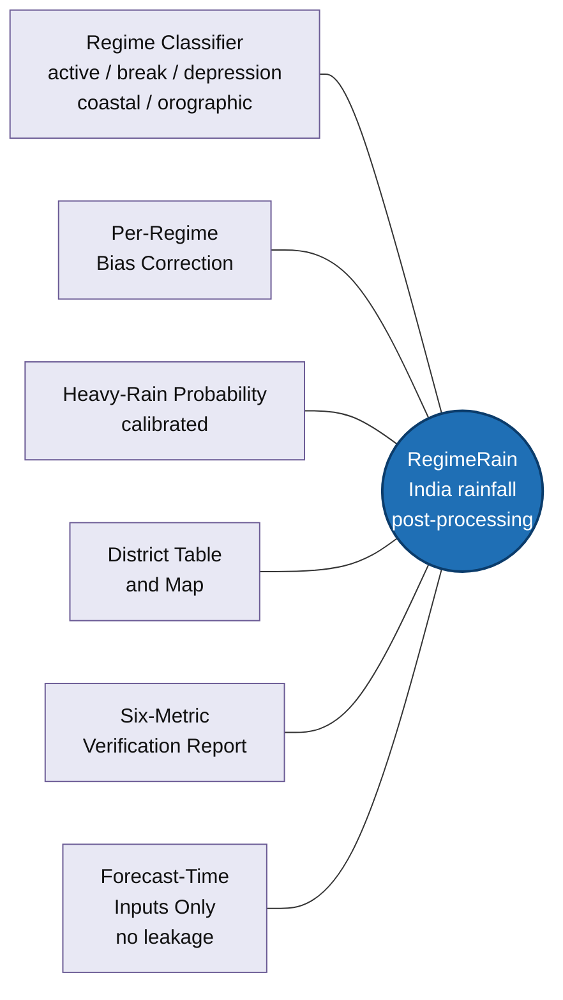
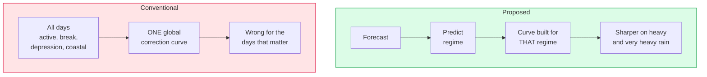
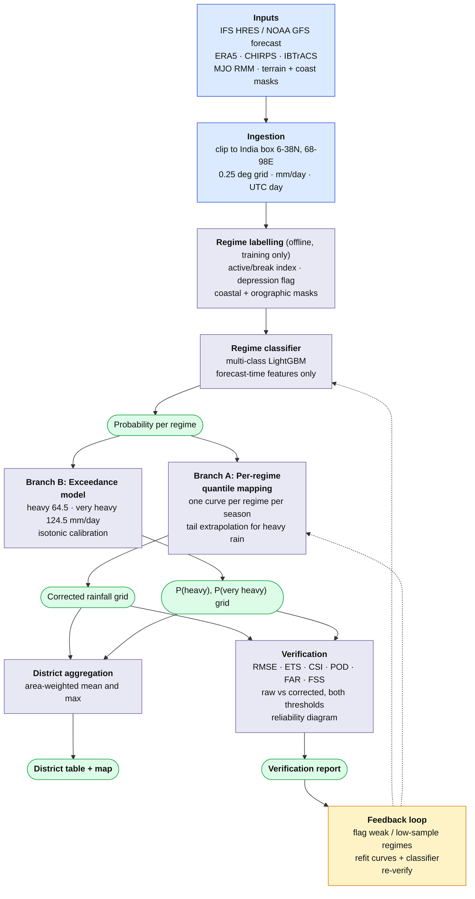
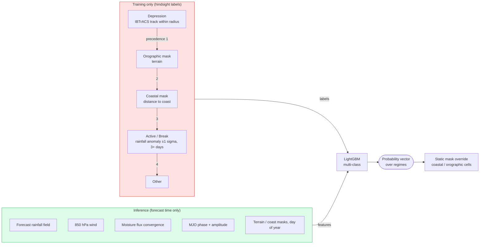
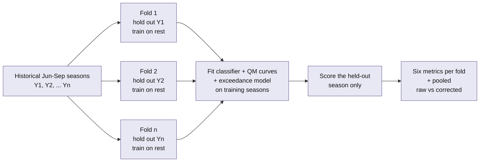
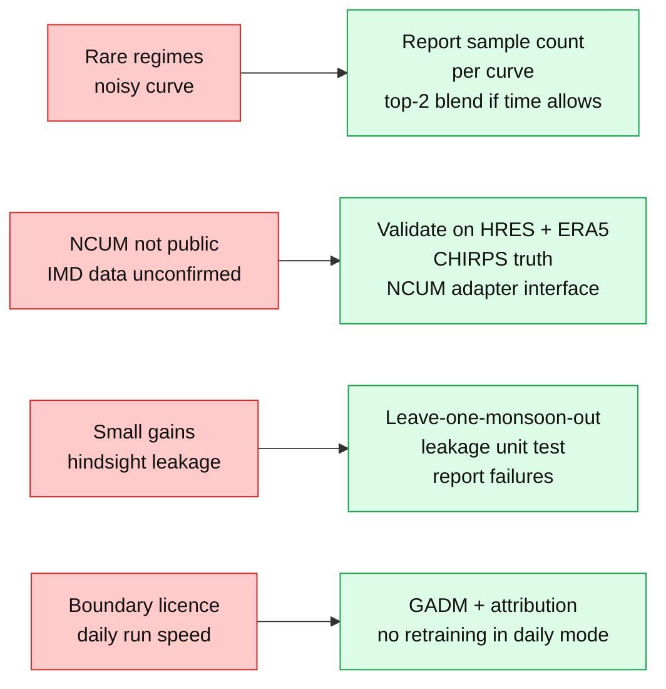
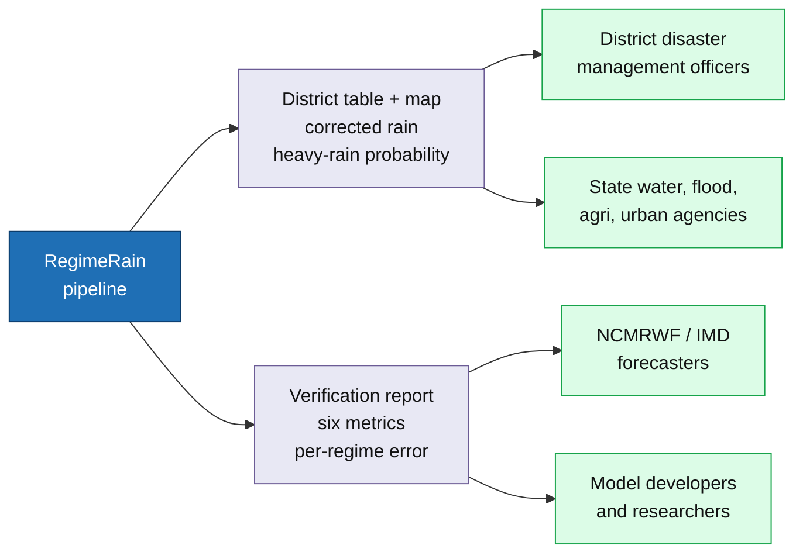
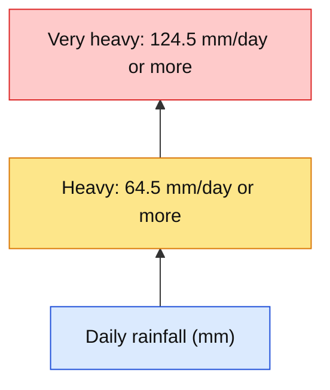
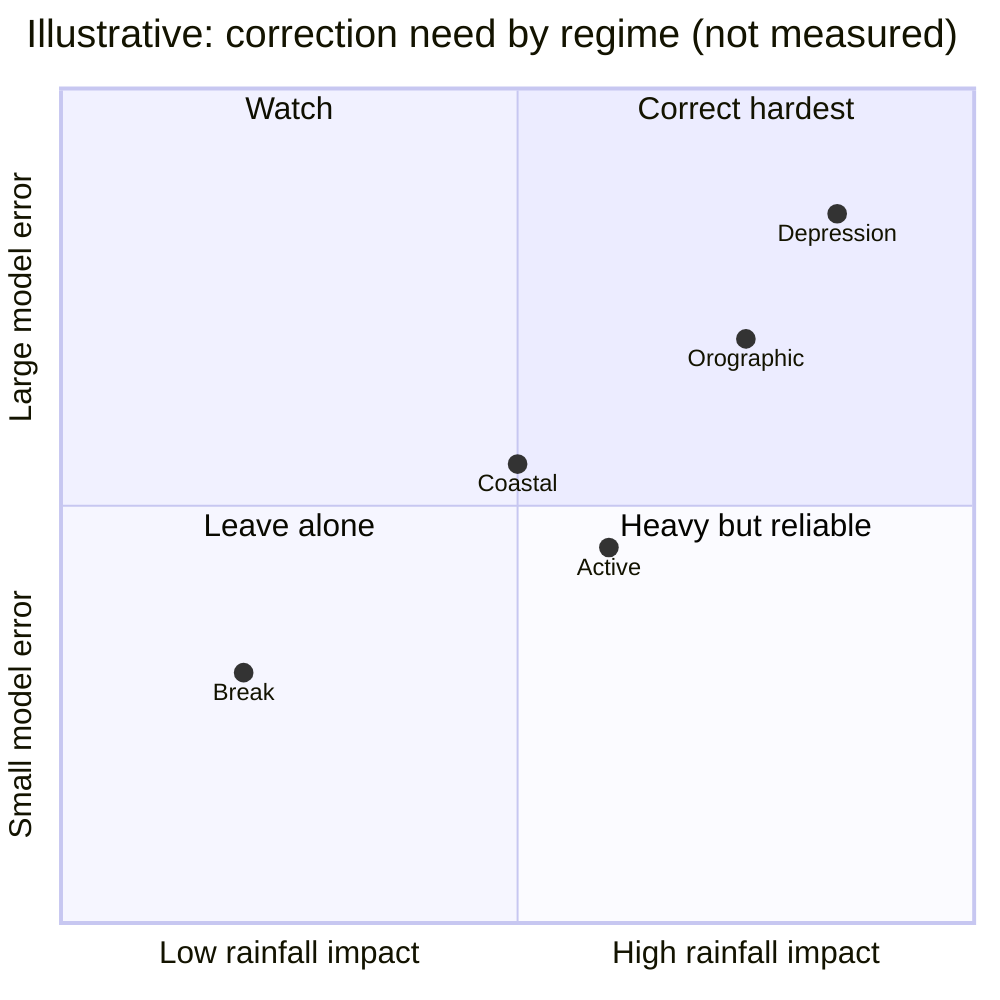
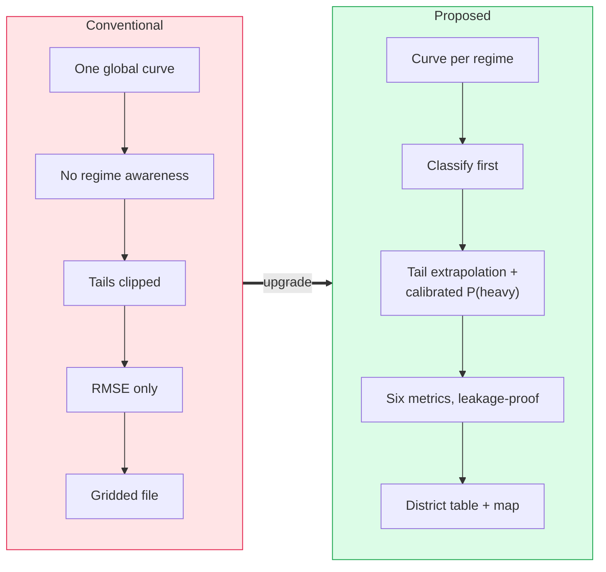

# PPT diagrams (Mermaid reference)

Reference sources for the graphics in `PPT_BRIEF.md`. Paste each block into https://mermaid.live, export SVG or PNG, then restyle in the deck (SIH blue, red highlights, icons). Use these as the structure. Do not ship the raw Mermaid look.

Labels use only facts from `../PRD.md` and `../TECHNICAL_SPEC.md`. No measured numbers.

---

## Slide 2: icon hub (solution at a glance)

Redraw as: centre icon, six icons around it, like the winning deck's shield graphic.

---

## Slide 2: problem in one picture (optional, one-line story)

Why one curve fails. Use as a small strip under the pills if space allows.

---

## Slide 3: main technical flow (the big one)

Mirrors the winning deck: inputs top-left, model box, branches, outputs, feedback loop.

---

## Slide 3: regime classifier detail (optional inset)

Shows the "forecast-time only" point and the label precedence.

---

## Slide 3: leakage-proof validation (optional inset)

Leave-one-monsoon-out. Season names are placeholders: use the real seasons in the training window.

---

## Slide 4: feasibility risk map (optional graphic behind or beside the table)

Risk to mitigation, one row per table row.

---

## Slide 5: who gets what (impact graphic)

Optional replacement for one bottom visual. Flow of value from pipeline to users.

---

## Slide 5: IMD threshold ladder

---

## Slide 5: illustrative curve concept (not measured)

Mermaid cannot plot curves. Draw this one in the deck tool. Spec:

- X axis: forecast rainfall. Y axis: corrected rainfall.
- One flat grey line labelled "single global curve".
- Three coloured lines, each with a different slope: "active", "break", "depression".
- Caption in small text: "Illustrative, not measured."

The only Mermaid-friendly version is a comparison, below.

Positions on the quadrant chart are made-up illustration coordinates. Keep the "not measured" caption. If the team cannot defend the placement, drop this graphic.

---

## Slide 6: conventional vs proposed (visual for the survey table)

---

## Export notes

- Render at 1920x1080 canvas. Export SVG so it stays sharp in the PDF.
- Keep text at 14 pt or larger after scaling. If a diagram gets too dense, use the optional insets on separate visuals, not one crowded slide.
- Replace box text with icons where the winning deck did (user, database, shield, alert). Keep the same colour roles: blue inputs, lilac processing, green outputs, amber loops, red risks.
- Slide budget stays at 6. Insets replace text, not add slides.
