# SIH26080 — The Complete Idea, Explained

**Regime-Aware AI Post-Processing of Monsoon Rainfall Forecasts**
Ministry of Earth Sciences (MoES) · NCMRWF · Software · Smart Automation

> **How to read this document.**
> **Part A** (§1–§8) explains the problem and our solution in plain language. Anyone on the team, or a judge, should be able to read it without a meteorology or ML background.
> **Part B** (§9–§22) is the technical approach: data, every model, every equation, every pipeline, with flowcharts.
> **Part C** (§23–§26) covers limitations, judge Q&A, a glossary, and how this document relates to `PRD.md` / `TECHNICAL_SPEC.md`.
>
> All diagrams are Mermaid. They render on GitHub, GitLab, VS Code (with the Mermaid extension), Obsidian, and most Markdown viewers.
> Numbers in the worked examples are **illustrative only**. Real numbers will come from the verification run and must never be typed into slides by hand (PRD AC-5).

---

## Table of contents

**Part A — The problem and the idea**
1. [The problem in plain words](#1-the-problem-in-plain-words)
2. [Why forecast errors depend on the "type of day"](#2-why-forecast-errors-depend-on-the-type-of-day)
3. [Why one correction for all days fails](#3-why-one-correction-for-all-days-fails)
4. [Our idea in one line, and the big picture](#4-our-idea-in-one-line-and-the-big-picture)
5. [What the PS asks for, and what we deliver](#5-what-the-ps-asks-for-and-what-we-deliver)
6. [What makes us different (novelty)](#6-what-makes-us-different-novelty)
7. [How we compare with what exists](#7-how-we-compare-with-what-exists)
8. [A day in the life: one forecast, end to end](#8-a-day-in-the-life-one-forecast-end-to-end)

**Part B — Technical approach**
9. [System architecture](#9-system-architecture)
10. [Data](#10-data)
11. [Regime design: two axes, not one list](#11-regime-design-two-axes-not-one-list)
12. [Regime labelling (building the training answers)](#12-regime-labelling-building-the-training-answers)
13. [Error-defined regimes (novelty #1)](#13-error-defined-regimes-novelty-1)
14. [Features: what the model is allowed to see](#14-features-what-the-model-is-allowed-to-see)
15. [Model 1 — Regime classifier](#15-model-1--regime-classifier)
16. [Model 2 — Regime-conditioned bias correction](#16-model-2--regime-conditioned-bias-correction)
17. [Model 3 — Heavy-rainfall probability](#17-model-3--heavy-rainfall-probability)
18. [The skill gate: knowing when not to correct](#18-the-skill-gate-knowing-when-not-to-correct)
19. [District aggregation](#19-district-aggregation)
20. [Explainability](#20-explainability)
21. [Verification: how we prove it works](#21-verification-how-we-prove-it-works)
22. [Training pipeline vs live pipeline, and the tech stack](#22-training-pipeline-vs-live-pipeline-and-the-tech-stack)

**Part C — Honesty, Q&A, reference**
23. [Limitations we state up front](#23-limitations-we-state-up-front)
24. [Judge Q&A](#24-judge-qa)
25. [Glossary](#25-glossary)
26. [Relation to PRD.md and TECHNICAL_SPEC.md](#26-relation-to-prdmd-and-technical_specmd)

---

# Part A — The problem and the idea

## 1. The problem in plain words

**NWP (Numerical Weather Prediction)** is how weather forecasts are made. A supercomputer divides the atmosphere into grid boxes and solves the physics equations for wind, temperature, moisture and cloud forward in time. NCMRWF runs India's NWP models (NCUM, and the NEPS ensemble); ECMWF and NOAA run global ones (IFS/HRES, GFS).

NWP is very good at large-scale weather: where a low-pressure system will move, how strong the monsoon winds will be. It is **much weaker at rainfall**, for three reasons:

1. **Rain is produced by processes smaller than a grid box.** A thunderstorm is a few kilometres across; a grid box is ~10–25 km. The model has to *guess* (parameterise) the storm's rain.
2. **Mountains and coastlines are smoothed.** The Western Ghats in the model are lower and smoother than in reality, so the model under-produces the rain that mountains squeeze out of monsoon winds.
3. **Small position errors become big rainfall errors.** A heavy-rain band forecast 50 km too far north is a "miss" in one district and a "false alarm" in the next.

These errors are **systematic**: the same model makes the same kind of mistake again and again in the same situations. Anything systematic can be learned from history and corrected. That correction step, applied *after* the model runs, is called **post-processing** or **bias correction**.

**The PS asks:** build an AI/ML post-processing system that improves district- and grid-level rainfall forecasts over India, **especially for heavy and very heavy rain**, by first figuring out which weather regime is in play and then applying a correction suited to that regime.

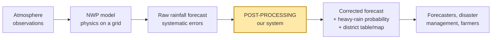

---

## 2. Why forecast errors depend on the "type of day"

A **weather regime** is the large-scale situation the atmosphere is in on a given day. During the Indian summer monsoon (June–September), the PS names these:

| Regime | What is happening | Typical NWP rainfall error |
|---|---|---|
| **Active monsoon** | Strong monsoon winds, monsoon trough in its normal position, widespread rain over central India | Rain spread too evenly: too much light rain, not enough heavy rain (the "drizzle bias") |
| **Break monsoon** | Monsoon trough shifts north to the Himalayan foothills; central India goes dry for days | Model often keeps producing rain in central India too long (wet bias), and misses foothill and northeast heavy rain |
| **Monsoon low / depression** | A cyclonic low forms over the Bay of Bengal and moves west-northwest across central India | Heavy rain is placed wrong (track or speed error), and peak intensity near the centre is under-forecast |
| **Orographic rainfall** | Moist winds forced up mountains (Western Ghats, Northeast hills, Himalayan foothills) | Strong under-forecast of heavy rain, because model mountains are too smooth |
| **Coastal rainfall** | Convection triggered along the coast (Konkan, Karnataka coast, Odisha–Andhra coast) | Rain placed inland or offshore of where it actually falls; intensity missed |
| **Western disturbance (WD)** | A trough from the Mediterranean/West Asia. Mainly a winter phenomenon; in the monsoon it matters at onset/withdrawal over northwest India and interacts with the monsoon to cause extreme events (e.g., Kedarnath 2013) | Timing and intensity errors over the western Himalaya |

**The key insight:** the error does not just differ in size between regimes; it differs in **direction and shape**. In one regime the model rains too much; in another, too little; in a third, it rains the right amount in the wrong place. A single correction cannot fix opposite errors at once.

---

## 3. Why one correction for all days fails

Imagine the model forecasts **40 mm** for a grid box. What did it probably mean?

- On a **depression** day, the model is known to under-forecast near the centre. Historically, a "40 mm" depression forecast verifies as ~70 mm.
- On a **break** day, the model is known to over-forecast in central India. A "40 mm" break forecast verifies as ~30 mm.

A single global correction learns roughly the *average* of these: it maps 40 → ~48 mm, which is **wrong in both regimes**. It pushes the break forecast the wrong way and doesn't push the depression forecast far enough. The heavy-rain days, which are what matter, are the ones it gets worst, because they are rare and get swamped in the average.

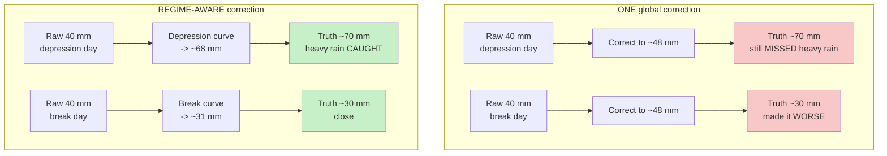

*(Numbers illustrative.)*

---

## 4. Our idea in one line, and the big picture

> **First work out what kind of day the model is forecasting, and what kind of mistake it tends to make on such a day. Then apply the correction learned for exactly that situation. Tell the user how confident we are, and where our correction should not be trusted.**

The pitch line for the deck:
> *"We don't just correct the forecast — we learn which kind of mistake the model is about to make, and we tell you when not to trust our correction."*

### The big picture (simple version)

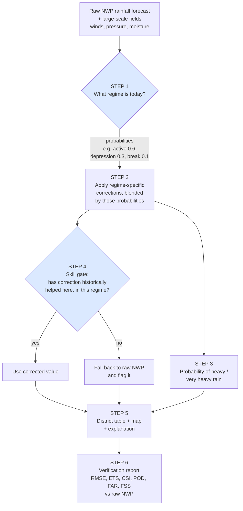

---

## 5. What the PS asks for, and what we deliver

| # | PS expected outcome | What we deliver | Section |
|---|---|---|---|
| 1 | **Weather regime classifier** (active, break, depression, coastal/orographic) | Classifier that gives regime **probabilities** per day and grid cell, using only information available at forecast time. Plus a second, data-driven "error regime" classification (novelty). | §11–§15 |
| 2 | **Bias-corrected rainfall forecast** better than raw NWP | Regime-conditioned quantile mapping, blended by regime probability, with an extreme-value tail for heavy rain. | §16 |
| 3 | **Heavy rainfall probability** above operational thresholds | Calibrated probability of exceeding IMD's heavy (≥64.5 mm/day) and very heavy (≥115.6 mm/day) thresholds. | §17 |
| 4 | **District-level rainfall product** (table/map) | District table and interactive map: mean and max rainfall, exceedance probabilities, regime, confidence flag, one-line explanation. | §19–§20 |
| 5 | **Verification report** (RMSE, ETS, CSI, POD, FAR, FSS) | All six, raw vs corrected, per regime, per threshold, per lead day, leave-one-monsoon-out, plus reliability diagrams. | §21 |

---

## 6. What makes us different (novelty)

Being "regime-aware" is not new in itself: research groups have studied regime-dependent post-processing, mostly for European temperature and wind. Our novelty is in **how** we use regimes. There are five points; the first three are the headline.

### ★1 — Regimes defined by how the model fails, not only by the weather
IMD's regime names describe the **weather**. We also discover regimes that describe the **model's mistakes**. We cluster historical days by the *shape of the forecast error* (wet bias, dry bias, displaced rain, missed extremes), then learn to predict that cluster from forecast-time information. We then show how these "error regimes" line up with IMD's named regimes, where they agree and where they don't. This is a scientific finding in its own right, and it is falsifiable. (§13)

### ★2 — Soft regimes (mixture of experts)
Real days are not cleanly "active" or "break"; transition days are mixtures. Instead of forcing one label, the classifier outputs probabilities, and the final correction is a probability-weighted blend of each regime's correction. This removes the sharp jumps that hard labels cause on transition days. (§16.4)

### ★3 — Knowing when NOT to correct (the skill gate)
For each district × regime × lead day, we check in cross-validation whether the correction actually beat raw NWP. Where it didn't, we automatically fall back to raw NWP and flag it on the map. Operational forecasters trust a system that admits its limits. (§18)

### 4 — Extreme-value tail for heavy rain
Standard quantile mapping cannot produce a value larger than anything in its training data, so it caps exactly the extreme events the PS cares about. We model the upper tail of each regime's rainfall with a **Generalised Pareto Distribution (GPD)**, so very heavy and extremely heavy values are extrapolated sensibly. (§16.3)

### 5 — An explanation for every alert
Each heavy-rain alert carries a short reason from SHAP feature attributions, for example *"strong low-level jet (+), depression regime p=0.7 (+), MJO phase 5 (+)"*. (§20)

### Stretch — Fixing misplaced rain
NWP often places heavy rain in the wrong place, which FSS penalises. A regime-dependent displacement correction (e.g., depressions whose rain is systematically placed too far north) would be genuinely new. It is hard to build, so it is a stretch goal and not part of the acceptance bar.

---

## 7. How we compare with what exists

| Who | What they typically do | Our difference |
|---|---|---|
| **Operational (NCMRWF / IMD)** | A single bias correction (e.g., quantile mapping or MOS-type) applied to NCUM/NEPS output, not split by regime *(our understanding; to be confirmed)* | Correction conditioned on regime, soft blending, skill-gated fallback map |
| **Published research** | Regime-dependent post-processing, mostly for European temperature/wind; for Indian rainfall, usually one global statistical or deep-learning model (U-Net and similar) | Regime-conditioned correction for **monsoon rainfall and its extremes**, with error-defined regimes |
| **Likely other SIH teams** | One model (U-Net or XGBoost), k-means "regimes", RMSE only, random train/test split (leaks), a Streamlit map | Error-defined regimes, all six named metrics, **leave-one-monsoon-out** validation, calibrated probabilities, an honest report of where it fails |

**Why rigour is our edge:** NCMRWF's judges are atmospheric scientists. They will ask *"better than what, measured how, on which season?"* A random train/test split on daily rainfall leaks information, because consecutive days are highly correlated, and inflates scores. Most teams won't notice. We will say so, and show honest numbers.

---

## 8. A day in the life: one forecast, end to end

**Scenario (illustrative):** 18 July. A depression has formed over the north Bay of Bengal. The 00 UTC NWP run is in. We produce the Day-1 to Day-5 corrected forecast for Odisha, Chhattisgarh and Madhya Pradesh.

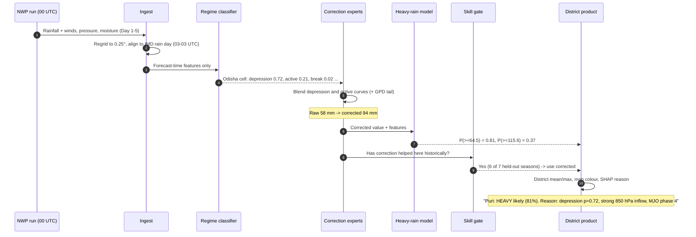

What the forecaster sees for one row of the district table:

| District | Day | Raw NWP (mm) | Corrected mean (mm) | Corrected max-cell (mm) | P(heavy) | P(very heavy) | Regime | Confidence | Reason |
|---|---|---|---|---|---|---|---|---|---|
| Puri | D1 | 58 | 94 | 131 | 0.81 | 0.37 | Depression (0.72) | Correction active ✔ | Depression, strong 850 hPa inflow, MJO ph. 4 |
| Bastar | D1 | 22 | 19 | 35 | 0.08 | 0.01 | Active (0.55) | Fallback to raw ⚠ | Correction not skilful here historically |

---

# Part B — Technical approach

## 9. System architecture

The system has two modes that share the same code:

- **Training / backtest mode** (offline, once): builds labels, trains all models, runs cross-validation, writes the verification report and the skill-gate table.
- **Live mode** (daily): pulls today's forecast, runs the trained models, writes the district product, serves it to the map.

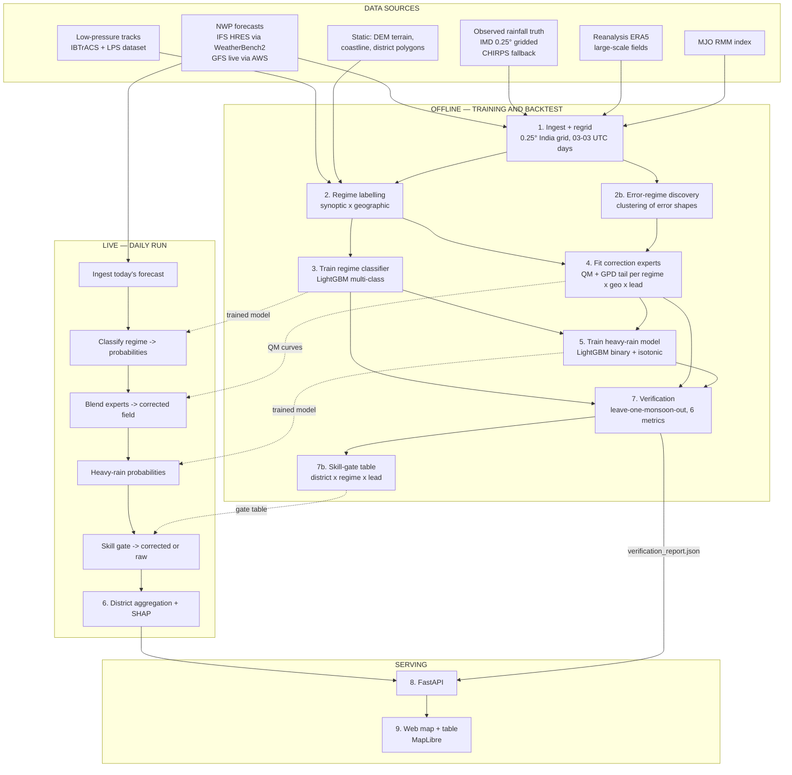

**Module list** (matches `TECHNICAL_SPEC.md` §4): `ingest` → `label` → `classify` → `correct` → `exceed` → `aggregate` → `verify` → `api` → `web`. Two additions come from this document: `label.error_regimes` (§13) and `verify.skill_gate` (§18).

---

## 10. Data

### 10.1 Sources

| Role | Dataset | Resolution | Period used | Access |
|---|---|---|---|---|
| **Forecast to correct (training)** | ECMWF IFS HRES, via WeatherBench2 | 0.25°, 00/12 UTC runs, lead up to 10 days | JJAS 2016–2022 | Public zarr (GCS) |
| **Forecast to correct (live demo)** | NOAA GFS | 0.25° | Today | AWS Open Data |
| **Rainfall truth (primary)** | IMD gridded daily rainfall | 0.25°, 1901–present | JJAS 2016–2022 | Public; downloadable with the `imdlib` Python package (to be confirmed from the team network in Phase 0) |
| **Rainfall truth (fallback)** | CHIRPS 2.0 daily | 0.05° → regridded to 0.25° | same | Open HTTPS |
| **Large-scale fields** | ERA5 (labels) and the forecast's own fields (features) | 0.25° | same | WeatherBench2 |
| **Depression / low tracks** | IBTrACS (depressions and stronger) + a public monsoon low-pressure-system track dataset (e.g., Hurley & Boos) | Track points, 6-hourly | same | Open |
| **Intraseasonal state** | BOM/NOAA MJO RMM index | Daily | same | Open |
| **Terrain** | SRTM / GMTED DEM | Aggregated to 0.25° (mean elevation, slope, std) | Static | Open |
| **Districts** | GADM level-2 (or Survey of India, licence permitting) | Polygons | Static | Open |

**Why IMD gridded rainfall should be the primary truth:** it is built from ~7,000 Indian rain gauges and is what IMD itself verifies against. CHIRPS is satellite-blended and underestimates heavy rain over mountains, the very place the PS asks us to improve. CHIRPS is kept only as a fallback.

### 10.2 Common grid and the "rain day"

- **Grid:** 0.25° × 0.25°, India domain 6.5°N–38.5°N, 66.5°E–100°E (IMD grid extents). Land cells only for verification.
- **Rain day:** IMD reports 24-hour rainfall ending **03 UTC (08:30 IST)**. Forecast accumulations are aligned to the same window: for a 00 UTC run, Day 1 = forecast hours 03–27, Day 2 = 27–51, and so on. Getting this wrong adds a phantom bias, so it is enforced in `ingest` with a unit test.
- **Lead days:** Day 1 to Day 5. Each lead day gets its own models, because errors grow with lead time.
- **Season:** June–September (JJAS). The HRES archive gives 7 seasons × 122 days = **854 forecast days per lead**, × ~4,500 land cells ≈ **3.8 million cell-days per lead**.

### 10.3 Data flow

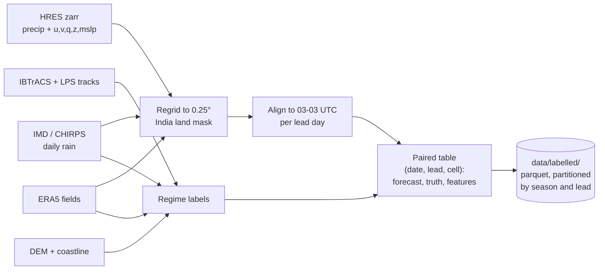

---

## 11. Regime design: two axes, not one list

The PS lists regimes as if they were one list (active, break, depression, coastal/orographic). They are really **two different kinds of thing**:

- **Synoptic regime (time axis):** active, break, depression/low, normal. This changes **day to day** and covers large areas.
- **Geographic setting (space axis):** orographic, coastal, plains. This is **fixed** for a grid cell; the Western Ghats are always mountainous.

If we forced them into one list with a precedence order, every Western Ghats cell would always be "orographic", and active vs break would never influence its correction. That is a problem, because orographic rain is **far heavier in active spells than in breaks**. It would throw away exactly the signal we need where heavy rain is most common.

**So we cross the two axes:**

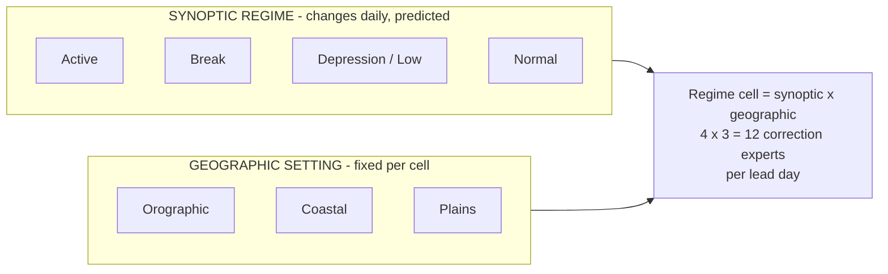

| | Orographic | Coastal | Plains |
|---|---|---|---|
| **Active** | Western Ghats in a strong monsoon surge — biggest under-forecast | Konkan/Karnataka coast convection | Central India widespread rain |
| **Break** | Himalayan foothills / NE heavy rain | Weak | Dry central India, wet bias |
| **Depression** | Eastern Ghats / Chhota Nagpur on the track | Odisha–Andhra coast landfall | Track across MP / Chhattisgarh |
| **Normal** | Moderate orographic rain | Moderate | Scattered |

**Western disturbances** are named in the PS text but not in its expected-outcome list, and are mainly a non-monsoon phenomenon. **Scope decision:** we do not model WD as a separate regime in the JJAS build. WD–monsoon interaction days in June and September over northwest India fall under "normal" or "break", and this is stated as a limitation (§23). A WD class is a natural extension if the system is run outside JJAS.

---

## 12. Regime labelling (building the training answers)

To train a classifier, we need historical days with a known, correct regime. These **labels** are computed **from observations** (truth), and are used **only for training**. The classifier itself never sees observations (§14).

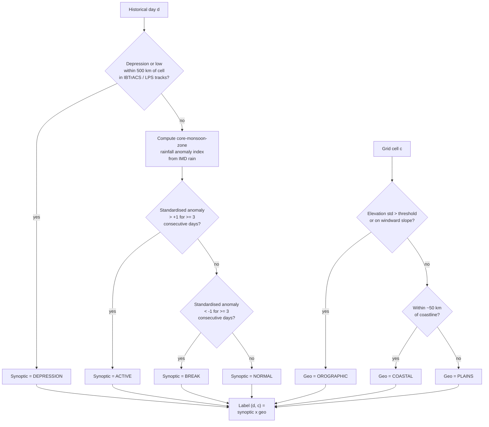

### 12.1 Active / break index (standard definition)
We follow the widely used IMD/IITM convention (Rajeevan, Gadgil & Bhate, 2010):
1. **Core monsoon zone:** roughly 18°N–28°N, 65°E–88°E (land cells).
2. Daily area-averaged rainfall over the zone, $R_d$.
3. Standardised anomaly: $z_d = (R_d - \mu_{doy}) / \sigma_{doy}$, where $\mu$ and $\sigma$ are the long-term (e.g., 1981–2015) mean and standard deviation for that calendar day, smoothed.
4. **Active** if $z_d > +1$ for ≥ 3 consecutive days; **break** if $z_d < -1$ for ≥ 3 consecutive days.

The original convention covers July–August. We apply the same rule across JJAS and report June/September separately, because onset and withdrawal behave differently.

### 12.2 Depression / low
A cell is labelled **depression** on day $d$ if a monsoon low or depression centre (from IBTrACS or a monsoon LPS track dataset) is within **~500 km** during that rain day. Depression overrides active/break for that cell, because a nearby depression dominates local error characteristics. IBTrACS alone misses weaker monsoon lows, which is why the LPS dataset is added.

### 12.3 Geographic setting (static)
- **Orographic:** sub-grid elevation standard deviation above a threshold (e.g., > 200 m), or mean slope facing the prevailing south-westerly flow. This captures the Western Ghats, NE hills, Himalayan foothills and Eastern Ghats.
- **Coastal:** within ~50 km of the coastline and not orographic.
- **Plains:** everything else.

Thresholds are tuned once, fixed, and written in the run config. Every run records the label counts per regime cell, so thin classes are visible.

---

## 13. Error-defined regimes (novelty #1)

**Question we answer:** *Are IMD's meteorological regimes actually the best way to group days for correcting this model? Or does the model fail in patterns that cut across them?*

### 13.1 Method

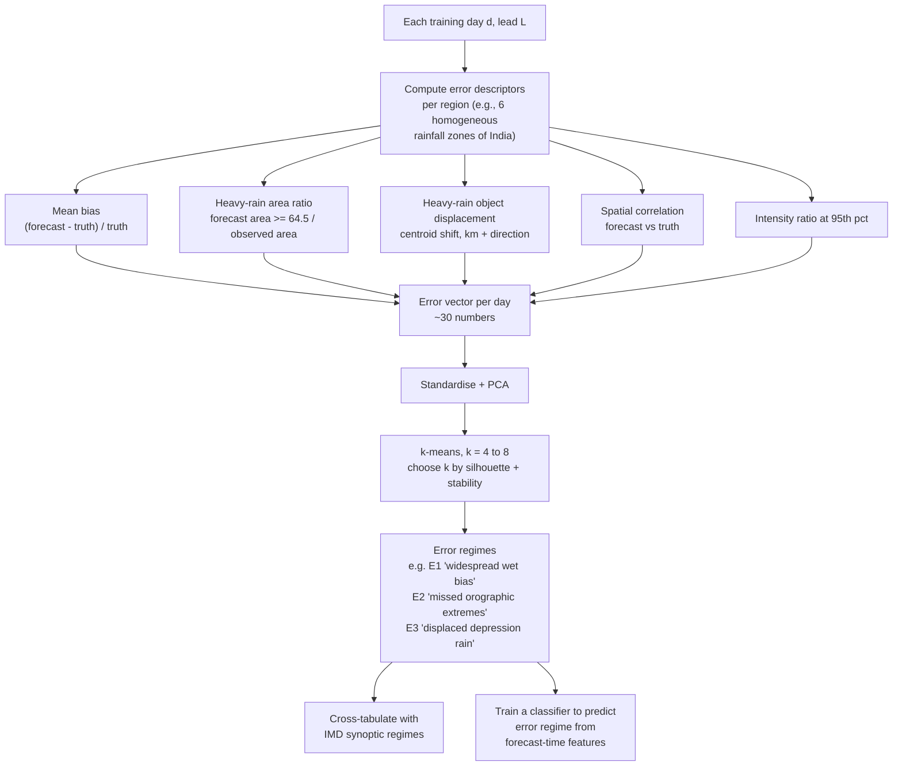

### 13.2 How it is used: a three-way experiment
We run the full pipeline three times and compare in the verification report:

| Variant | Correction groups by | Purpose |
|---|---|---|
| **A. Global** | nothing (one curve per geo × lead) | The baseline every other team will have |
| **B. Meteorological regimes** | synoptic × geo (§11) | What the PS literally asks for |
| **C. Error regimes** | error cluster × geo | Our novelty |

The result is a publishable-style finding either way:
- If **C beats B**: *"Grouping by how the model fails beats grouping by the weather."*
- If **B ≈ C**: *"IMD's regimes already capture the model's failure modes. Here is the evidence."* That is still a scientific statement NCMRWF would value.
- The cross-tab (which error regimes occur in which meteorological regimes) is itself a diagnostic that NCMRWF model developers can use.

The **product** shown on the map uses whichever variant verifies best (B by default), and the regime shown to the user is always the meteorological name, since that is what forecasters speak.

---

## 14. Features: what the model is allowed to see

**Rule zero: no leakage.** At forecast time, we do not know the observed rain. So the classifier and all correction models may use **only** things known when the forecast is issued. A unit test asserts that no truth-derived column enters the feature matrix (PRD AC-1).

| Group | Feature | Why it helps |
|---|---|---|
| **Forecast rainfall** | Raw forecast rain at the cell; neighbourhood mean and max (3×3 and 5×5 cells) | The quantity being corrected; neighbourhoods capture "rain nearby" that may be displaced |
| **Monsoon circulation** | 850 hPa zonal/meridional wind; low-level jet strength over the Arabian Sea (index box) | Active spells have a strong jet; breaks a weak one |
| **Monsoon trough** | Latitude of the minimum MSLP / 850 hPa trough along 75–85°E | Trough near the foothills → break; over central India → active |
| **Moisture** | Total column water vapour; 850 hPa specific humidity; vertically integrated moisture flux convergence | Fuel for rain; convergence marks where it will fall |
| **Cyclonic systems** | 850 hPa relative vorticity (max within 500 km); forecast MSLP minimum and distance to it | Detects forecast lows and depressions |
| **Stability** | e.g., 500 hPa vertical velocity, 850–500 hPa lapse rate | Convective potential |
| **Intraseasonal** | MJO RMM phase (one-hot) and amplitude on the initialisation day | Strongly modulates active/break over India |
| **Static geography** | Mean elevation, elevation std, slope, windward index, distance to coast, lat, lon | Orographic and coastal effects |
| **Time** | Day of year (sin/cos), lead day | Seasonal cycle; errors grow with lead |
| **Persistence** | Regime predicted for the previous day (from yesterday's run) | Regimes persist for several days |

For the **live demo**, all of these come from GFS plus the latest MJO index, which is available in real time.

---

## 15. Model 1 — Regime classifier

### 15.1 What it does
Input: the forecast-time features for a grid cell and lead day.
Output: a probability for each **synoptic** regime: $p = (p_{active}, p_{break}, p_{dep}, p_{normal})$, summing to 1.
The **geographic** setting is not predicted; it is known from the map (§12.3).

### 15.2 Model choice: gradient-boosted trees (LightGBM)
- Works very well on **tabular** features like these, and trains in minutes on a laptop.
- Handles mixed feature types and non-linear interactions (jet strength × trough latitude) without hand-tuning.
- Gives **SHAP** explanations natively (§20).
- Doesn't need a deep-learning specialist, which matters for the team (PRD §18).

A CNN over the whole India map could learn spatial patterns better, but it needs more data than 7 seasons and more expertise. It is listed as a future extension, not a build requirement.

### 15.3 Training details

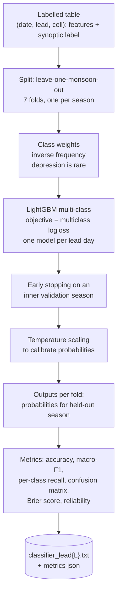

- **Lead day is a feature** (Day 1–5): regime predictability decays with lead, and the model learns that. Separate models per lead are an option if compute allows.
- **Class imbalance:** depression days are rare, so inverse-frequency class weights are used and **macro-F1** is reported (not just accuracy, which would be dominated by "normal").
- **Spatial smoothing:** the raw per-cell probabilities are smoothed with a small spatial filter (e.g., 3×3 mean), because regimes are large-scale and cell-to-cell flicker is not physical.
- **Sanity check:** the all-India share of cells predicted "break" should track the observed break-day index. This is plotted as a time series in the report.

### 15.4 Output
A NetCDF/zarr array `regime_prob[lead, lat, lon, regime]`, plus a daily all-India regime summary for display ("Today: Depression over Odisha, active elsewhere").

---

## 16. Model 2 — Regime-conditioned bias correction

This is the heart of the system.

### 16.1 The core idea: quantile mapping (QM), explained simply
Take all historical depression days in plains cells at Day-1 lead. Sort the **forecast** values and sort the **observed** values separately. If the forecast of 40 mm sits at the 92nd percentile of *forecasts*, replace it with the 92nd percentile of *observations*, say 68 mm. That's quantile mapping: it makes the corrected forecast have the **same statistical distribution** as reality, for that regime.

Mathematically, for regime cell $k$ (synoptic × geo), lead $L$ and region $z$:

$$
\hat{x}_{corr} = F^{-1}_{obs,k}\big( F_{fcst,k}(x_{raw}) \big)
$$

where $F_{fcst,k}$ is the cumulative distribution (CDF) of historical forecasts in that group and $F^{-1}_{obs,k}$ is the inverse CDF (quantile function) of historical observations in the same group.

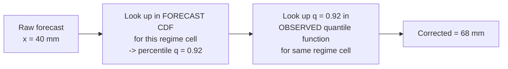

### 16.2 Handling dry days (wet-day frequency)
NWP often produces a little rain on days that were dry (drizzle bias). QM handles this naturally. If 45% of observed days are dry but only 20% of forecasts are below 0.1 mm, then every forecast value below the forecast's 45th percentile is mapped to 0. This removes spurious drizzle, which directly improves FAR at low thresholds.

### 16.3 The heavy-rain tail: Generalised Pareto (novelty #4)
Empirical QM can't output anything bigger than the largest value it has seen. For rare, very heavy events that is a hard cap, exactly where the PS wants improvement. So:

1. Below the 95th percentile of each distribution: use the empirical CDF (smoothed).
2. Above it: fit a **Generalised Pareto Distribution** to the exceedances, separately for forecast and observed:

$$
P(X > u + y \mid X > u) = \left(1 + \frac{\xi y}{\sigma}\right)^{-1/\xi}
$$

where $u$ is the 95th-percentile threshold, $\sigma$ is the scale and $\xi$ the shape (tail heaviness).
3. The mapping in the tail becomes $x_{corr} = G^{-1}_{obs}(G_{fcst}(x_{raw}))$ with $G$ the spliced empirical+GPD CDFs.
4. $\xi$ is constrained to a physically sensible range (e.g., $0 \le \xi \le 0.4$), and pooled across neighbouring regions if the fit is unstable.

This lets a 150 mm forecast in an orographic-active cell map to, say, 230 mm if that is what history supports, instead of being clipped at the training maximum.

### 16.4 Soft blending: mixture of experts (novelty #2)
Each regime cell has its own QM "expert". The classifier gives probabilities. The final correction blends the experts:

$$
\hat{x}_{corr} = \sum_{r \in \{active, break, dep, normal\}} p_r \cdot QM_{r, g, L, z}(x_{raw})
$$

where $g$ is the cell's fixed geographic setting. Two practical rules:
- Only experts with $p_r \ge 0.1$ are used, then weights are renormalised. This avoids noise from irrelevant experts.
- If one regime has $p_r \ge 0.8$, the result equals that expert's output (hard regime) for interpretability.

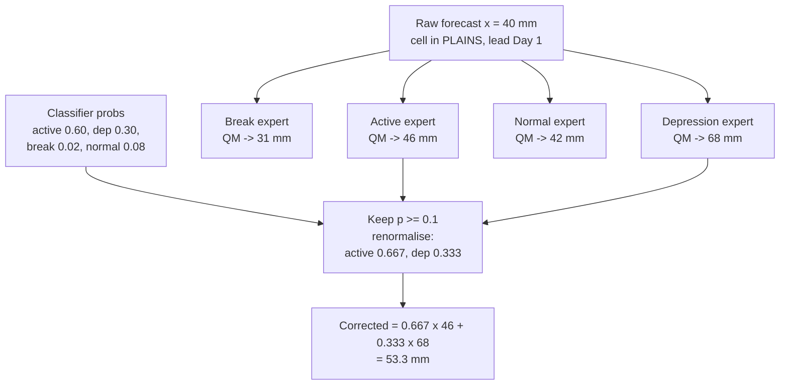

### 16.5 Where the data comes from for each expert (pooling)
One grid cell has only ~850 days per lead, and only a few dozen depression days, which is too few to fit a CDF. So each expert is fitted on **pooled** data:

- **Pool over space** within a zone $z$: IMD's four homogeneous monsoon regions (Northwest, Central, South Peninsula, East & Northeast).
- **Always shrink toward the parent**, more strongly when the expert has seen few days:

$$
QM_{final} = w \cdot QM_{expert} + (1 - w) \cdot QM_{parent}, \quad w = \frac{n_{days}}{n_{days} + N_0}, \quad N_0 = 30
$$

We count **distinct days**, not cell-days, because all the cells on one day are strongly correlated; a thousand cells on one depression day are not a thousand independent examples. The parent chain is (regime, geo, zone, lead) → (geo, zone, lead) → (geo, lead). Thin regimes therefore degrade gracefully toward the global correction instead of producing noisy nonsense. The day count behind every expert and its weight $w$ are written into the report.

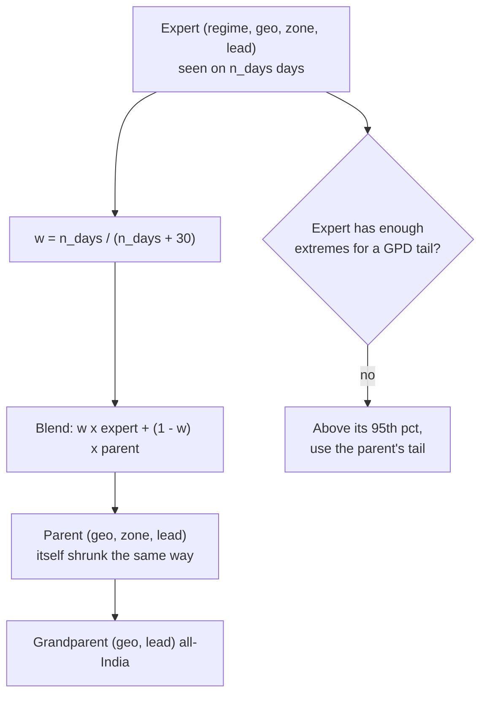

Full code: `docs/MODEL_SPEC.md` §11.4.

### 16.6 Why QM and not a neural network for the correction?
- QM is **transparent**: a forecaster can look at the curve and see "in depression + plains, 40 mm means ~68 mm".
- It needs far less data than a neural network, which matters because some regime cells are thin.
- It preserves the **distribution**, including heavy rain, which ETS/CSI/POD at high thresholds reward.
- Its known weakness (it can't fix misplaced rain) is handled separately by the neighbourhood features in Model 3 and the stretch-goal displacement correction.

### 16.7 A known tension: QM vs RMSE
QM makes the corrected forecast as **variable** as reality. When the forecast is imperfect, a more variable forecast can have a **higher RMSE** than a smooth one, even while it catches more heavy rain (better POD, CSI, ETS). The six PS metrics therefore pull in different directions. We handle this honestly:
- We report every metric separately, raw vs corrected. We never pick only the ones that improved.
- We offer an optional second output, the **conditional mean** $E[\text{obs} \mid \text{features}]$ (a LightGBM regressor), which is RMSE-optimal but smooth. The map defaults to the QM product; the conditional mean is available in the API for users who care about RMSE (e.g., hydrology totals).

---

## 17. Model 3 — Heavy-rainfall probability

### 17.1 What it outputs
For each cell and lead day:
- $P(\text{rain} \ge 64.5\ \text{mm/day})$ — IMD **heavy**
- $P(\text{rain} \ge 115.6\ \text{mm/day})$ — IMD **very heavy**
- $P(\text{rain} \ge 204.5\ \text{mm/day})$ — IMD **extremely heavy**: reported descriptively only, because there are too few events to verify reliably.

**IMD 24-hour rainfall categories** (for reference):

| Category | mm/day |
|---|---|
| Light | 2.5 – 15.5 |
| Moderate | 15.6 – 64.4 |
| Heavy | 64.5 – 115.5 |
| Very heavy | 115.6 – 204.4 |
| Extremely heavy | ≥ 204.5 |

### 17.2 Why a separate model and not just "is the corrected value above 64.5"?
A single corrected number is one best guess. It can't express *"there's a 40% chance of heavy rain somewhere near here"*. A probability model can, and it uses neighbourhood information, so it partly compensates for displacement errors.

### 17.3 Model

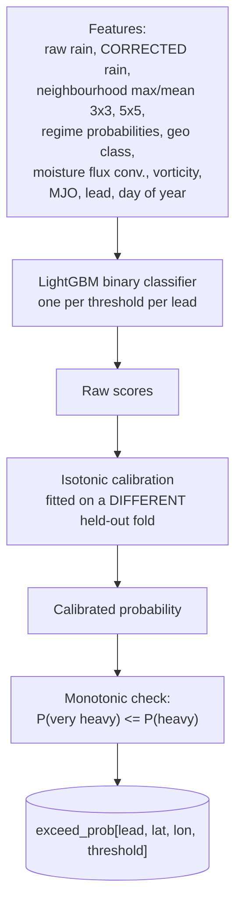

- **Class imbalance:** heavy-rain cell-days are a few percent of the data, and very heavy far fewer. We use class weights and evaluate with the **Brier score**, **reliability diagrams**, and **ROC-AUC / PR-AUC**, never accuracy.
- **Calibration** is fit on a fold that is neither the training fold nor the fold shown in the reliability diagram (no double-dipping; `TECHNICAL_SPEC.md` §4.5).
- **Monotonicity:** if the two models disagree so that P(very heavy) > P(heavy), the very-heavy value is capped.

### 17.4 How probabilities become an alert
The map colours a district by the highest threshold whose probability exceeds a decision level (e.g., 0.5 for "likely", 0.3 for "possible"). The decision levels are configurable, because disaster managers may prefer more false alarms and fewer misses. POD/FAR at each decision level is shown in the report so they can choose.

---

## 18. The skill gate: knowing when not to correct (novelty #3)

### 18.1 The idea
Post-processing doesn't help everywhere. In some districts, regimes and leads it may do nothing or make things worse, especially where training data is thin. Instead of hiding that, we **measure** it and act on it.

### 18.2 How it works

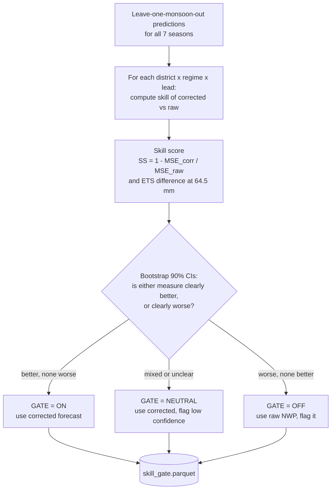

### 18.3 Why this is valuable
- A forecaster sees **where the system is trustworthy**, as a map.
- It prevents the system from making a forecast **worse** anywhere it is known to be worse.
- It tells NCMRWF **where their model's errors are not systematic**, which is useful diagnostic information for model development.
- It turns the PS's "verification report" from a static PDF into a live control on the product.

---

## 19. District aggregation

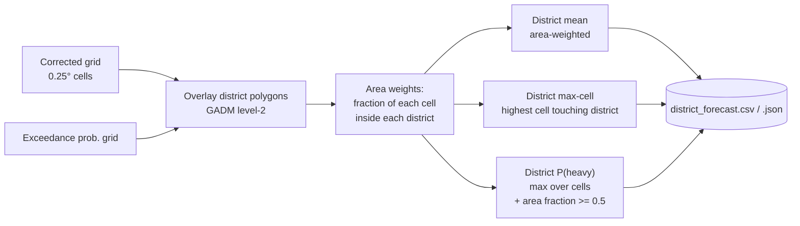

- **Area-weighted mean**: $\bar{x}_D = \sum_c w_{c,D} x_c / \sum_c w_{c,D}$, where $w_{c,D}$ is the area of cell $c$ inside district $D$.
- **Max-cell value** is always shown next to the mean. A district mean of 30 mm can hide one cell with 150 mm, and that cell is the flood.
- **District probability**: shown as both "max over cells" (chance of heavy rain *somewhere* in the district) and "% of district area with P ≥ 0.5".
- Small districts (smaller than one cell) still get the value of the cell(s) that overlap them.

---

## 20. Explainability

For every district alert, we compute **SHAP values** from the heavy-rain model (TreeSHAP is exact and fast for LightGBM). The top three positive contributors are turned into a plain-language reason:

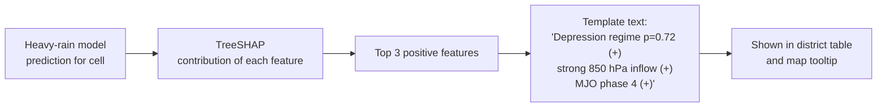

We also produce **global** explanations for the report: which features matter most for each regime's classifier and for the heavy-rain model. Judges can check that these are physically sensible, e.g., low-level jet strength dominating active/break and vorticity dominating depression.

---

## 21. Verification: how we prove it works

### 21.1 The rule: always against raw NWP, on unseen seasons
Every number is **raw NWP vs corrected**, computed on a monsoon season the models **never saw** during training.

### 21.2 Leave-one-monsoon-out cross-validation

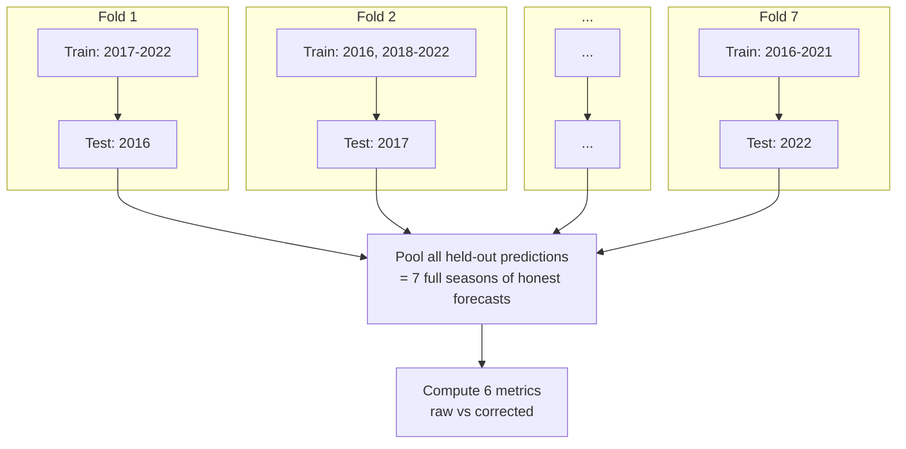

**Why not a random split?** Rainfall on consecutive days is strongly correlated, and a monsoon season has its own character (e.g., El Niño year vs normal year). A random split puts Tuesday in training and Wednesday in testing, which lets the model "remember" the event and inflates scores. Holding out a **whole season** is the only honest test of "will this work next year?".

### 21.3 The six metrics

A **contingency table** is built at each threshold (e.g., "did rain ≥ 64.5 mm happen?"):

| | Observed YES | Observed NO |
|---|---|---|
| **Forecast YES** | Hits (H) | False alarms (FA) |
| **Forecast NO** | Misses (M) | Correct negatives (CN) |

| Metric | Formula | Meaning | Best |
|---|---|---|---|
| **RMSE** | $\sqrt{\frac{1}{n}\sum(\hat{r}-r)^2}$ | Typical size of the error in mm | 0 |
| **POD** | $H / (H+M)$ | Of the heavy-rain events that happened, how many did we forecast? | 1 |
| **FAR** | $FA / (H+FA)$ | Of our heavy-rain forecasts, how many were false alarms? | 0 |
| **CSI** | $H / (H+M+FA)$ | Overall hit rate, ignoring correct "no" forecasts | 1 |
| **ETS** | $\frac{H - H_r}{H+M+FA-H_r}$, $H_r = \frac{(H+M)(H+FA)}{n}$ | CSI with lucky random hits removed; the fairest single score for rare events | 1 |
| **FSS** | $1 - \frac{\sum (P_f - P_o)^2}{\sum P_f^2 + \sum P_o^2}$ over neighbourhoods | Gives credit for "right event, nearly right place" at a chosen scale (e.g., 25, 50, 100 km) | 1 |

In FSS, $P_f$ and $P_o$ are the fractions of cells exceeding the threshold within each neighbourhood window, in forecast and observation.

### 21.4 How results are broken down
Every metric is computed for **raw** and **corrected**, and sliced by:
- **Threshold:** 2.5 (rain/no rain), 15.6, 64.5, 115.6 mm/day
- **Lead day:** 1 to 5
- **Regime:** active, break, depression, normal × orographic, coastal, plains
- **Variant:** global QM (A), meteorological-regime QM (B), error-regime QM (C) (§13.2)
- **Season:** each held-out year, to show consistency, not just a lucky average

Plus:
- **Bootstrap 90% confidence intervals** (resampling whole days) on every raw-vs-corrected difference. A difference that isn't significant is labelled as such.
- **Reliability diagrams** for the heavy-rain probabilities.
- **Classifier confusion matrix** and per-class recall.
- **Maps** of skill improvement (the skill-gate map, §18).

### 21.5 Output: `verification_report.json`
All numbers go into one machine-readable file. The dashboard and the deck read from it; nothing is hand-typed (PRD AC-5). If correction does **not** improve a metric or regime, the report and the deck say so plainly (PRD AC-6).

---

## 22. Training pipeline vs live pipeline, and the tech stack

### 22.1 Training pipeline (offline, run once, ~hours on a laptop/workstation)

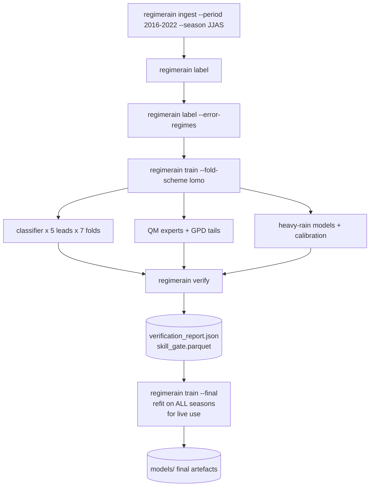

Command names are proposals, in line with `TECHNICAL_SPEC.md` §7.

### 22.2 Live pipeline (daily, ~minutes)

**Note:** the models are trained on HRES, but the live demo uses GFS, a different model with different biases. For the demo this is acceptable and we disclose it. Operationally, the same pipeline would be retrained on **NCUM** hindcasts at NCMRWF through an adapter; the pipeline is model-agnostic by design.

### 22.3 Tech stack

| Layer | Choice | Why |
|---|---|---|
| Data handling | Python, `xarray`, `zarr`, `dask`, `pandas`/`pyarrow` | Standard for gridded weather data; lazy loading of large archives |
| Regridding / regions | `xesmf` or `xarray` interp; `regionmask`, `geopandas`, `rasterio` | Grid ↔ polygon operations |
| Truth download | `imdlib` (IMD), HTTPS (CHIRPS) | Direct |
| ML | `lightgbm`, `scikit-learn` (k-means, PCA, isotonic), `scipy.stats.genpareto` | Tabular-scale, fast, well understood |
| Explainability | `shap` (TreeSHAP) | Exact, fast for trees |
| Verification | Custom (contingency, FSS) + `scores` or `xskillscore` for cross-checks | Transparent, unit-tested |
| API | FastAPI | Simple, typed |
| Frontend | MapLibre GL + a small table view | Reuses the team's SatQuery pattern (`PRD.md` §8) |
| Reproducibility | Fixed seeds, config-hashed run folders, `pytest` | Every number traceable to a run |

---

# Part C — Honesty, Q&A, reference

## 23. Limitations we state up front

| Limitation | Effect | What we do |
|---|---|---|
| **No access to NCMRWF's own NCUM/NEPS output** | We correct HRES/GFS, not NCMRWF's model | Model-agnostic pipeline + documented NCUM adapter |
| **Only 7 monsoon seasons of HRES** | Thin data for rare regimes and extremes | Spatial pooling, hierarchical shrinkage, sample counts reported, bootstrap CIs |
| **Depression days are rare** | Noisier depression expert | Shrinkage to parent curve (§16.5); report n |
| **Bias correction gains are usually modest** (a few % RMSE) | Not a dramatic headline | Emphasise heavy-rain POD/ETS/FSS and the skill gate; never oversell |
| **QM can increase RMSE** while improving heavy-rain detection | Metrics conflict | Report all six honestly; optional conditional-mean product (§16.7) |
| **QM does not fix misplaced rain** | FSS gains limited at small scales | Neighbourhood features in the heavy-rain model; displacement correction as a stretch goal |
| **Train on HRES, demo on GFS** | Live demo corrections not tuned to GFS | Disclosed; operationally retrain per model |
| **Western disturbances not modelled as a separate regime** | WD–monsoon interaction days are less well served | Stated scope; natural extension outside JJAS |
| **Regime labels are rule-based** | The "truth" regime is itself a convention | Use published, standard definitions; error-regime variant tests whether the convention is the right grouping |

---

## 24. Judge Q&A

**Q: Isn't this just quantile mapping, which has existed for decades?**
A: QM is the correction engine, chosen because it is transparent and data-efficient. The contribution is (1) conditioning it on predicted regimes with soft blending, (2) testing whether error-defined regimes beat meteorological ones, (3) GPD tails for extremes, and (4) a skill gate that disables correction where it doesn't help. We compare against plain global QM (variant A) explicitly.

**Q: How do you know the regime at forecast time? Active/break is defined from observed rain.**
A: The *labels* are defined from observed rain, for training only. The *classifier* predicts the regime from forecast-time fields only: jet strength, trough position, vorticity, moisture flux, MJO. A unit test enforces that no observation-derived feature enters it.

**Q: Why not deep learning?**
A: With 7 seasons, a U-Net risks overfitting, and it is harder to explain to forecasters. Gradient-boosted trees plus QM are data-efficient, fast and interpretable. A CNN classifier is a listed extension once longer hindcasts (e.g., NCUM reforecasts) are available.

**Q: Your RMSE barely improved (or got worse).**
A: Expected for distribution-preserving correction; §16.7 explains why. The PS asks especially for heavy and very heavy rain, where POD, CSI, ETS and FSS are the right measures. We also provide an RMSE-optimal conditional-mean product.

**Q: How would NCMRWF adopt this?**
A: Point the ingest adapter at NCUM/NEPS hindcasts, retrain (hours), and run the daily pipeline after each NCUM cycle. The outputs are NetCDF grids plus a district CSV/JSON, ready for existing dissemination.

**Q: Why leave-one-monsoon-out?**
A: Consecutive days are correlated and each season has its own character. Holding out a whole season is the only split that honestly answers "will this work next monsoon?".

---

## 25. Glossary

| Term | Meaning |
|---|---|
| **NWP** | Numerical Weather Prediction: physics-based computer forecast |
| **NCMRWF** | National Centre for Medium Range Weather Forecasting (MoES), runs India's NWP |
| **NCUM / NEPS** | NCMRWF Unified Model (deterministic) / NCMRWF Ensemble Prediction System |
| **HRES / IFS** | ECMWF's high-resolution deterministic forecast / Integrated Forecasting System |
| **GFS** | NOAA's Global Forecast System |
| **ERA5** | ECMWF reanalysis: best-estimate historical atmosphere |
| **Post-processing / bias correction** | Statistical correction of model output using past forecast–observation pairs |
| **Regime** | Large-scale weather situation (active, break, depression, normal) |
| **Quantile mapping (QM)** | Correction that maps a forecast's percentile to the same percentile of observations |
| **GPD** | Generalised Pareto Distribution: models the tail of extreme values |
| **Mixture of experts** | Several specialised models blended by weights from a "gating" model |
| **LightGBM** | Fast gradient-boosted decision tree library |
| **SHAP** | Method that attributes a model's prediction to its input features |
| **MJO** | Madden–Julian Oscillation: 30–60-day tropical rain pulse that modulates the monsoon |
| **Low-level jet (LLJ)** | Strong 850 hPa westerly wind over the Arabian Sea feeding the monsoon |
| **Monsoon trough** | Low-pressure belt across north/central India; its position sets active vs break |
| **Depression** | Monsoon low-pressure system with sustained winds ~17–27 knots |
| **Leave-one-monsoon-out (LOMO)** | Cross-validation holding out one full JJAS season per fold |
| **JJAS** | June–July–August–September, the southwest monsoon season |
| **Rain day (IMD)** | 24 h ending 08:30 IST (03 UTC) |
| **Contingency table** | Hits, misses, false alarms, correct negatives at a threshold |

---

## 26. Relation to PRD.md and TECHNICAL_SPEC.md

This document is the **explanatory** companion. `PRD.md` (Rev B), `TECHNICAL_SPEC.md` (TRD, Rev B) and `docs/MODEL_SPEC.md` (model build guide with code) are the build contract. The changes below were introduced here and have been **merged into Rev B** of those documents:

| Topic | Rev A said | Rev B says | Reason |
|---|---|---|---|
| Very-heavy threshold | ≥124.5 mm/day (`PRD.md` §3, FR-4; `TECHNICAL_SPEC.md` §4.5) | **≥115.6 mm/day** | IMD's official category boundary |
| Regime structure | One list with precedence depression > orographic > coastal > active/break | **Two axes: synoptic × geographic** (§11) | Precedence hides active/break exactly where heavy rain is |
| Rainfall truth | CHIRPS default, IMD if reachable | **IMD primary**, CHIRPS fallback | CHIRPS underestimates orographic heavy rain |
| Depression labels | IBTrACS only | **IBTrACS + monsoon LPS tracks** | IBTrACS misses weaker monsoon lows |
| Soft blending | Stretch goal (§10.2b) | **Core design** (§16.4) | Novelty #2 |
| Additions | — | Error-defined regimes (§13), GPD tail (§16.3), skill gate (§18), SHAP reasons (§20), hierarchical shrinkage (§16.5), conditional-mean product (§16.7) | Novelty and robustness |
| Western disturbances | Mentioned in context | **Explicitly out of JJAS scope** | Not in the PS expected-outcome list |
